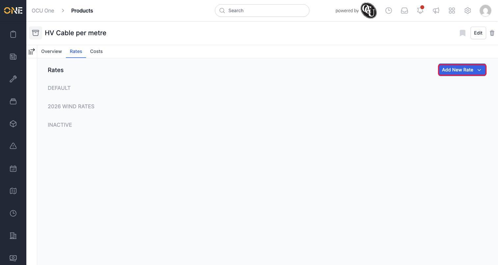
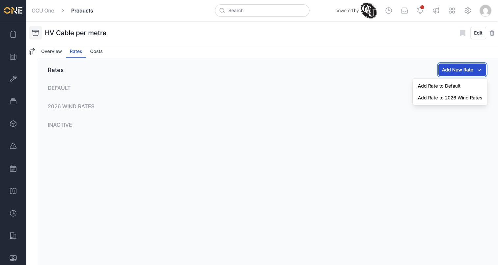
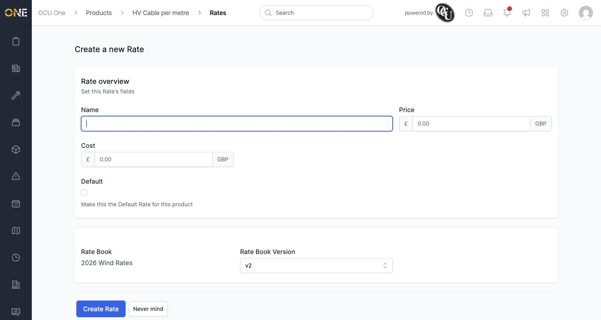
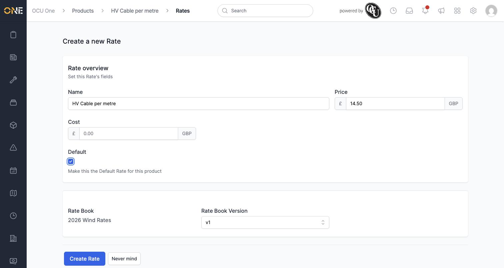
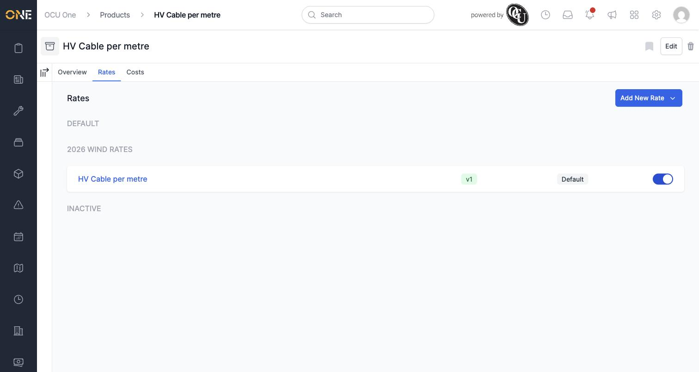
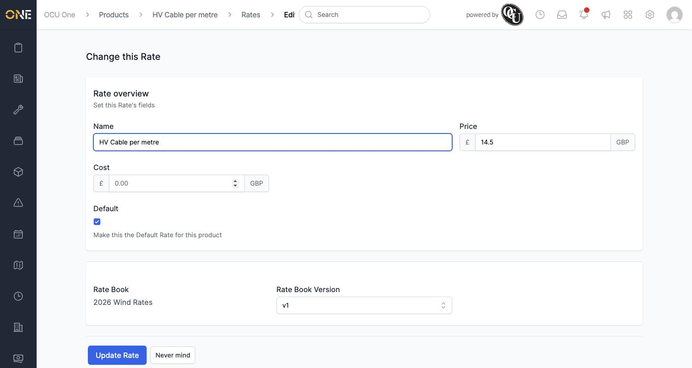

# Managing sell rates on a product

This is the same feature as *Setting product rates within a rate book version*, but starting from the product instead of the rate book — handy when you're focused on one product and want to see (or set) its price across every price book at once.

## Where to find it

Open a product and click its **Rates** tab. Prices are grouped by rate book, with a separate section for anything **Inactive**. With nothing set up yet, the groups are empty:

## Adding a sell rate

Click **Add New Rate**. Since a product can be priced under more than one rate book, you're asked which one this new price belongs to:

Choose one, and the same form from *Setting product rates within a rate book version* opens — except this time the **Product** is already fixed, and you instead choose which **Rate Book Version** the price belongs to:

Fill in a **Name**, the **Price**, and tick **Default** if it's the first (or main) price for this product on this rate book:

Click **Create Rate**, and it appears on the Rates tab, grouped under its rate book with the version and Default status shown alongside it:

## Editing a rate

Click a rate's name to open **Change this Rate**, where you can update the name, price, cost, Default status, or even move it to a different version of the same rate book:

## Other things to know

- The toggle next to each rate switches it between active and inactive without deleting it — useful for retiring an old price while keeping a record of what it was.
- This tab only shows **Price** rate books. To set what this product costs you internally, use the **Costs** tab instead — covered in *Managing cost rates on a product*.
