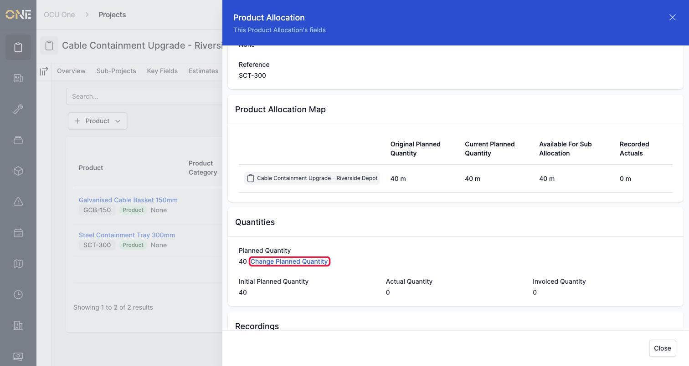
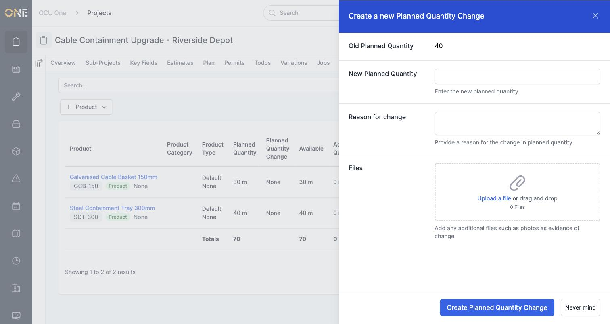
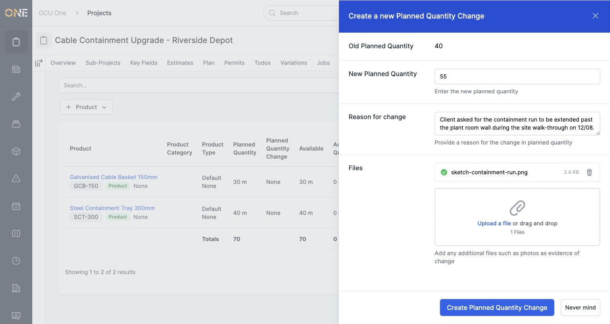
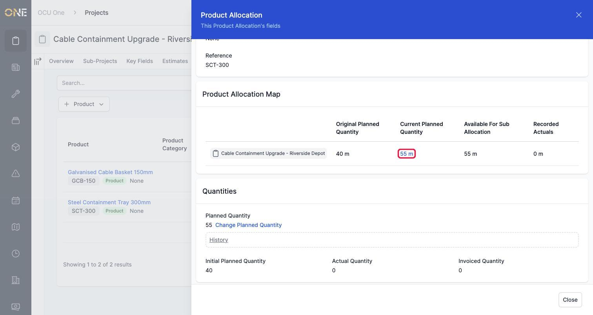
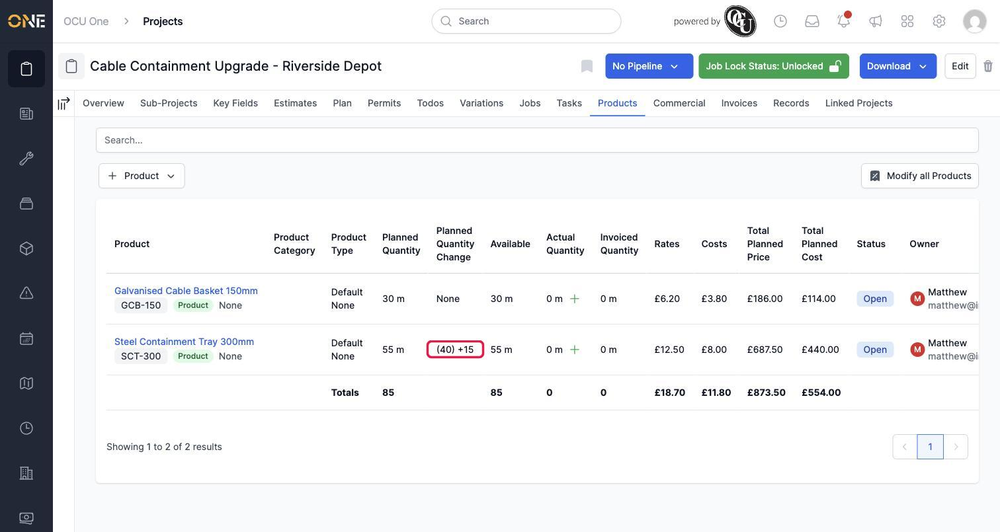
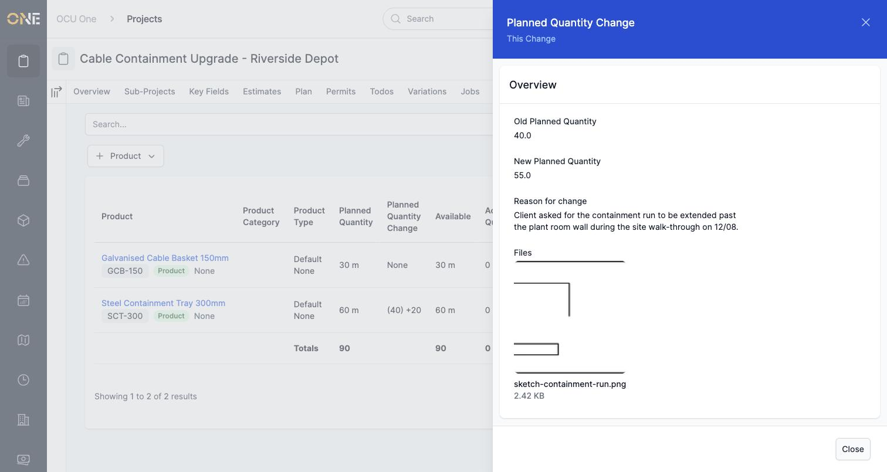

# Raising a planned quantity change on an allocation

Plans change — a client asks for more work, or less is needed than first thought. Rather than just overtyping the number, changing a planned quantity keeps a permanent record of what it used to be, what it's now, and why it changed.

## Where to find it

Open a product's allocation and look in the **Quantities** section. Next to the current **Planned Quantity**, there's a **Change Planned Quantity** link.

## Making the change

Click it, and a form opens showing the current quantity for reference, alongside fields for the new figure, the reason for the change, and any supporting files.

Enter the new quantity and a clear reason — this is the part that makes the change traceable later, so it's worth being specific. Attaching a file, like a sketch or photo, is optional but useful as evidence of why the change was needed.

Click **Create Planned Quantity Change** to save it.

## Seeing the result

The allocation's planned quantity updates immediately to the new figure:

Back on the Products tab, the **Planned Quantity Change** column shows exactly what happened at a glance — the original figure in brackets, followed by how much it's gone up (or down) by:

## Viewing a single change afterwards

Click on the old quantity shown for any past change (you'll see how to get to the list of past changes in the guide on viewing quantity change history) to open its full details — the old and new figures, the reason given, and any files attached to it:

## Other things to know

- You can raise more than one change over time on the same allocation — each one is kept, building up a full history of how the plan evolved. Viewing that history is covered in its own guide.
- This is different from correcting a mistake in the **Title** or **Category** via **Edit** — those don't affect the plan itself and don't need a reason recorded against them.
