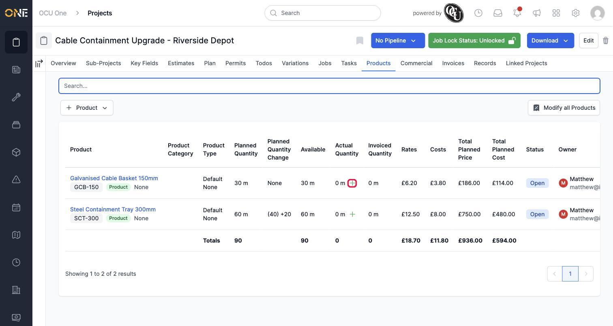
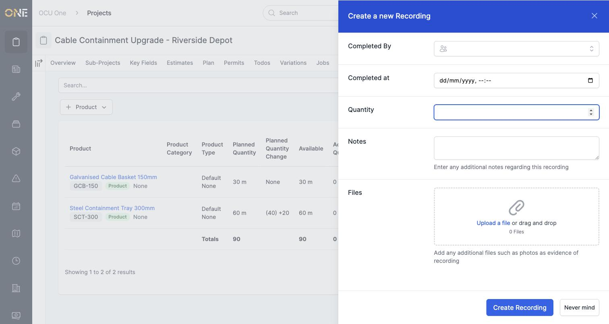
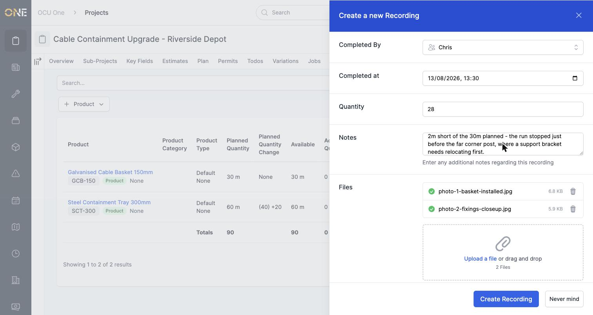
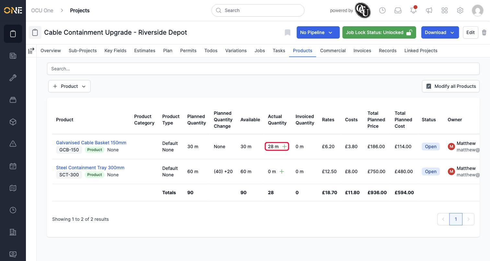
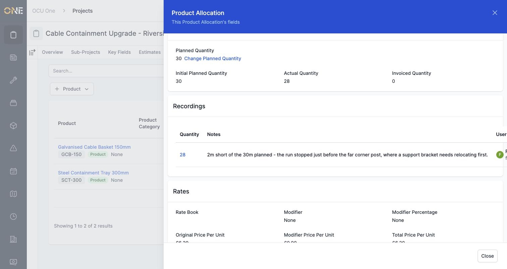
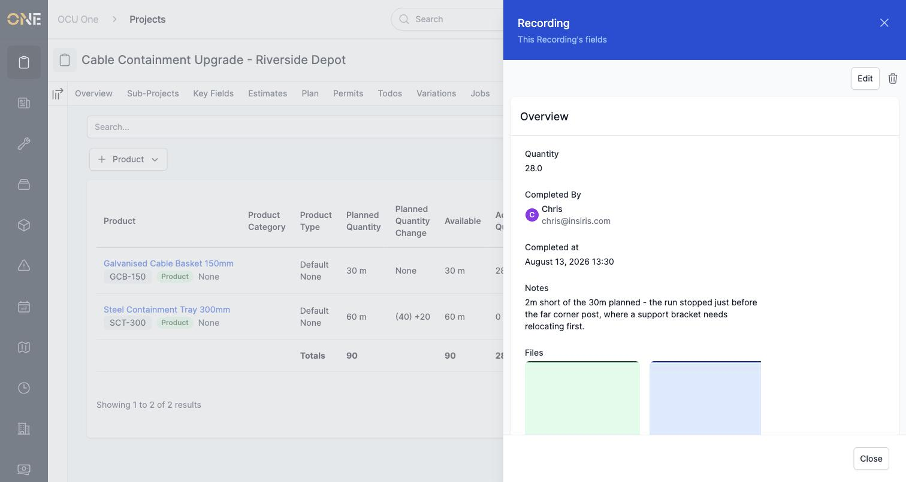
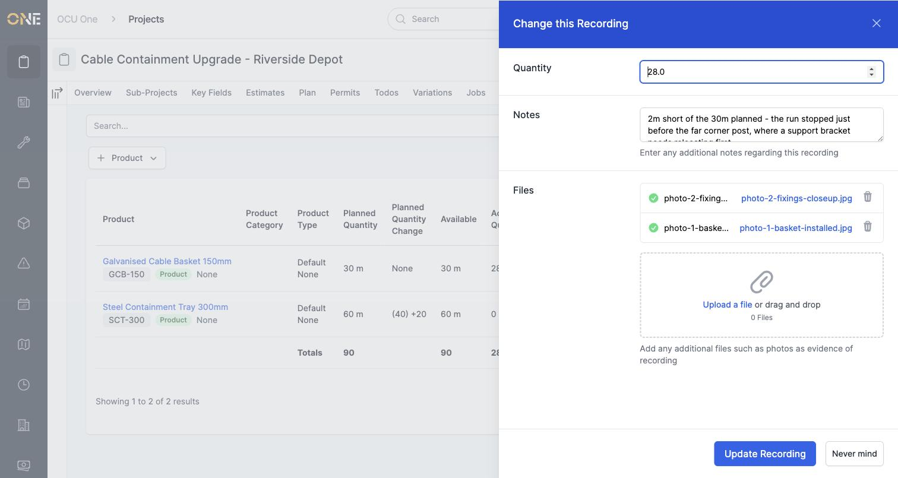

# Recording actual product usage against an allocation

Once work is underway, you can log exactly how much of a planned product has actually been used — separate from the original plan, so you can always see the two side by side.

## Where to find it

On a Products tab, look for the small **+** icon next to the **Actual Quantity** figure on a row.

## Logging the usage

Click it, and a form opens for **Completed By**, **Completed at**, **Quantity**, **Notes**, and any supporting **Files** such as photos.

Choose who actually did the work and when, enter how much was used, and add a note explaining anything worth flagging — here, that the run came up 2 metres short because a support bracket needs moving first. Attaching photos gives a visual record alongside the numbers.

Click **Create Recording** to save it.

## Seeing the result

The **Actual Quantity** column updates to show what's actually been used, right alongside the original **Planned Quantity**:

Opening the allocation's own details shows the same figure in the **Product Allocation Map** as **Recorded Actuals**, and a full **Recordings** table further down listing every recording made against it:

## Viewing, editing, or removing a recording

Click the quantity in the Recordings table to open its full details — who completed the work, when, the note, and the photos attached:

From there, **Edit** lets you correct the quantity, notes, or files:

**Good to know:** who completed the work and when can only be set when the recording is first created — editing only lets you fix the quantity, notes, or attached files afterwards. The trash icon next to **Edit** removes the recording entirely, if it was logged by mistake.

## Other things to know

- You can log more than one recording against the same allocation over time — useful if the work happens in stages. Each one is kept as its own entry in the Recordings table.
- This is different from a **Planned Quantity Change** — recording actual usage never changes what was planned, it only tracks what's really happened so far against that plan.
