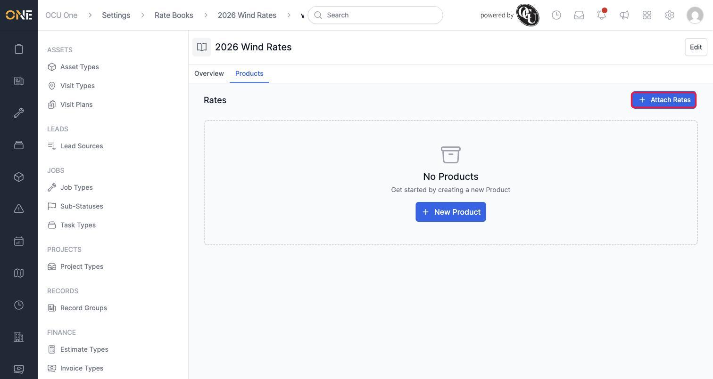
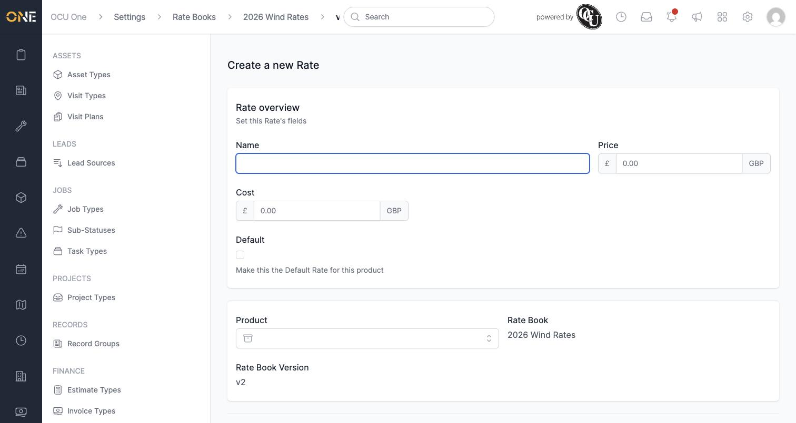
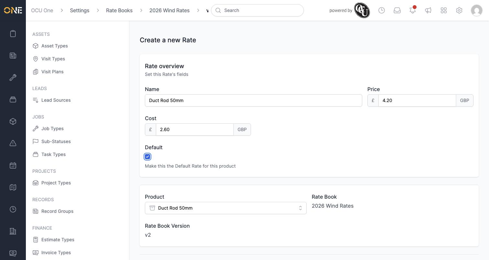
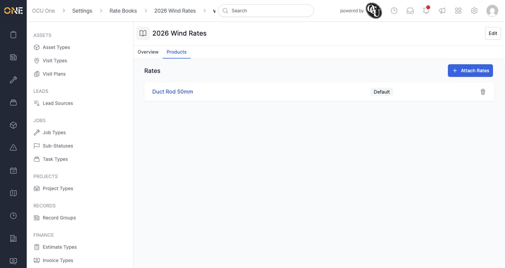
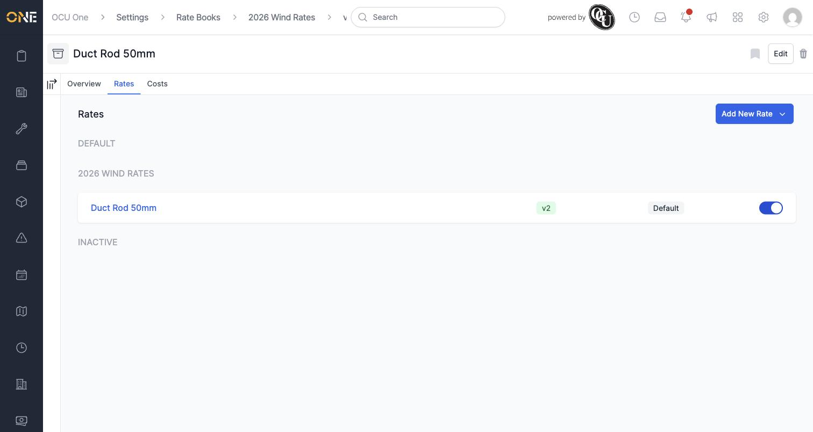

# Setting product rates within a rate book version

Once a rate book has a version (see *Creating a rate book and its versions*), you need to actually attach prices to it — one per product. This guide covers doing that from the rate book's side; the same thing can also be done starting from the product itself, covered in *Managing sell rates on a product* and *Managing cost rates on a product*.

## Where to find it

Open a rate book version and go to its **Products** tab. With nothing set up yet, it's empty:

## Attaching a rate

Click **Attach Rates**. This opens a form for the new price: a **Name**, **Price**, **Cost**, and whether it should be the **Default** rate for that product. The product, rate book, and version are already fixed to whichever ones you came from.

Search for and select the **Product** this rate is for, then fill in the rest. Here, "Duct Rod 50mm" is being priced at £4.20 with a £2.60 cost, and marked as the Default rate:

**Good to know:** if this is the first rate you're setting up for this product on this rate book, you need to tick Default — there has to be exactly one default rate per product, per rate book.

Click **Create Rate**, and it's added to the version:

## Seeing it from the product's side

The same rate also shows up if you open the product itself and go to its **Rates** tab (or **Costs** tab, for a cost book) — grouped under the rate book it belongs to, with the version and Default status shown alongside it:

## Other things to know

- The trash icon next to a rate removes that specific price only — it doesn't touch the product itself, or any of its other rates under different rate books or versions.
- A product can only have one rate per rate book version — if you need to change the price, edit the existing rate rather than trying to add a second one for the same version.
