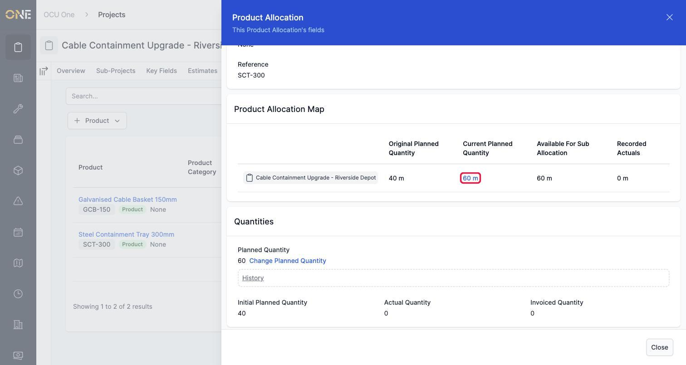
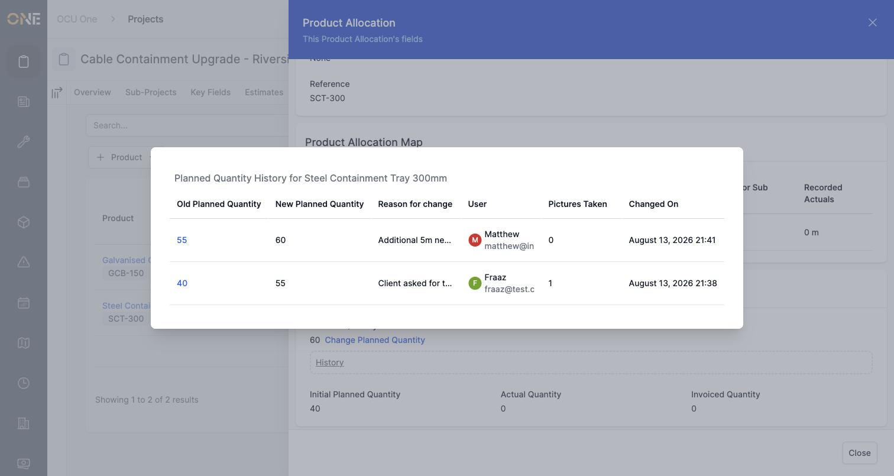
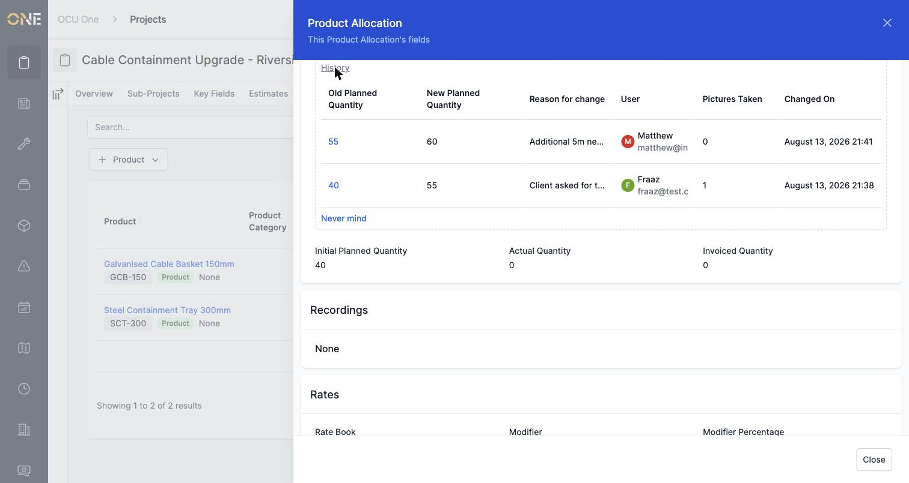

# Viewing planned quantity change history

Once an allocation's planned quantity has been changed at least once, you can see a full log of every change made to it — what it was, what it became, why, who made the change, and when.

## Where to find it

Open the allocation's details and look at the **Product Allocation Map**. Once there's been at least one change, the **Current Planned Quantity** figure becomes a clickable link.

## Reading the history

Click it, and a window opens listing every change made to that allocation, most recent first:

Each row shows:

- **Old Planned Quantity** and **New Planned Quantity** — what it changed from and to. Clicking the old quantity opens that change's full details.
- **Reason for change** — why it happened.
- **User** — who made the change.
- **Pictures Taken** — how many files were attached as evidence.
- **Changed On** — exactly when it happened.

## An alternative way to see it

The same history is also available without leaving the page. Right under the **Change Planned Quantity** link on the allocation's details page, there's a collapsed **History** section — click it to expand the same table in place:

## Other things to know

- This is a read-only log — you can't edit or delete a past change from here. If a quantity needs correcting again, raise a new change rather than trying to undo an old one.
