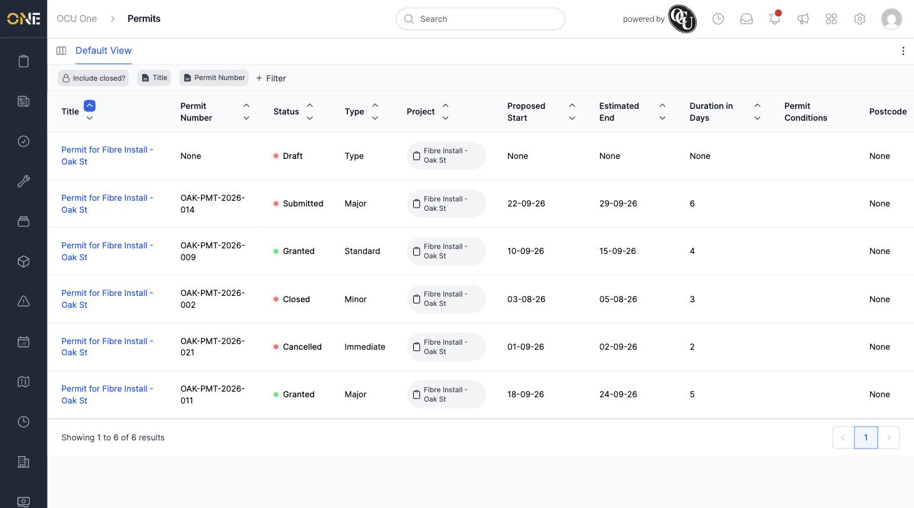

# Browsing Permits

The permits table gives you a single, sortable list of every permit in the system, regardless of which project it belongs to. It's the quickest way to find a specific permit, or to scan across many permits at once (for example, to see which are still in draft or which have been granted).

## Getting there

From the [Permits landing page](Using%20the%20permits%20landing%20page.md), click the **Permits** card. You can also get here directly from the sidebar's Permits link.

## What you'll see

The table lists every permit with these columns:

- **Title** — the permit's name, usually "Permit for &lt;Project Name&gt;"
- **Permit Number** — shown as "Reference" internally, but always labelled **Permit Number** on screen
- **Status** — Draft, Submitted, Granted, Closed, Cancelled, and so on
- **Type** — Minor, Major, Immediate, Standard, Remedial, Interim to Perm, or Private
- **Project** — the project this permit belongs to, with a link to open it
- **Proposed Start** / **Estimated End**
- **Duration in Days**
- **Permit Conditions**
- **Postcode**

## Filtering and sorting

Along the top of the table is a row of filter chips — by default **Include closed?**, **Title**, and **Permit Number**. Click any chip to open its filter options, or click **+ Filter** to add more — you can filter by Status, Type, Permit Conditions, Proposed Start, Estimated End, Location, Owner, Assigned Users, Project, Project Type, Labels, and more.

Click any column header's up/down arrows to sort by that column.

By default the list only shows permits that aren't closed. Turn on **Include closed?** to also bring back Closed, Cancelled, Registered, Revoked, and similar released statuses.

## Opening a permit

Click a permit's **Title** to open its full overview — see [Viewing a permit's overview page](Viewing%20a%20permit's%20overview%20page.md).
