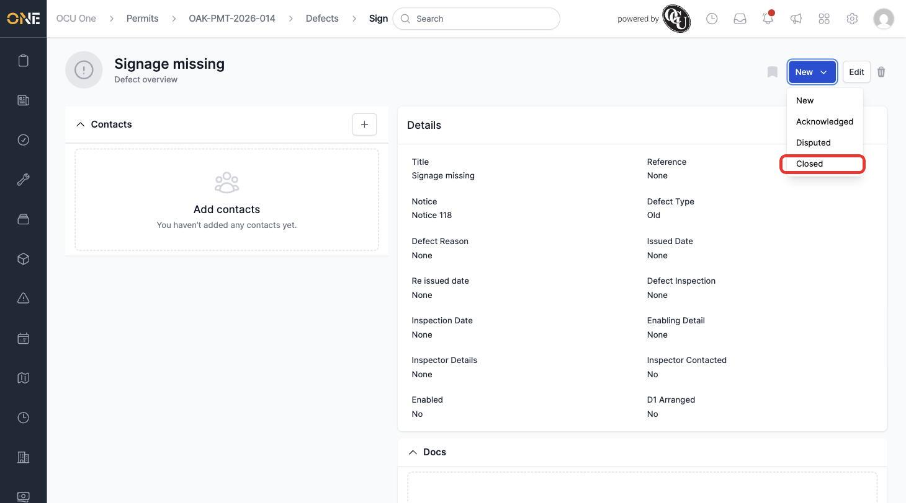
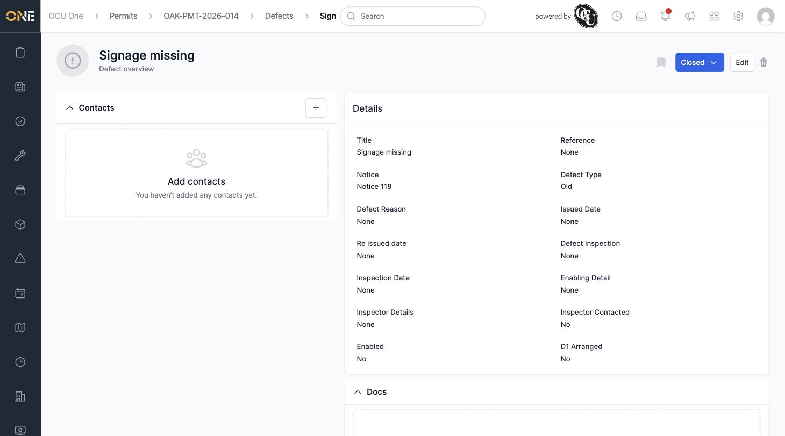

# Changing a Defect's Status

A defect moves through a simple set of statuses as it's investigated and resolved: New, Acknowledged, Disputed, and Closed.

## Getting there

Open the defect and click the status button at the top right (next to Edit) — it shows the current status, for example **New**.

## Changing the status

Click the status button to open the dropdown showing all four statuses:

Click the status you want to move the defect to.

## After changing

The status button updates immediately to reflect the new status:

There's no confirmation step for changing a defect's status, so double-check you've picked the right option before clicking it — especially when moving a defect to Closed, since that usually signals the underlying problem has actually been fixed on site.
