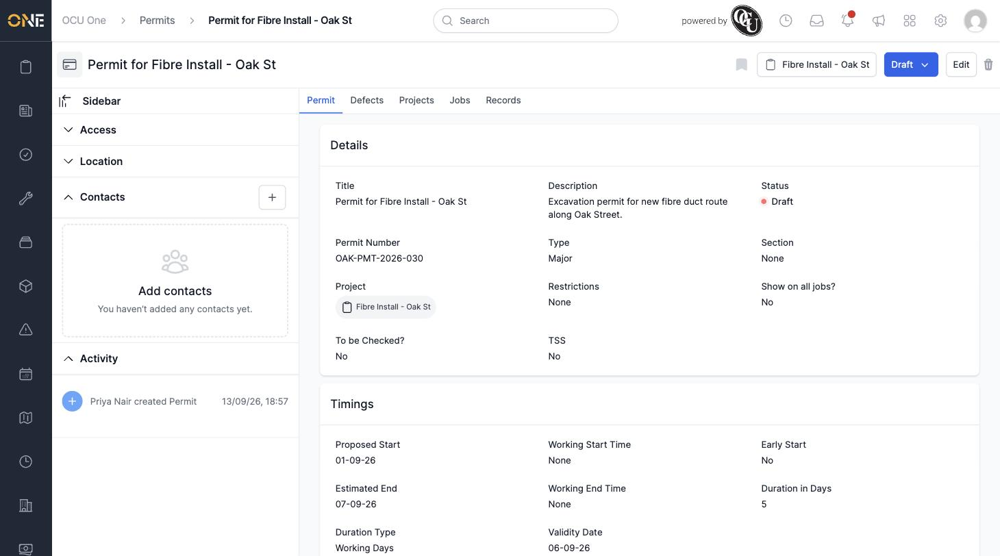
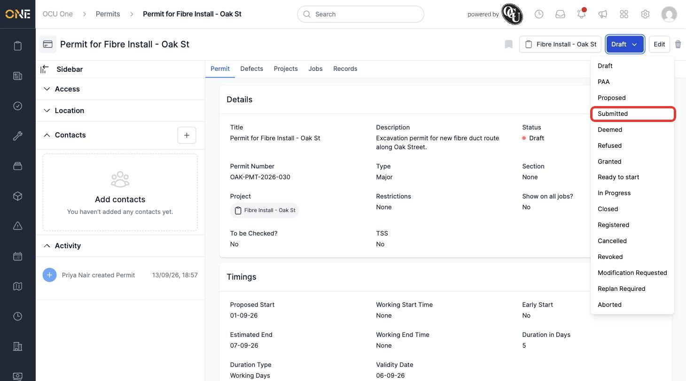
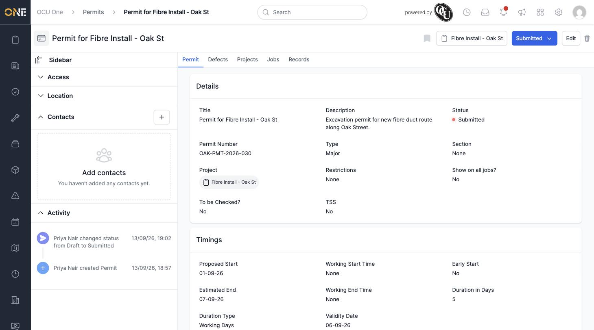

# Changing a Permit's Status

A permit moves through a fixed set of statuses as it progresses — from an initial draft, through submission to the authority, to being granted (or refused), and eventually closed once the works are done.

## Getting there

Open the permit and look at the status button at the top right of its overview page — it shows the current status (for example **Draft**) with a dropdown arrow.

## Changing the status

Click the status button to open the full list of statuses: Draft, PAA, Proposed, Submitted, Deemed, Refused, Granted, Ready to Start, In Progress, Closed, Registered, Cancelled, Revoked, Modification Requested, and Replan Required.

Click the status you want to move the permit to. Note that some statuses — Type, Proposed Start, Estimated End, Duration Type, Duration in Days, TM Request, and Road Type — must already be filled in before you can move a permit out of Draft, and a Permit Number is required before it can reach a released status like Granted, Registered, or Closed.

## After changing

The status button updates immediately, and the change is recorded in the permit's **Activity** feed on the left, showing who made the change and when:

The [permits board](Viewing%20the%20permits%20board%20%28pipeline%29.md) shows the same statuses as columns, giving you an at-a-glance view of how many permits are sitting at each stage.
