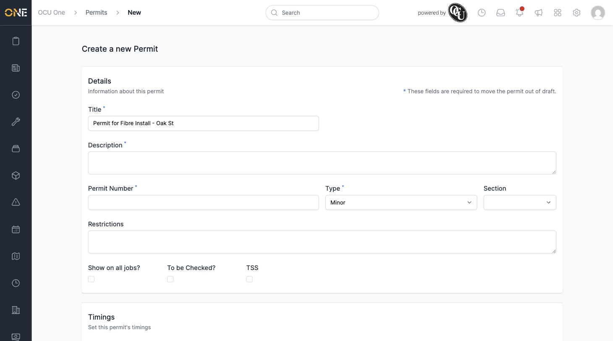
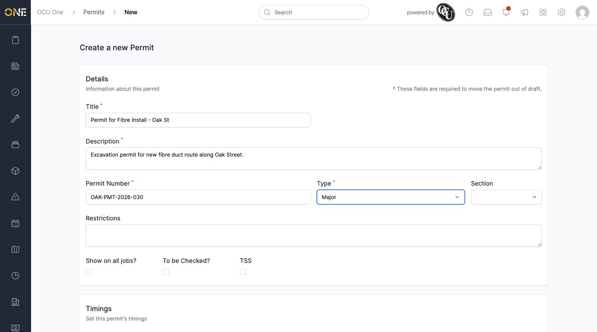
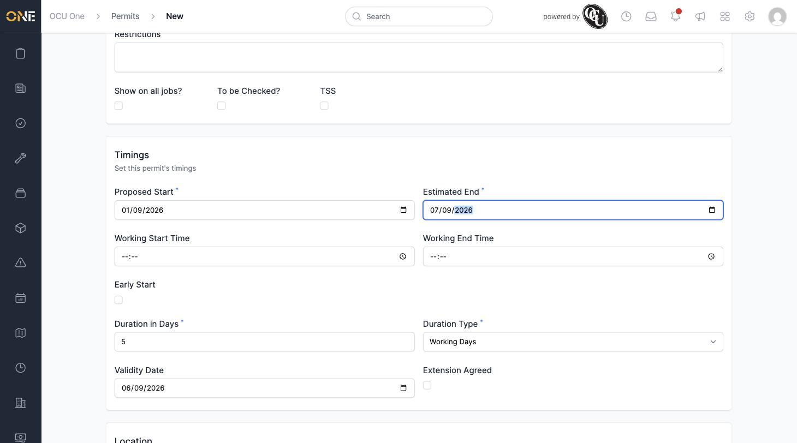
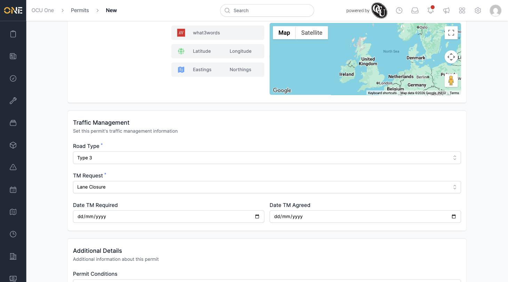
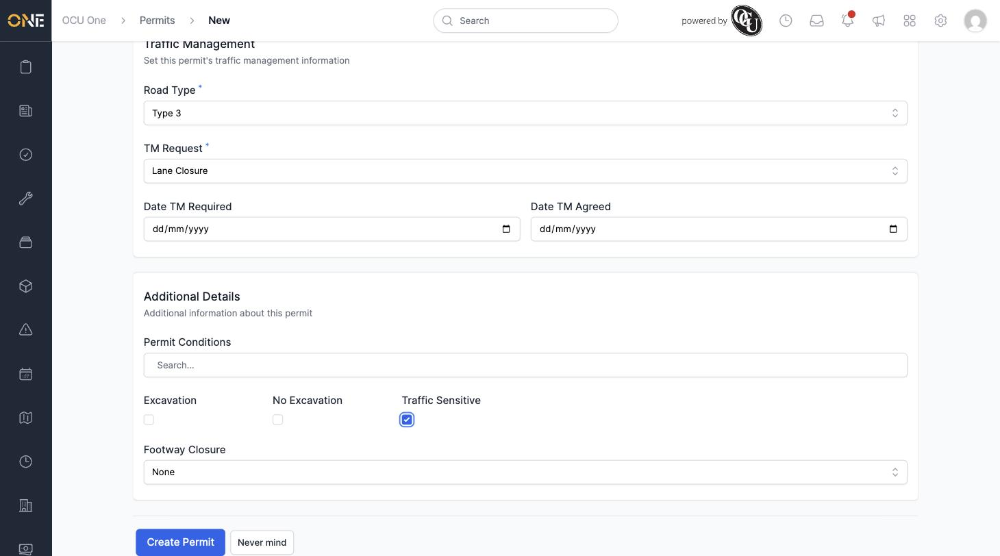
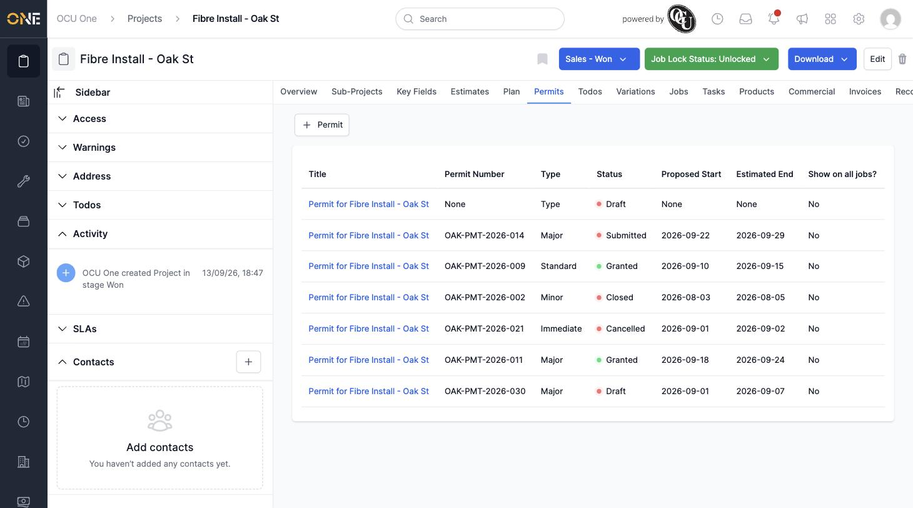

# Creating a Permit for a Project

Permits belong to a project — you can't create one on its own without saying which project it covers. This guide walks through creating one from a project's Permits tab.

## Getting there

Open the project you want to raise a permit against, and go to its **Permits** tab. Click **+ Permit**. You'll land on the "Create a new Permit" screen with the title already filled in for you as "Permit for &lt;Project Name&gt;".

The form is split into five sections: **Details**, **Timings**, **Location**, **Traffic Management**, and **Additional Details**. Fields marked with a blue asterisk aren't required to save the permit as a draft, but you will need to fill them in before you can move it out of Draft status.

## Details

Fill in:
- **Description** — a short summary of what the permit covers
- **Permit Number** — leave blank for now if you don't have one yet; it isn't required until the permit reaches a released status like Granted
- **Type** — Minor, Major, Immediate, Standard, Remedial, Interim to Perm, or Private
- **Section**, **Restrictions**, and the **Show on all jobs?** / **To be Checked?** / **TSS** checkboxes, if relevant

## Timings

Set the **Proposed Start** and **Estimated End** dates — note the date fields use day/month/year order. Fill in **Working Start Time** and **Working End Time** if the works are limited to certain hours, and **Duration in Days** with a **Duration Type** of Working Days or Calendar Days. The **Validity Date** field will suggest a value automatically once you've set the other timing fields, but you can change it.

## Location

By default a new permit uses the project's own address (**Use address from: Use project/parent address**). You can switch this to a custom address if the works are somewhere else on site.

## Traffic Management

Set the **Road Type** and **TM Request** (traffic management request) from their dropdowns — for example Type 3 and Lane Closure. **Date TM Required** and **Date TM Agreed** are optional.

## Additional Details

Tick **Traffic Sensitive**, **Excavation**, **No Excavation**, or set a **Footway Closure** option if any apply, and add any **Permit Conditions** from the search box.

## Saving

Click **Create Permit**. You're taken back to the project's Permits tab, where a green "Permit was successfully created" message confirms it, and the new permit appears in the list alongside any others already on that project.

From here you can open the new permit to keep working on it — see [Viewing a permit's overview page](Viewing%20a%20permit's%20overview%20page.md) — or move it forward once it's ready, see [Changing a permit's status](Changing%20a%20permit's%20status.md).
