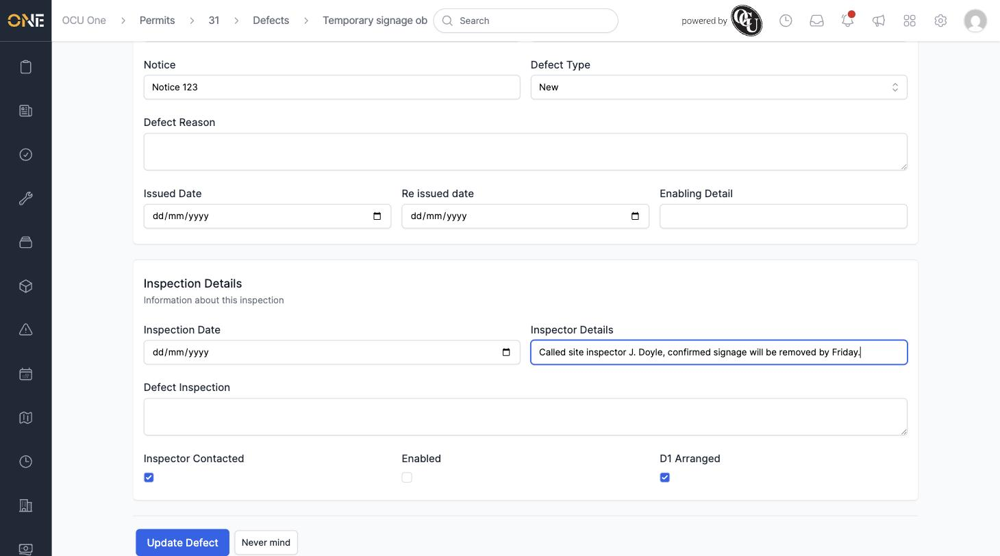
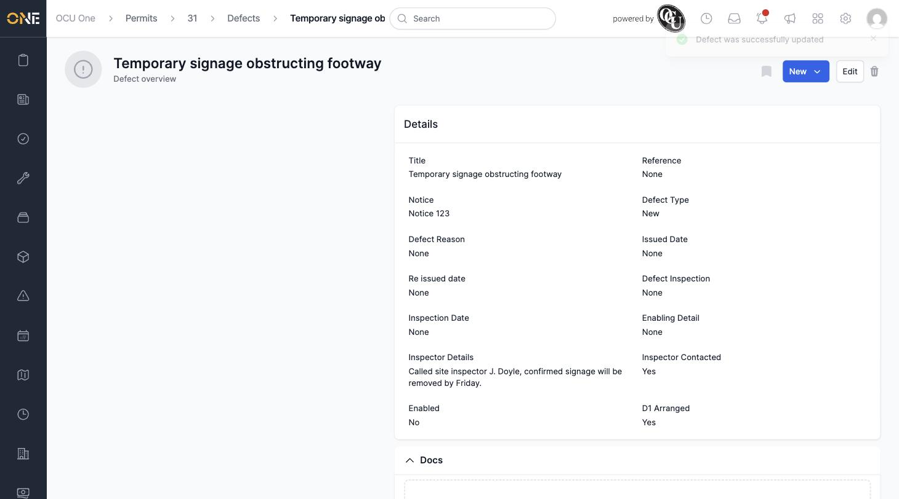
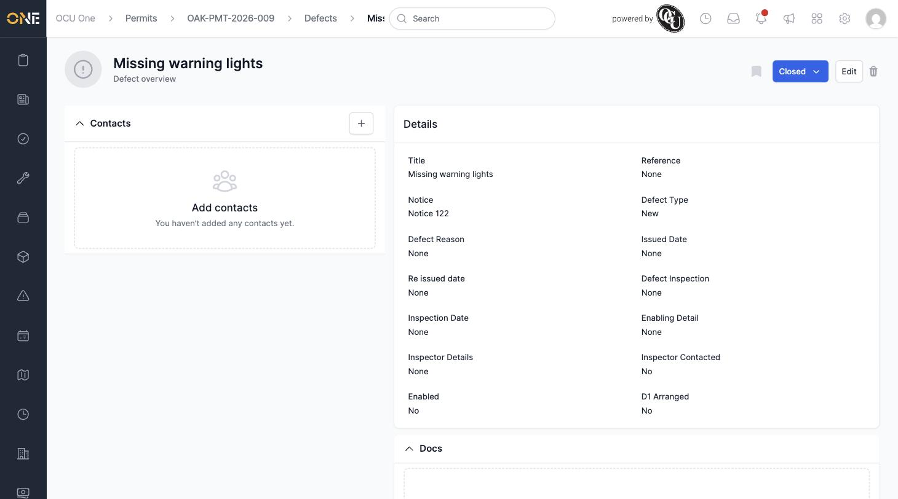
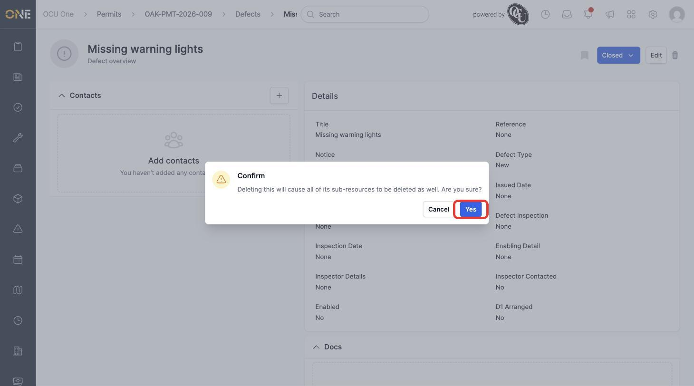
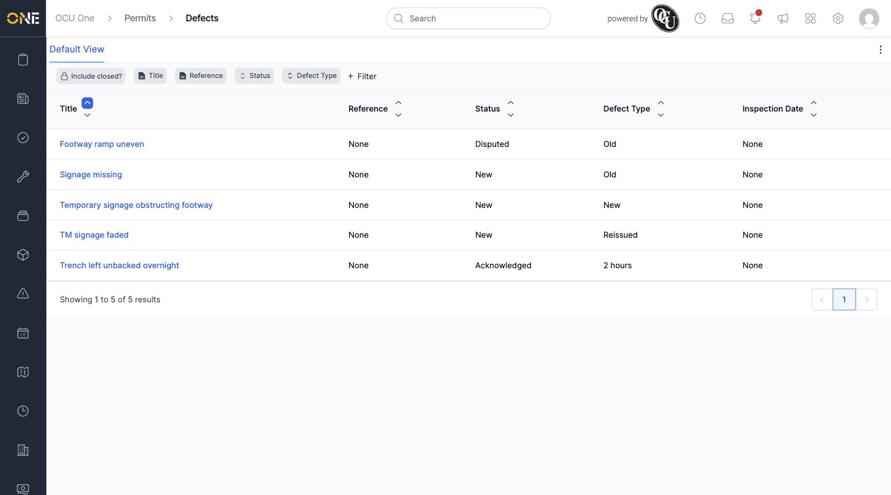

# Editing or Deleting a Defect

Once a defect's been raised you can go back and update any of its details — for example to record that you've now spoken to the inspector — or remove it entirely if it's been resolved and is no longer needed.

## Editing a defect

Open the defect and click **Edit**. This opens the same form used when raising the defect. Here, the **Inspector Contacted** checkbox is ticked and a note is added to **Inspector Details**:

Click **Update Defect** to save. You're taken to the defect's overview page with a "Defect was successfully updated" message:

## Deleting a defect

Open the defect you want to remove — here, a resolved defect already marked **Closed**:

Click the trash icon at the top right. A confirmation dialog appears:

Click **Yes** to confirm. The defect no longer appears in the defects list:

Deleting a defect archives it rather than removing it from the database outright — it also won't affect the permit it was raised against, or any other defects on that permit.
