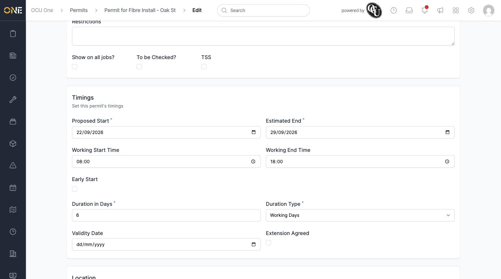
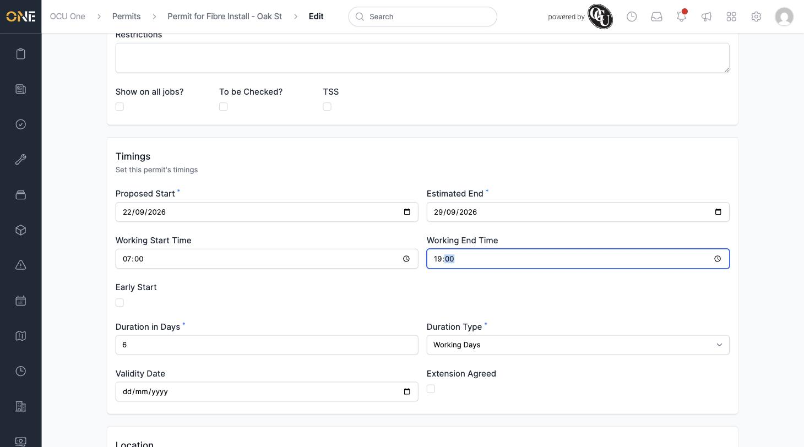
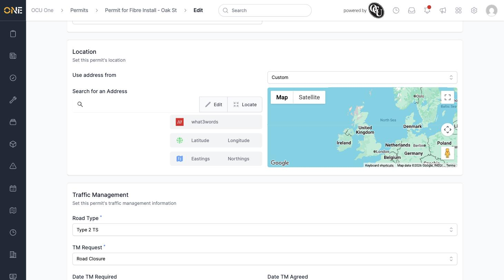
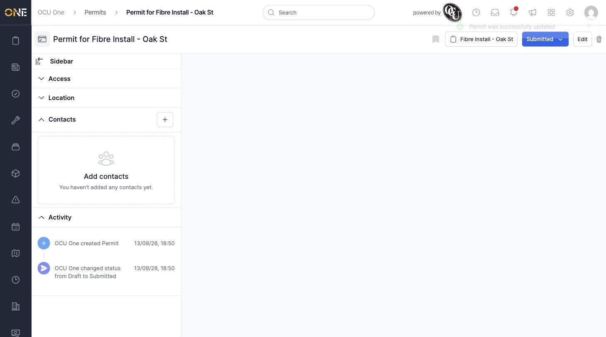
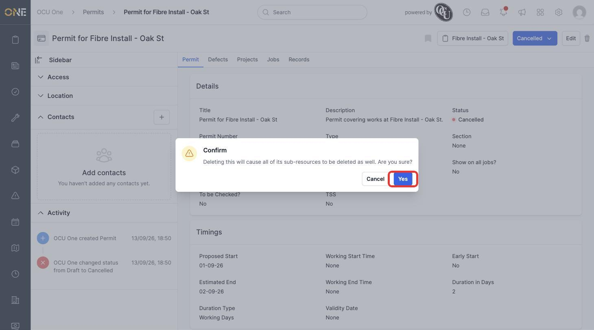
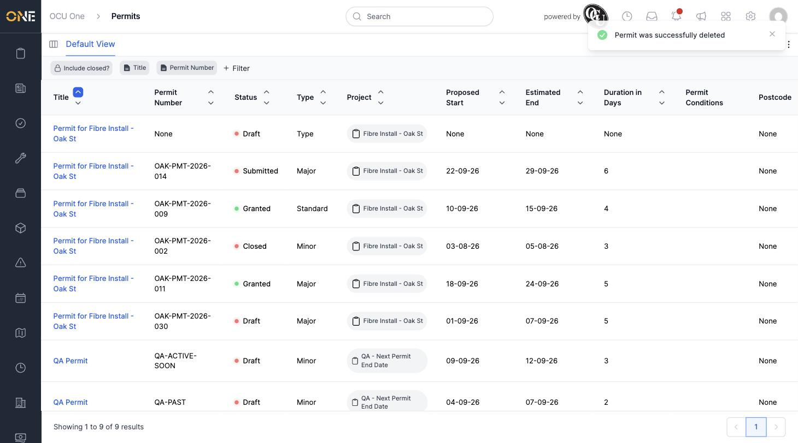

# Editing or Deleting a Permit

Once a permit exists you can go back and change any of its details, or remove it entirely if it was raised in error or is no longer needed.

## Editing a permit

Open the permit and click **Edit** (top right of its overview page). This opens the same form used when creating the permit, with every section — Details, Timings, Location, Traffic Management, and Additional Details — already filled in with its current values.

For example, here a permit's working hours are being widened from 08:00–18:00 to 07:00–19:00:

Traffic management details can be changed the same way — here the **TM Request** is switched from Lane Closure to Road Closure:

Click **Update Permit** at the bottom of the form to save. You're taken to the permit's overview page with a "Permit was successfully updated" message, and the activity feed on the left records the change.

## Deleting a permit

Open the permit you want to remove and click the trash icon at the top right of its overview page (next to Edit). A confirmation dialog appears warning that deleting the permit will also delete all of its sub-resources (such as any defects raised against it):

Click **Yes** to confirm. You're returned to the permits table with a "Permit was successfully deleted" message, and the permit no longer appears in the list.

Deleting a permit archives it rather than removing it from the database outright — if you need it back, contact an administrator rather than recreating it from scratch.
