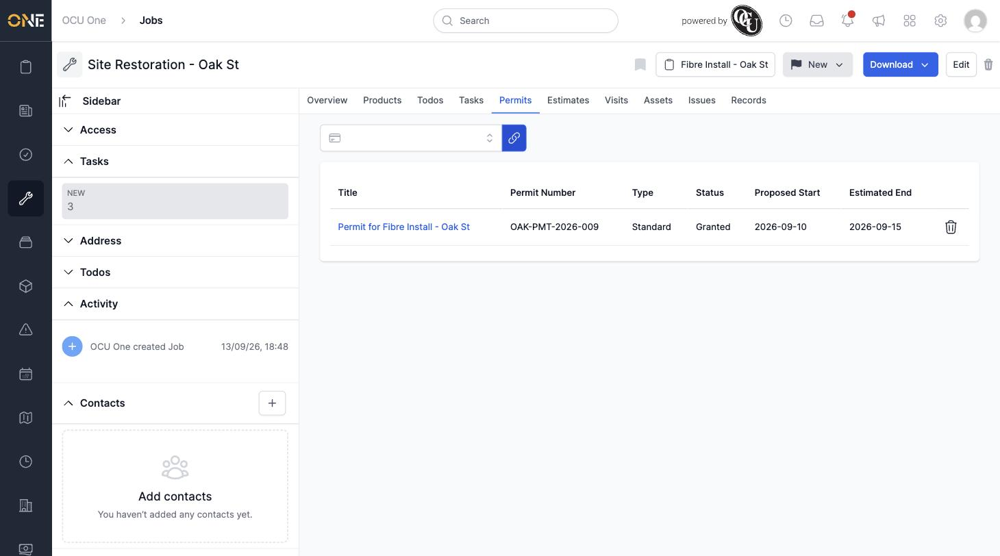
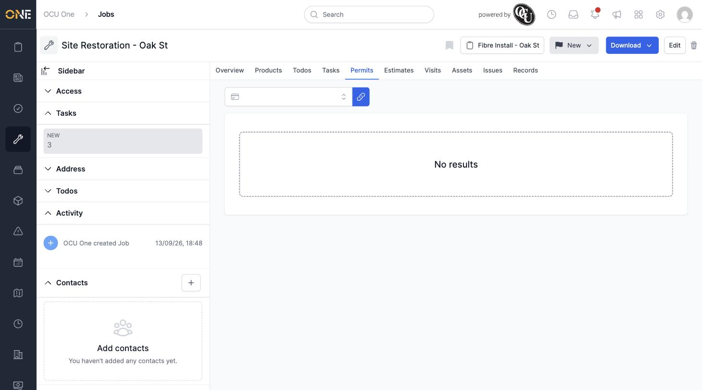

# Linking or Unlinking a Permit to a Job

If a job needs a specific permit in place before it can go ahead — for example a road closure permit for a job that involves digging up a section of carriageway — you can attach that permit directly to the job from the job's own Permits tab.

## Getting there

Open the job and click its **Permits** tab. If nothing is linked yet, you'll see "No results":

## Linking a permit

Click the search box and start typing, or just click it to see a list of available permits on this job's project. Each option shows the permit's title, permit number, and type:

Select the permit you want, then click the chain/link icon next to the search box to attach it. It appears immediately in the table below, along with its type, status, proposed start, and estimated end dates:

## Unlinking a permit

Click the trash icon at the end of the permit's row. It's removed from the job immediately — no confirmation step is needed for this action, since unlinking doesn't delete the permit itself, only the connection between it and this job.

Unlinking a permit from a job doesn't affect the permit or any other job it might be linked to — it only removes this one connection. To see every job a permit is currently linked to, open the permit itself and check its own Jobs tab — see [Viewing a permit's linked jobs](Viewing%20a%20permit's%20linked%20jobs.md).
