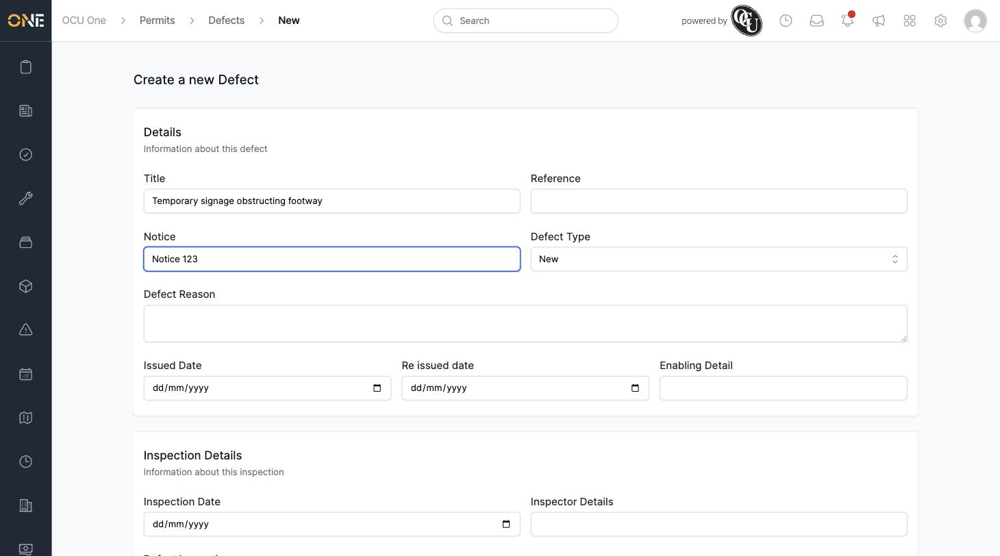
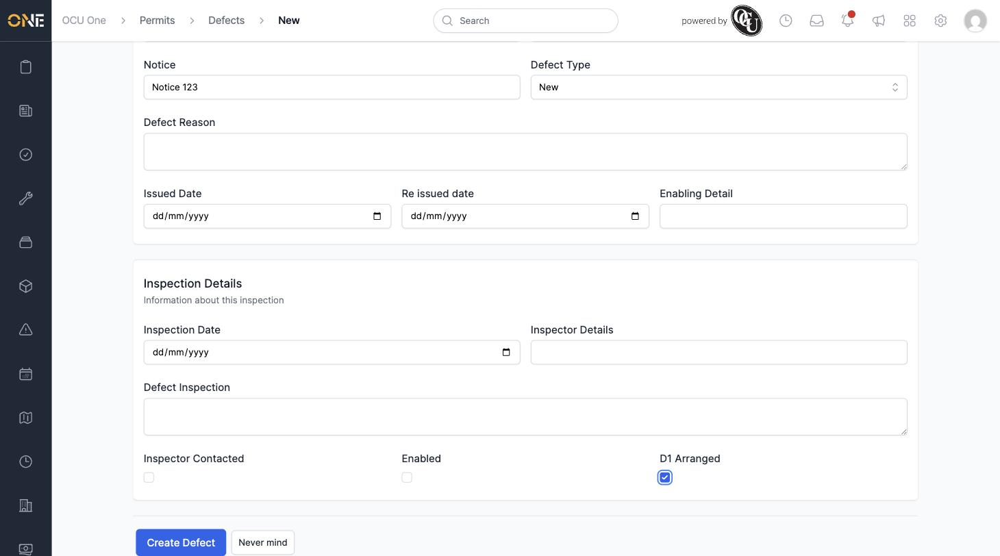
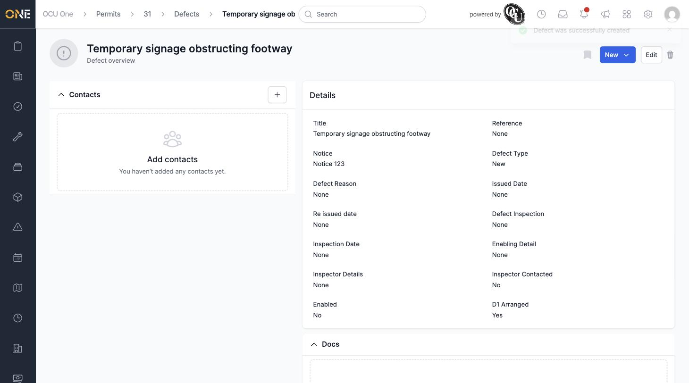

# Raising a Defect Against a Permit

If something's wrong on site that relates to a permit — missing signage, an unbacked trench, faded traffic management signs — you can log it as a defect against that permit so it's tracked through to resolution.

## Getting there

Open the permit, go to its **Defects** tab, and click **+ Defect**.

## Filling in the defect

The form is split into **Details** and **Inspection Details**.

Under Details, fill in:
- **Title** — a short description of the problem
- **Notice** — the notice number this defect relates to, if there is one
- **Defect Type** — New, Old, 2 hours, 4 hours, or Reissued
- **Defect Reason**, **Issued Date**, **Re issued date**, and **Enabling Detail** if relevant

Under Inspection Details, you can record who inspected the defect and when, along with three checkboxes: **Inspector Contacted**, **Enabled**, and **D1 Arranged** (whether a D1 notice has been arranged for this defect):

## Saving

Click **Create Defect**. You're taken to the new defect's overview page with a "Defect was successfully created" message, showing all the details you entered:

From here you can edit the defect further or change its status — see [Editing or deleting a defect](Editing%20or%20deleting%20a%20defect.md) and [Changing a defect's status](Changing%20a%20defect's%20status.md).
