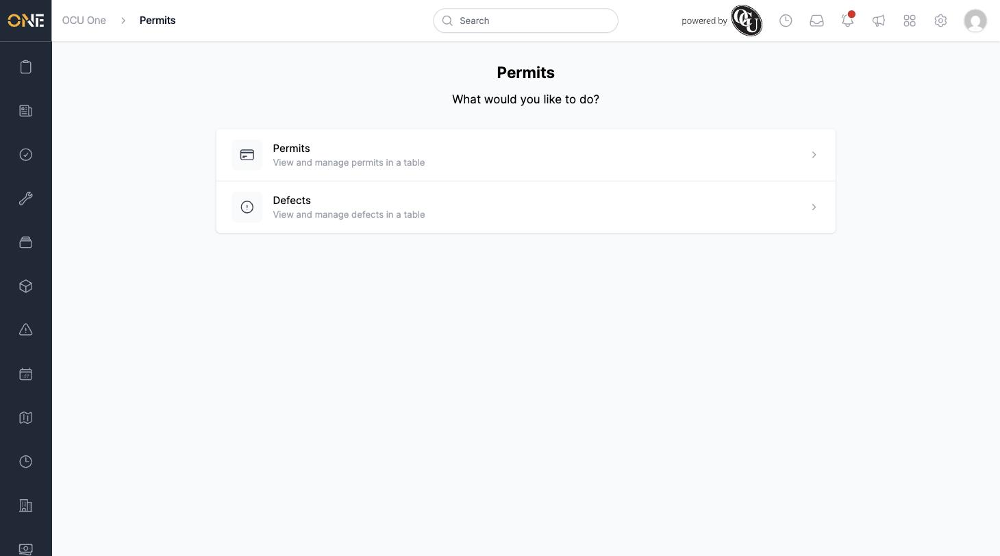

# Using the Permits Landing Page

The Permits landing page is the starting point for working with permits across the system. It gives you quick links to the different ways you can view permit information, without needing to remember exact web addresses or navigate through a project first.

## Getting there

Open **Permits** from the main navigation sidebar. You'll land on a simple page titled "Permits" with the question "What would you like to do?" underneath it.

## What's on this page

The landing page shows two cards you can click into:

- **Permits** — "View and manage permits in a table." This takes you to the full permits list, where every permit across every project is shown in a sortable, filterable table.
- **Defects** — "View and manage defects in a table." This takes you to the defects list, where every defect raised against any permit is shown in one place.

Each card has an arrow on the right showing it's clickable. There's nothing to fill in or configure here — it's purely a navigation hub, similar to the landing pages used elsewhere in the app (for example the Assets or Permits sections you may already be familiar with).

## What to do next

- To browse and filter permits, click the **Permits** card — see [Browsing permits](Browsing%20permits.md).
- To browse and filter defects, click the **Defects** card — see [Browsing defects](Browsing%20defects.md).

You can also reach the permits board (a kanban-style view grouped by status) from links inside a project's Permits tab, or by navigating directly — see [Viewing the permits board (pipeline)](Viewing%20the%20permits%20board%20%28pipeline%29.md).
