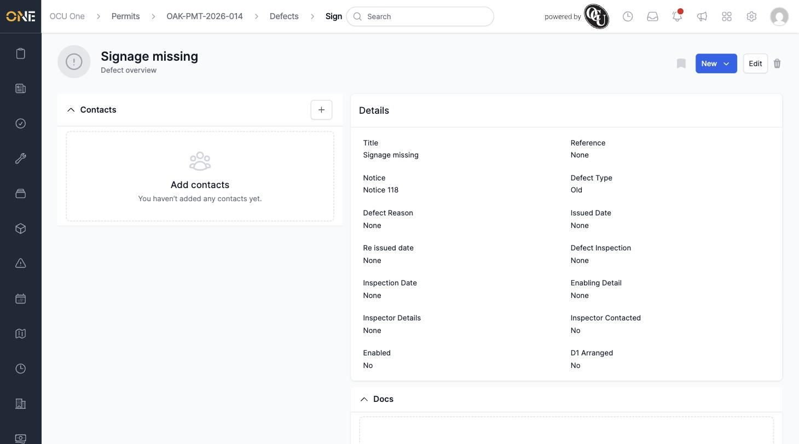

# Viewing a Defect

A defect's overview page brings together everything logged against it — its title, notice, type, and every inspection detail — in one place.

## Getting there

Open a defect from a permit's [Defects tab](Viewing%20a%20permit's%20defects%20tab.md), from [Browsing defects](Browsing%20defects.md), or from a permit's breadcrumb trail.

## What you'll see

At the top is the defect's title, a status button (New, Acknowledged, Disputed, or Closed), and **Edit** and delete icons. The breadcrumb above shows which permit this defect belongs to.

The **Details** panel shows the **Title**, **Reference**, **Notice**, **Defect Type**, **Defect Reason**, **Issued Date**, **Re issued date**, and **Defect Inspection**, followed by **Inspection Date**, **Enabling Detail**, **Inspector Details**, **Inspector Contacted**, **Enabled**, and **D1 Arranged**:

On the left is a **Contacts** panel for adding people associated with this defect, and further down a **Docs** section for attaching supporting files or photos.

To change any of these details, click **Edit** — see [Editing or deleting a defect](Editing%20or%20deleting%20a%20defect.md). To move it through to resolution, use the status button — see [Changing a defect's status](Changing%20a%20defect's%20status.md).
