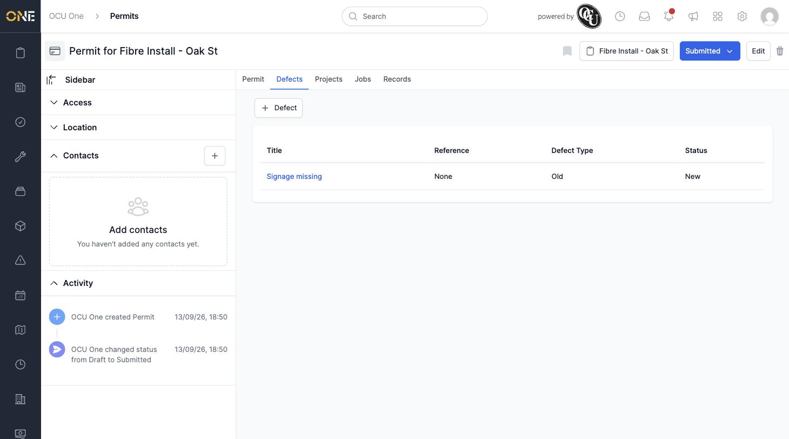

# Viewing a Permit's Defects Tab

Defects are problems raised against a specific permit — things like missing signage or an unbacked trench that need to be tracked and resolved. Each permit has its own Defects tab listing everything raised against it.

## Getting there

Open a permit and click its **Defects** tab.

## What you'll see

A table listing each defect raised against this permit, with its **Title**, **Reference**, **Defect Type** (New, Old, 2 hours, 4 hours, or Reissued), and **Status** (New, Acknowledged, Disputed, or Closed):

## Adding a defect

Click **+ Defect** to raise a new one against this permit — see [Raising a defect against a permit](Raising%20a%20defect%20against%20a%20permit.md) for the full walkthrough.

## Opening a defect

Click a defect's title to open its own overview page — see [Viewing a defect](Viewing%20a%20defect.md).
