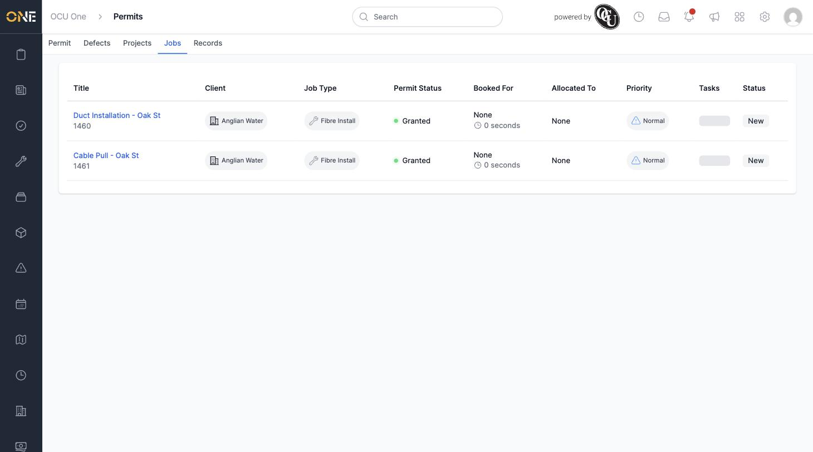

# Viewing a Permit's Linked Jobs

A permit can be linked to one or more jobs — the actual booked work on site that the permit covers. The Jobs tab on a permit shows every job it's currently linked to.

## Getting there

Open a permit and click its **Jobs** tab.

## What you'll see

A table listing each linked job with its **Title** and job number, **Client**, **Job Type**, this permit's **Permit Status** for context, **Booked For** date, **Allocated To** user, **Priority**, **Tasks**, and **Status**:

Click a job's title to open it directly.

To link or unlink a permit from a job, you do this from the job side rather than the permit — see [Linking or unlinking a permit to a job](Linking%20or%20unlinking%20a%20permit%20to%20a%20job.md).
