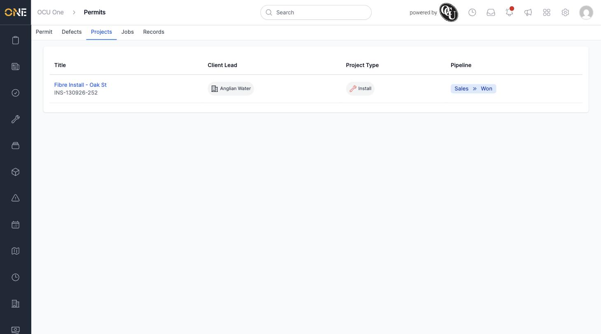

# Viewing a Permit's Linked Project

Every permit belongs to exactly one project — the works it covers. The Projects tab on a permit shows that link and a few key details about the project, without you having to leave the permit to look it up.

## Getting there

Open a permit and click its **Projects** tab.

## What you'll see

A single row showing the project this permit belongs to, with its **Title** and reference number, **Client Lead**, **Project Type**, and current **Pipeline** stage (for example "Sales » Won"):

Click the project's title to open it directly.

A permit is always created against a project — it's the "Project" field you can't change from this tab, since it's shown here purely for reference rather than as an editable field.
