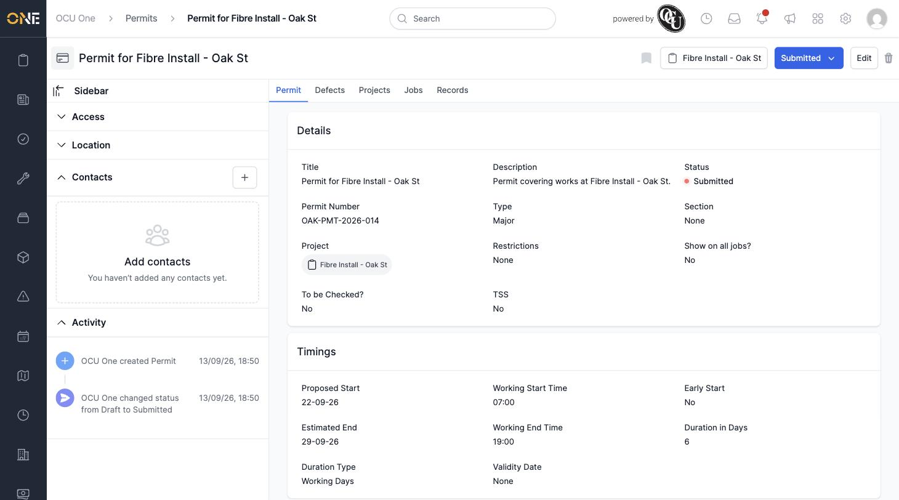
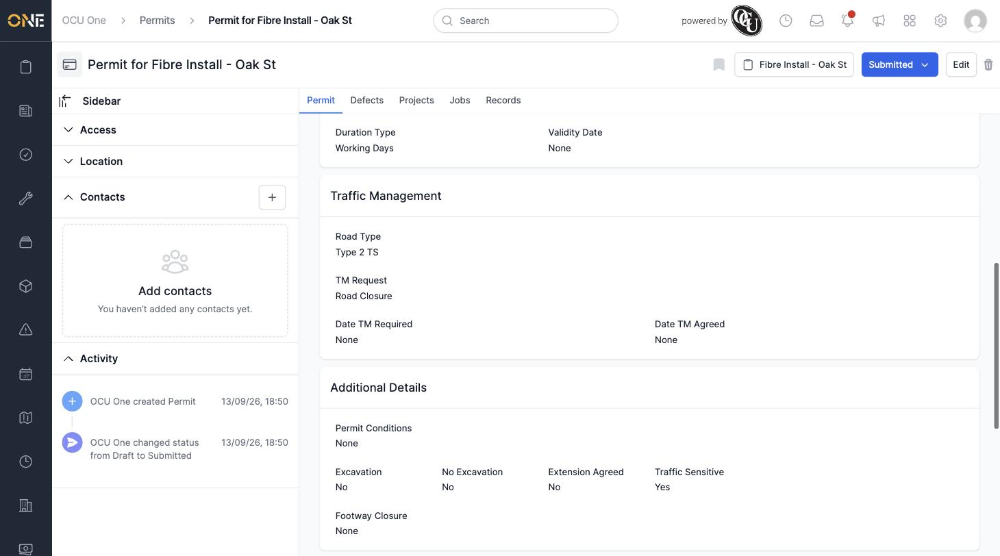

# Viewing a Permit's Overview Page

A permit's overview page is where all of its details live — everything you set up when creating or editing it, plus its current status, project, and activity history.

## Getting there

Click into any permit from [Browsing permits](Browsing%20permits.md), the [permits board](Viewing%20the%20permits%20board%20%28pipeline%29.md), or a project's Permits tab.

## What you'll see

Along the top is the permit's title, its current **Status** as a dropdown (see [Changing a permit's status](Changing%20a%20permit's%20status.md)), the project it belongs to, and **Edit** and delete icons.

Underneath, five tabs run across the page — **Permit** (this overview), **Defects**, **Projects**, **Jobs**, and **Records** — covering the related information described in the other Permits guides.

The **Details** section shows the title, description, status, permit number, type, section, restrictions, and the "Show on all jobs?" flag:

Underneath that, the **Timings** section shows the proposed start and end dates, working hours, duration, and validity date. Further down, **Traffic Management** shows the road type and TM request, and **Additional Details** shows permit conditions and the excavation / traffic sensitive / footway closure flags:

## The sidebar

On the left is a collapsible sidebar with:
- **Access** — who owns and can see this permit (inherited from the project)
- **Location** — the permit's address, if one is set (shows "None" if it's using the project's default address and no override has been added)
- **Contacts** — people associated with this permit
- **Activity** — a running log of everything that's happened to the permit, including who created it and every status change, with the date and time

This is a good place to check the history of a permit at a glance — for example, confirming who submitted it and when.
