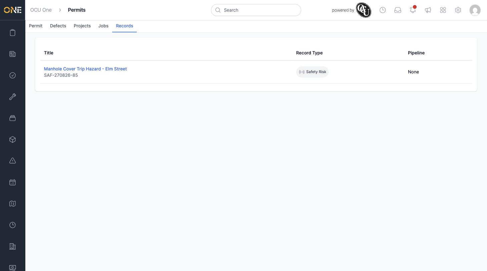

# Viewing a Permit's Records

Records — things like inspection reports, safety risks, or incident reports — can be attached to a permit so they're easy to find alongside it. The Records tab on a permit shows every record currently linked to it.

## Getting there

Open a permit and click its **Records** tab.

## What you'll see

A table listing each attached record with its **Title** and reference number, its **Record Type** (shown with a coloured badge, for example "Safety Risk"), and its **Pipeline** stage if the record type has one configured:

Click a record's title to open it directly.

Records get attached to a permit from the record's own side — using the record's "Attach permit" option — rather than from the permit itself, so this tab is read-only for viewing what's already linked.
