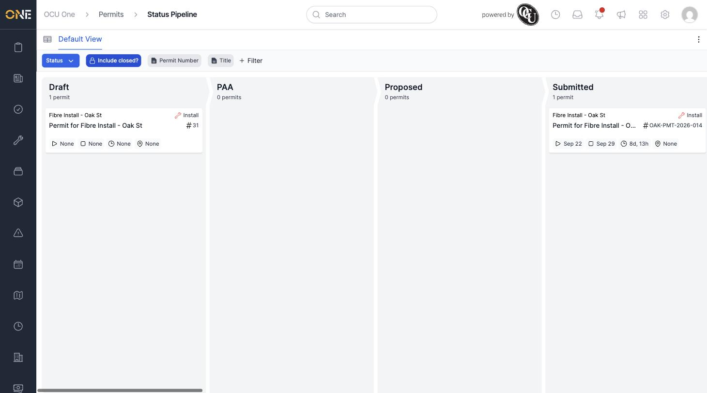
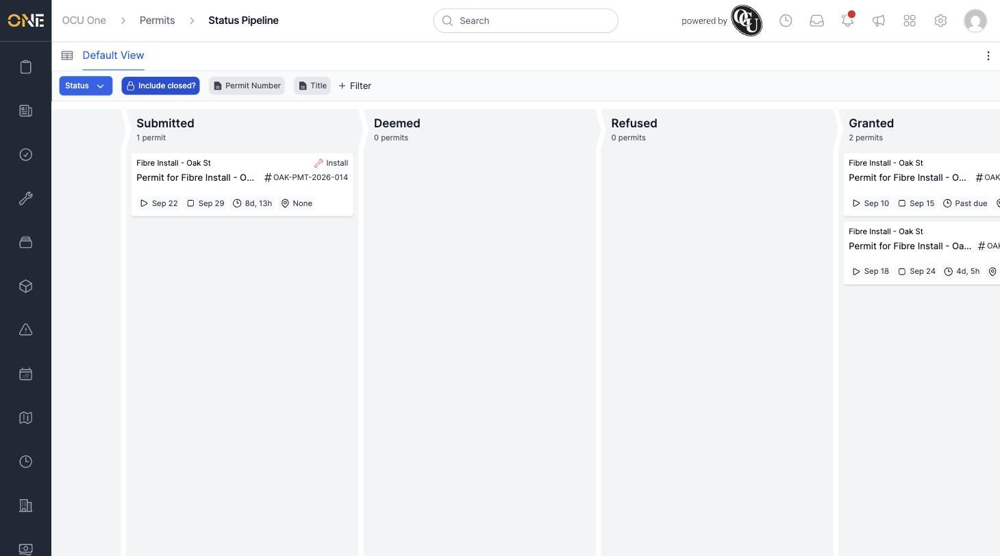

# Viewing the Permits Board (Pipeline)

The permits board shows every permit as a card, grouped into columns by its current status. It's a quick way to see how many permits are sitting at each stage — how many are still Draft, how many are Submitted and waiting on a decision, how many have been Granted — without opening each one individually.

## Getting there

Navigate to the Status Pipeline from the Permits area of the app (breadcrumb: **Permits › Status Pipeline**). Above the board is a **Default View** toggle that switches between this card board and the plain table used in [Browsing permits](Browsing%20permits.md).

## What you'll see

Each column is one real permit status — **Draft**, **PAA**, **Proposed**, **Submitted**, **Deemed**, **Refused**, **Granted**, and further along, **Ready to Start**, **In Progress**, **Closed**, **Registered**, **Cancelled**, **Revoked**, **Modification Requested**, and **Replan Required**. Every permit status in the system is a column here — there's no separate "configure your own stages" step for permits, since the columns are fixed to match the permit's status field directly.

Each card shows the permit's project, its type, title, permit number, proposed start and estimated end dates, how long is left (or "Past due"), and its location if one is set.

By default the board only shows permits that aren't in a closed-off status. Turn on **Include closed?** in the filter bar to also see Granted, Closed, Cancelled, and other released permits — scroll the board sideways to bring those columns into view.

## Filtering

The same filter chips available in the table view — **Permit Number**, **Title**, **Status**, **Type**, and more via **+ Filter** — work here too, so you can narrow the board down to, for example, only the permits on a specific project.

## Opening a permit

Click any card to open that permit's full overview — see [Viewing a permit's overview page](Viewing%20a%20permit's%20overview%20page.md).
