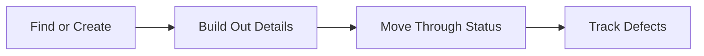

# Permits — Overview

A **Permit** covers the legal and traffic-management side of works that involve digging up or otherwise affecting a public road or footway — things like council street-works permits. This guide explains how the pieces fit together, before you dive into the detailed guides for each part.

## The core pieces

Every permit belongs to exactly one **Project** — it's raised from that project's Permits tab and can't exist on its own. A permit has a **Type** (Minor, Major, Immediate, Standard, Remedial, Interim to Perm, or Private), a set of **Timings** (proposed start, estimated end, working hours, duration), a **Location**, and **Traffic Management** details (road type, TM request).

A permit moves through a fixed set of **Statuses** as it progresses — Draft, PAA, Proposed, Submitted, Deemed, Refused, Granted, Ready to Start, In Progress, Closed, Registered, Cancelled, Revoked, Modification Requested, and Replan Required. Some fields only become required once you try to move a permit past Draft, and a Permit Number is only required once it reaches a released status like Granted.

**Defects** can be raised against a permit — things like missing signage or an unbacked trench that need to be tracked through to resolution, with their own simpler status flow (New, Acknowledged, Disputed, Closed).

A permit can also be linked to one or more **Jobs** (the booked work it covers) and can have **Records** (like inspection reports) attached to it.

## Why this matters

Treating permits as their own tracked records, rather than just a line item on a project, is what makes it possible to:

- **Know exactly what's authorised** — the permit's type, timings, and traffic management details are all in one place, rather than scattered across emails or paperwork.
- **Track compliance issues as they arise** — a defect raised against a permit stays linked to it, so nothing gets lost between the permit and the problem it caused.
- **See at a glance which jobs depend on which permits** — a job that needs a road closure permit in place is linked directly to it, so nobody books work that isn't actually authorised yet.
- **Follow a permit's real-world lifecycle** — from a first draft through submission, a decision, and eventual closure, with every status change recorded.

## The end-to-end flow

It starts with **finding your way in**. The permits landing page is the entry point — see [Using the permits landing page](Using%20the%20permits%20landing%20page.md) — from which you can browse existing permits two ways: [Browsing permits](Browsing%20permits.md) for a flat, sortable table, or [Viewing the permits board (pipeline)](Viewing%20the%20permits%20board%20%28pipeline%29.md) for a Kanban-style view grouped by status.

Adding a new permit is covered in [Creating a permit for a project](Creating%20a%20permit%20for%20a%20project.md) — raised from a project's own Permits tab. From there, [Viewing a permit's overview page](Viewing%20a%20permit's%20overview%20page.md) covers everything that page brings together, [Editing or deleting a permit](Editing%20or%20deleting%20a%20permit.md) covers changing its details later or archiving it, and [Changing a permit's status](Changing%20a%20permit's%20status.md) covers moving it through its real-world lifecycle.

Once a permit exists, its other tabs cover what it's connected to: [Viewing a permit's defects tab](Viewing%20a%20permit's%20defects%20tab.md) for problems raised against it, [Viewing a permit's linked project](Viewing%20a%20permit's%20linked%20project.md) for the project it belongs to, [Viewing a permit's linked jobs](Viewing%20a%20permit's%20linked%20jobs.md) for the booked work it authorises, and [Viewing a permit's records](Viewing%20a%20permit's%20records.md) for any documentation attached to it. [Linking or unlinking a permit to a job](Linking%20or%20unlinking%20a%20permit%20to%20a%20job.md) covers making or breaking that job connection, done from the job's own Permits tab.

Defects have their own small set of guides: [Browsing defects](Browsing%20defects.md) for the flat list across every permit, [Raising a defect against a permit](Raising%20a%20defect%20against%20a%20permit.md) for logging a new one, [Viewing a defect](Viewing%20a%20defect.md) for its overview page, [Editing or deleting a defect](Editing%20or%20deleting%20a%20defect.md) for updating or removing one, and [Changing a defect's status](Changing%20a%20defect's%20status.md) for moving it through to resolution.

## The flow at a glance

- **Find or Create** — browse via the table or pipeline board, or raise a brand new permit against a project.
- **Build Out Details** — timings, location, traffic management, and links to jobs and records all get filled in.
- **Move Through Status** — Draft through to Granted (or Refused), then on to Closed once works are complete.
- **Track Defects** — any problems found relating to the permit get logged, worked, and closed out separately.

Not every permit needs a linked job or an attached record on day one — a fresh Draft permit is just a title, a project, and a status waiting to move forward. But the full flow above is there for anything with a more involved compliance trail to track.
