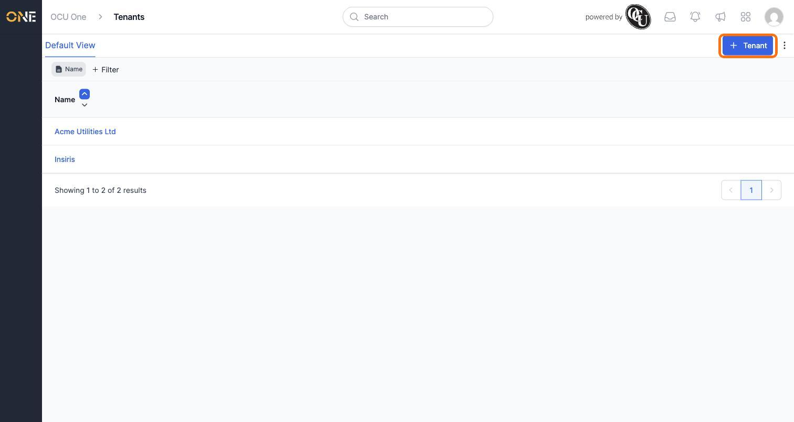
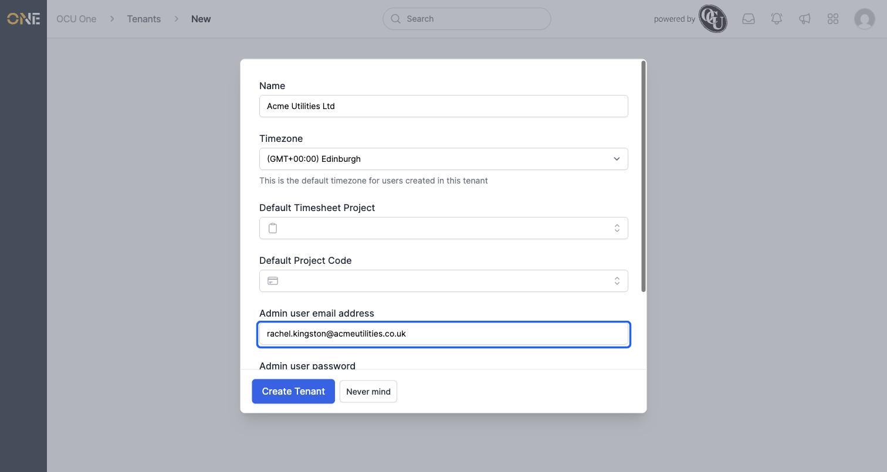
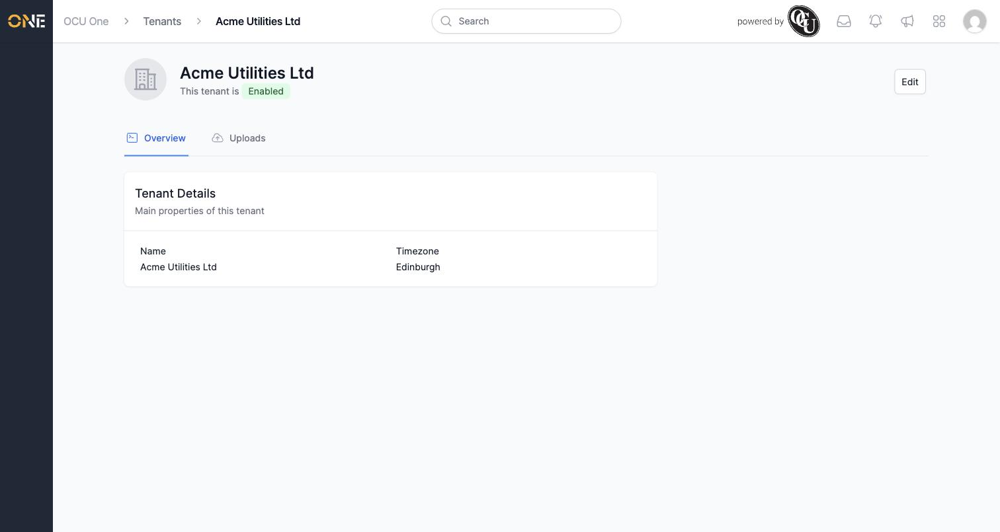
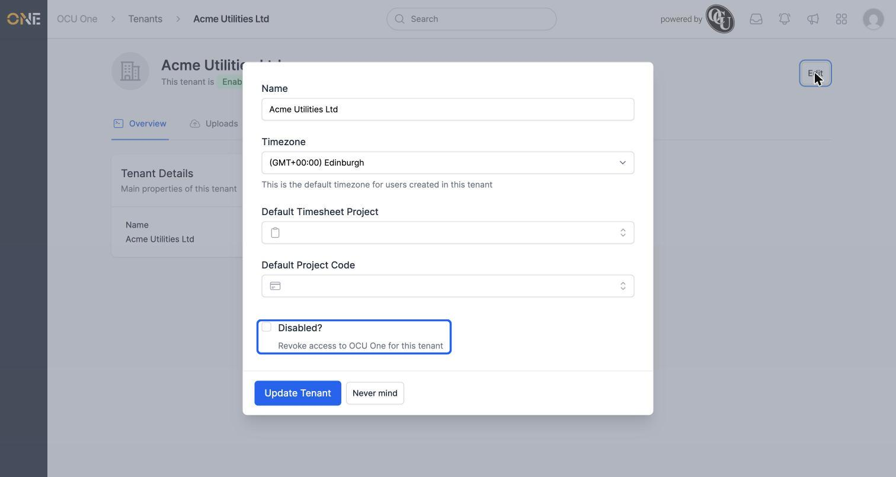
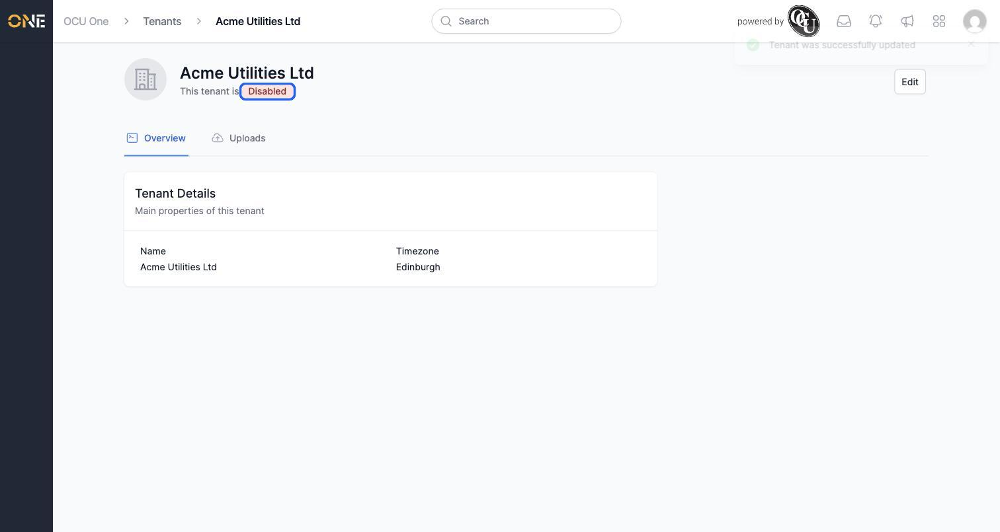

# Managing customer tenants

This screen is only available to OCU's own platform team — it lists every customer organisation ("tenant") using OCU One, and lets you create a new one, view or edit its details, and enable or disable its access.

## Where to find it

Open **Tenants** from the platform navigation. Every existing tenant is listed here, one row per organisation:

## Creating a new tenant

Click **+ Tenant**. A form opens asking for:

- **Name** — the organisation's name, e.g. "Acme Utilities Ltd".
- **Timezone** — the default timezone new users in this tenant will get.
- **Default Timesheet Project** and **Default Project Code** — optional defaults used elsewhere once the tenant is up and running; these can be left blank and set later.
- **Admin user email address** and **Admin user password** — the very first login for this tenant. Both are required, and only appear when creating a brand-new tenant — you can't add or change them afterwards from this form.

Click **Create Tenant** to save. The new tenant's own admin account is created automatically from the email and password you entered — that's the account whoever runs the organisation will use to sign in for the first time.

## Viewing and editing a tenant

Click a tenant's name from the list to open its overview, showing its **Name** and **Timezone**. From here, click **Edit** to change the name, timezone, or default timesheet project/project code.

**Good to know:** the **Admin user email address** and **Admin user password** fields only show up when creating a *new* tenant — editing an existing one never lets you change or re-set its admin account from here.

## Disabling a tenant

Tick **Disabled?** on the Edit form and save to revoke that tenant's access to OCU One entirely. The tenant's overview page immediately reflects this with a red **Disabled** badge in place of the green **Enabled** one:

Unticking **Disabled?** and saving again restores access.

## Other things to know

- This whole area is gated to OCU's own platform team — it isn't something any customer's own users, even admins, can see or reach.
- There's no way to delete a tenant from here once created — disabling it is the only way to revoke its access.
