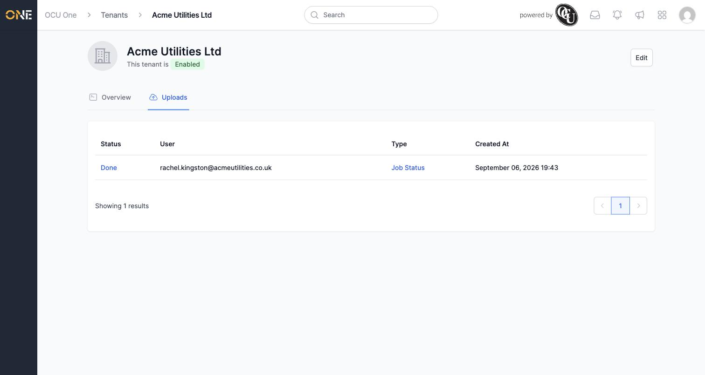

# Reviewing a tenant's mobile uploads

Every piece of data a field user's mobile device sends back — a completed job status, a photo, a shift starting or ending, and so on — arrives as an upload. This screen, only available to OCU's own platform team, lists every upload sent by any user in a given customer tenant, so you can see at a glance what's come in and whether anything needs attention.

## Where to find it

Open the tenant from the **Tenants** list, then click its **Uploads** tab:

Each row shows:

- **Status** — where the upload is in processing, e.g. **Done**.
- **User** — the email address of whoever's device sent it.
- **Type** — what kind of upload it is, e.g. **Job Status**.
- **Created At** — when it arrived.

## Other things to know

- **Status** and **Type** are both links through to that specific upload's own detail screen, where it can be inspected and resolved further — that's covered in its own guide.
- This list only ever shows uploads for the one tenant you're currently viewing — there's no way to see uploads across every tenant at once from here.
- Like the rest of this tenant's pages, this tab is only reachable by OCU's own platform team, never by a customer's own users.
