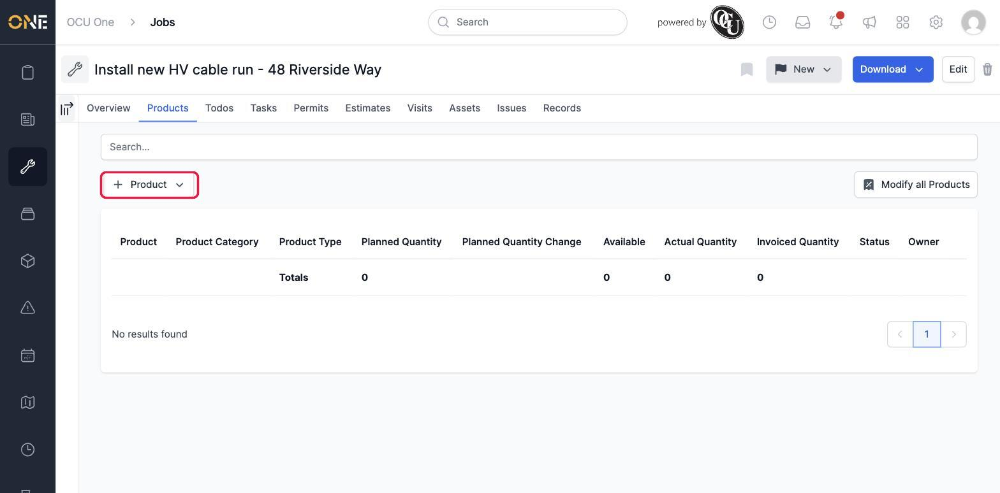
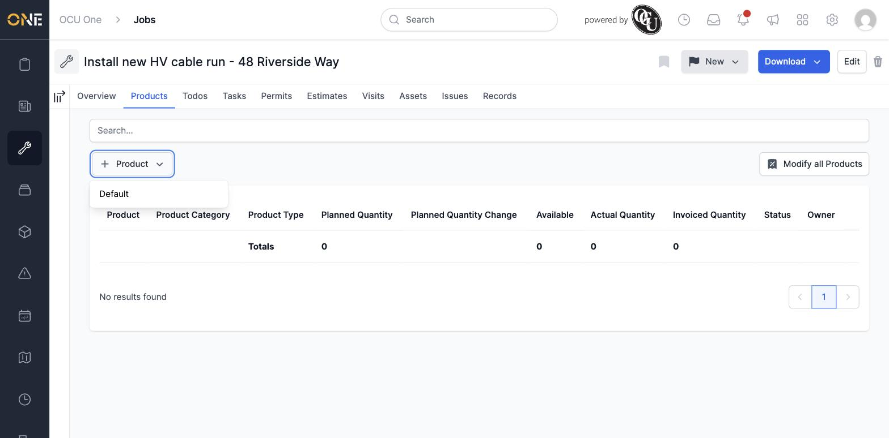
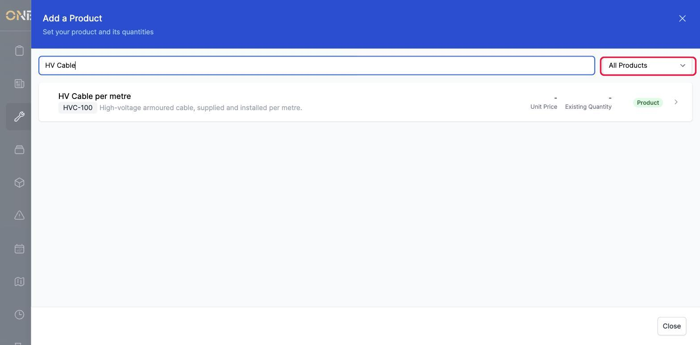
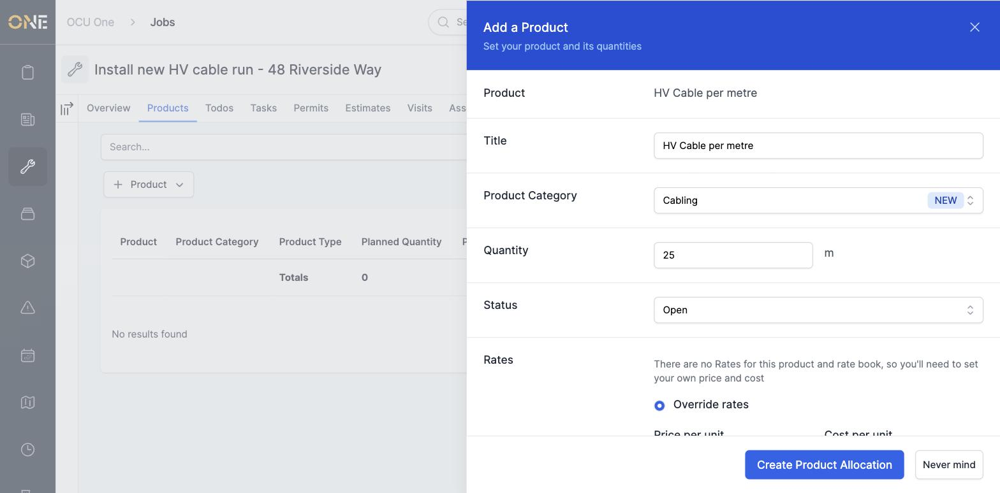
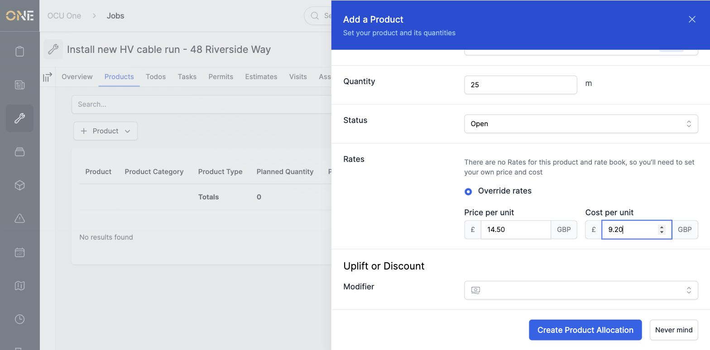
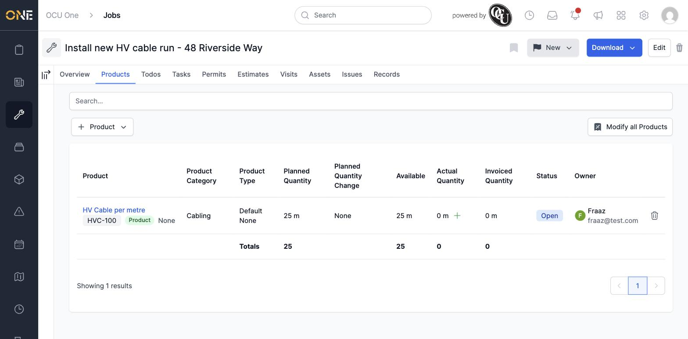

# Allocating products or materials to a job, project, estimate, or variation

Jobs, projects, estimates, and variations all share the same **Products** tab for planning out the materials, parts, or other billable items a piece of work needs. This is where you add something new to that plan from scratch. (If you instead want to pull something that's *already* planned on a related record — like giving a task a slice of what the project has planned — that's covered in its own guide.)

## Where to find it

Open a job (or project, estimate, or variation) and click its **Products** tab.

With nothing allocated yet, the tab shows an empty table with a search box and a **+ Product** button above it.

## Choosing what to add

Click **+ Product**. If your organisation only has one type of allocation set up, it appears straight away; if there's more than one (for example, separate types for materials and labour), you're asked to pick one first.

This opens a search screen listing products from your catalogue, showing each one's unit price and how much of it is already allocated elsewhere.

**Good to know:** the dropdown in the top-right of this screen controls which products you're shown, and it matters — by default it's set to **Rate Book Products**, which only shows products that already have a price set up. If you can't find the product you're after, switch it to **All Products** to search the whole catalogue instead.

## Filling in the details

Click the product you want, and a form appears for its quantity and pricing.

- **Title** is filled in with the product's name automatically — change it if you want this particular allocation to be labelled differently.
- **Product Category** lets you group similar allocations together. Start typing to search for an existing category, or type a new one and choose **Use "..."** to create it on the fly.
- **Quantity** is how much of the product this record needs, shown next to its unit of measure (here, metres).
- **Status** defaults to **Open**.

Underneath, the **Rates** section either lets you use an existing rate book price, or — if none has been set up for this product yet — asks you to enter your own price and cost per unit instead, as it does here:

Below that is an optional **Modifier** field, for applying a pre-set uplift or discount percentage across this allocation — leave it blank if it doesn't apply.

Click **Create Product Allocation** to save it.

## Seeing it on the Products tab

The new allocation appears as a row in the table, and the totals at the bottom of the table update to include it:

Each row shows:

- **Product**, its reference code, and **Product Category** / **Product Type** — what it is and how it's classified.
- **Planned Quantity** — how much is currently planned.
- **Planned Quantity Change** — shows how the quantity has changed since it was first set, once it's been changed.
- **Available** — how much of this is still free to hand out further down the chain (for example, to a task underneath a project).
- **Actual Quantity** — how much has actually been recorded as used, with a small **+** to log a new record.
- **Invoiced Quantity** — how much of it has made it onto an invoice.
- **Status** and **Owner** — who added it.

Depending on your role, you may also see columns for rates, costs, and planned totals here.

## Doing this on a project, estimate, or variation instead

The process is identical wherever you start it — open the record's **Products** tab and follow the same steps. The only differences you might notice:

- On a **variation**, the search screen defaults to showing products already used elsewhere on the related project, rather than rate book products.
- On records that sit underneath something else (like a task under a project, or a job linked to a project), you may also see an **Allocate from** option next to **+ Product**. That pulls an existing allocation across from the related record instead of creating a brand new one, and is covered separately.
- A task's own Products tab never shows a **+ Product** option at all, regardless of whether product allocations are enabled for that task type — see *Managing a task's product allocations tab* for how allocations get onto a task.

Once an allocation exists, editing its details, changing its planned quantity, and recording actual usage against it all work the same way regardless of where it was created — see *Viewing and managing product allocations on a project* and *Managing a task's product allocations tab* for those steps.

## Other things to know

- If you keep needing to override the price and cost by hand for the same product, it's worth asking whoever manages your rate books to add a proper rate for it — that saves everyone from typing it in each time.
- A product only shows up under **Existing Products** in the search screen once someone has planned it somewhere on that record already, so on a fresh job, project, estimate, or variation you'll always need **Rate Book Products** or **All Products** to find things for the first time.
