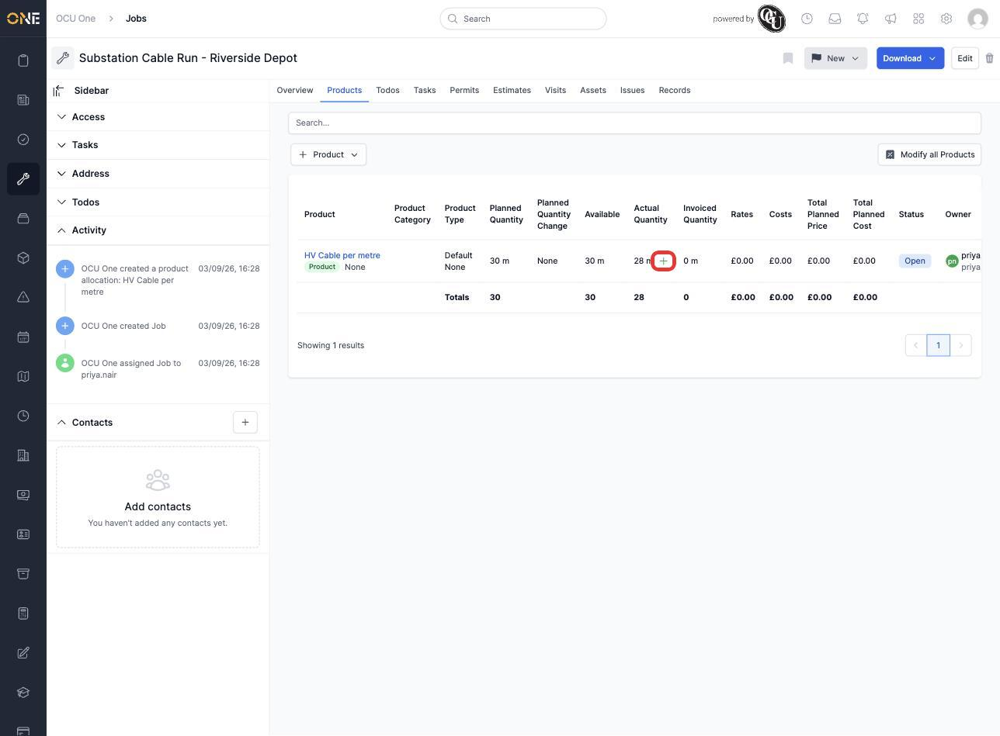
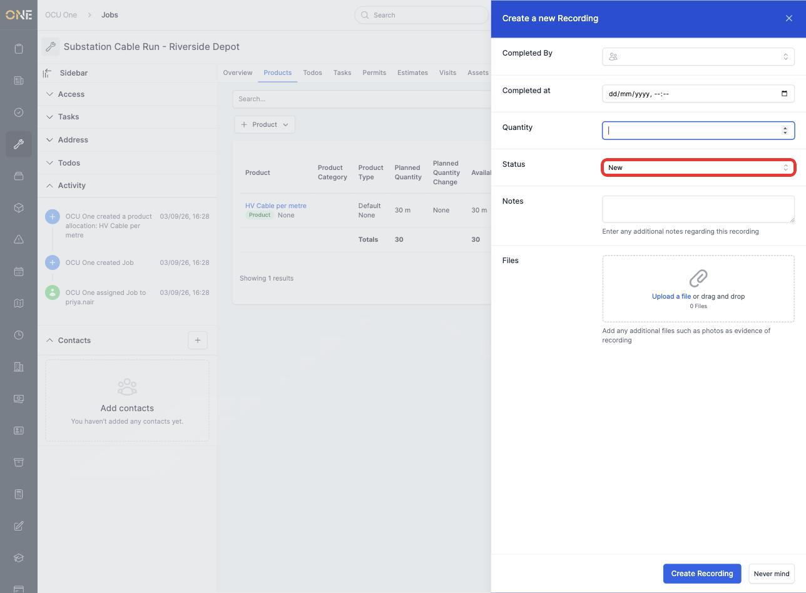
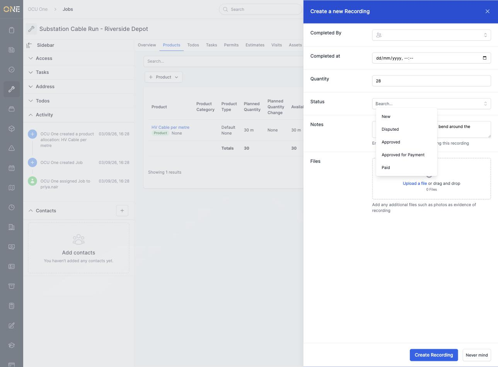
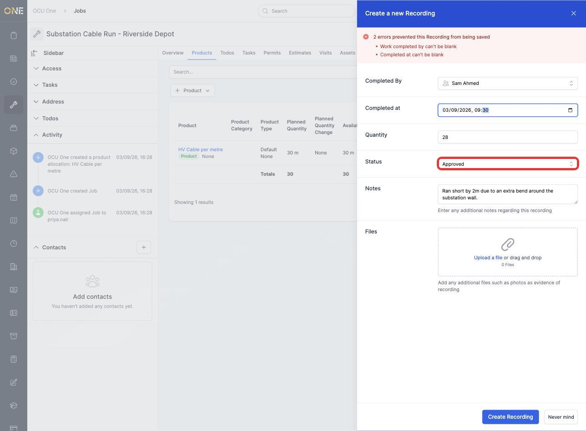
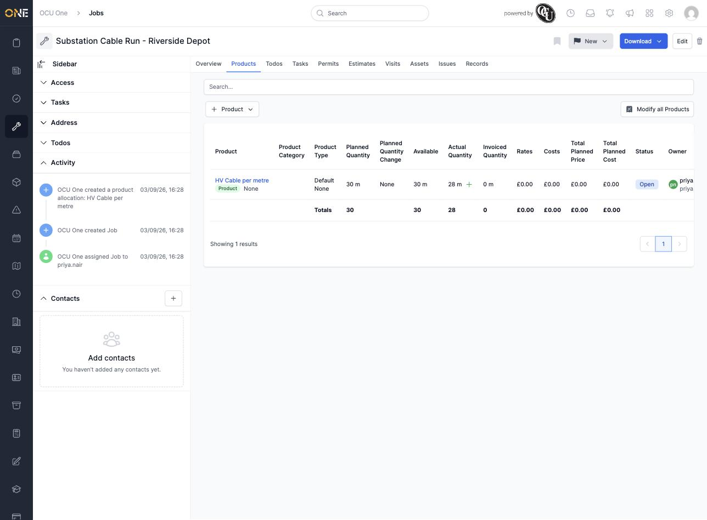
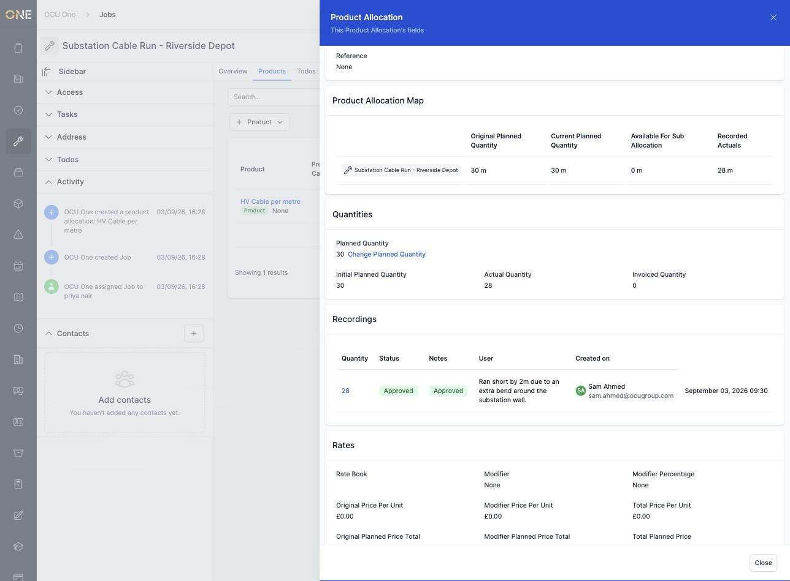

# Recording actual product usage against an allocation

Once work is underway, you can log exactly how much of a planned product has actually been used — separate from the original plan, so you can always see the two side by side.

## Where to find it

On a Products tab, look for the small **+** icon next to the **Actual Quantity** figure on a row.

## Logging the usage

Click it, and a "Create a new Recording" panel opens with fields for **Completed By**, **Completed at**, **Quantity**, **Status**, **Notes**, and any supporting **Files** such as photos. Completed By and Completed at are both required.

**Status** lets you track where this recording is in its own approval process, separately from the quantities themselves. Click it to see the options:

Choose who actually completed the work, when, how much was used, and a status. Add a note explaining anything worth flagging — here, that the run came up 2 metres short because of an extra bend around a wall.

Click **Create Recording** to save it. The Products tab updates immediately — the **Actual Quantity** column now shows what's actually been used, alongside the original **Planned Quantity**.

## Viewing a recording's detail

Click the product's name to open the allocation's detail panel and scroll down to the **Recordings** section. Every recording made against this allocation is listed here with its quantity, status, notes, who completed it, and when.

## Things to know

- You can add more than one recording against the same allocation — for example, logging usage in stages as work progresses. Each one is tracked separately, and the Actual Quantity total reflects all of them combined.
- Completed By and Completed at are both required — you can't save a recording without saying who did the work and when.
- Status is there to track a recording's own approval state (New, Disputed, Approved, Approved for Payment, Paid) independently of the allocation's own status, which stays Open until the whole allocation is closed out.
- Attaching photos under Files gives a visual record alongside the numbers — useful evidence if a recording is later disputed.
