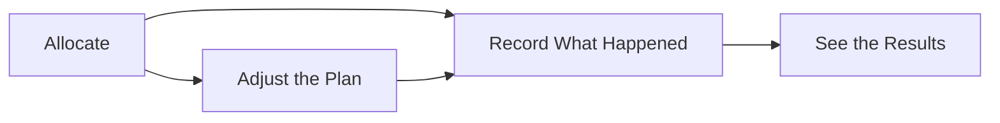

# Planned vs Actual — Overview

If you allocate products or materials to jobs, projects, estimates, or variations, you'll come across the terms **Planned** and **Actual** everywhere — on allocations, on dashboards, in reports. This guide explains what they mean and how all the individual pieces fit together, before you dive into the detailed guides for each part.

The guides these pieces are split across live in a few different folders in this repo (**Product Allocations**, **Products & Rates**, and **Projects**) rather than one single area — this overview is what ties them back together as one Planned-vs-Actual concept.

## What "Planned" and "Actual" mean

**Planned** is what you expect to happen — the quantity of a product you think a job will need, based on the quote, the estimate, or your best guess at the time.

**Actual** is what really happened — the quantity that was genuinely used, installed, or completed once the work was done.

These two numbers start out the same (or close to it) when you first allocate something, and then naturally drift apart as work progresses — you order more cable than expected, a job finishes early, a part turns out not to be needed. Tracking both side by side is what lets you see that drift instead of only finding out about it once the invoice lands.

## Why this matters

Comparing Planned against Actual is how you keep a handle on:

- **Spend** — whether a job is on track to cost what was quoted, or running over.
- **Materials** — whether what's been used matches what was ordered or allocated, so nothing goes missing or unaccounted for.
- **Progress** — how much of the allocated work is actually done, at a glance, without having to ask around.

The further Actual drifts from Planned, the more useful it is to have both numbers visible — rather than just one final total at the end.

## The end-to-end flow

It starts with **allocating** a product or material to whatever it belongs to — a job, project, estimate, or variation. See [Allocating products or materials to a job, project, estimate, or variation](Allocating%20products%20or%20materials%20to%20a%20job%2C%20project%2C%20estimate%2C%20or%20variation.md) for how that's done, and how prices come from the rate books and cost books set up in [Creating a rate book and its versions](../Products%20%26%20Rates/Creating%20a%20rate%20book%20and%20its%20versions.md), [Setting product rates within a rate book version](../Products%20%26%20Rates/Setting%20product%20rates%20within%20a%20rate%20book%20version.md), [Managing sell rates on a product](../Products%20%26%20Rates/Managing%20sell%20rates%20on%20a%20product.md), and [Managing cost rates on a product](../Products%20%26%20Rates/Managing%20cost%20rates%20on%20a%20product.md). Each allocation also belongs to a Product Allocation Type (see [Managing product allocation types](../Products%20%26%20Rates/Managing%20product%20allocation%20types.md)) and can carry a Rate Category (see [Managing rate categories](../Products%20%26%20Rates/Managing%20rate%20categories.md)), which together decide things like what statuses it can move through and how it's grouped for reporting.

Once something is allocated, you're not stuck with the original numbers. If the allocated quantity needs to change — more was needed, less was needed, plans shifted — you raise a change against it rather than silently editing the figure, so there's a record of what changed and why. See [Raising a planned quantity change on an allocation](Raising%20a%20planned%20quantity%20change%20on%20an%20allocation.md), and [Viewing planned quantity change history](Viewing%20planned%20quantity%20change%20history.md) to look back over everything that's changed on an allocation over time. Allocations themselves can also be edited, removed, copied onto another record entirely, or have a rate modifier applied in bulk — covered in [Editing or removing a product allocation](Editing%20or%20removing%20a%20product%20allocation.md), [Copying or transferring allocated products between records](Copying%20or%20transferring%20allocated%20products%20between%20records.md), and [Bulk-applying a rate modifier to all allocated products](Bulk-applying%20a%20rate%20modifier%20to%20all%20allocated%20products.md).

Once work is actually carried out, you record what really happened against the allocation — how much was genuinely used or completed. This is the Actual side of the picture, and it's covered in [Recording actual product usage against an allocation](Recording%20actual%20product%20usage%20against%20an%20allocation.md).

From there, you can see everything allocated to a project or a task at once — see [Viewing and managing product allocations on a project](../Projects/Viewing%20and%20managing%20product%20allocations%20on%20a%20project.md) and [Managing a task's product allocations tab](../Projects/Managing%20a%20task%27s%20product%20allocations%20tab.md) — and finally see Planned and Actual brought together as totals and differences on [Viewing a project's commercial stats dashboard](../Projects/Viewing%20an%20projects%20commercial%20stats%20dashboard.md).

## The flow at a glance

- **Allocate** — assign a product or material to a job, project, estimate, or variation, with a planned quantity.
- **Adjust the Plan** — raise a change if the planned quantity needs updating, before or during the work.
- **Record What Happened** — log the actual quantity once it's known.
- **See the Results** — view Planned and Actual side by side, on the allocation, the project, or the commercial stats dashboard.

Not every allocation goes through every step — plenty are allocated and recorded without ever needing a plan change — but this is the full path any single allocation can take.
