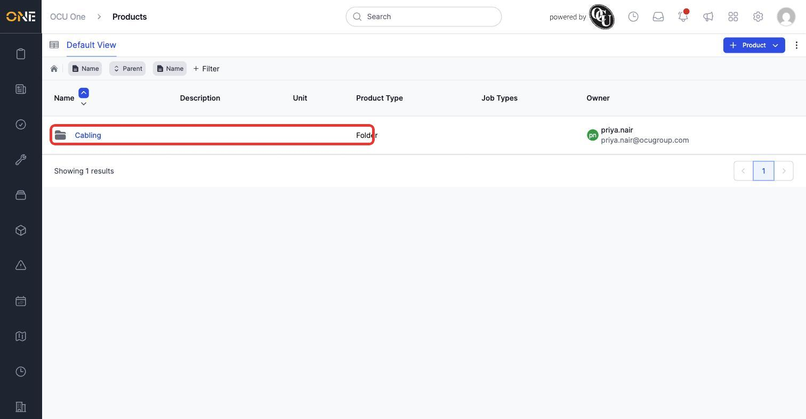
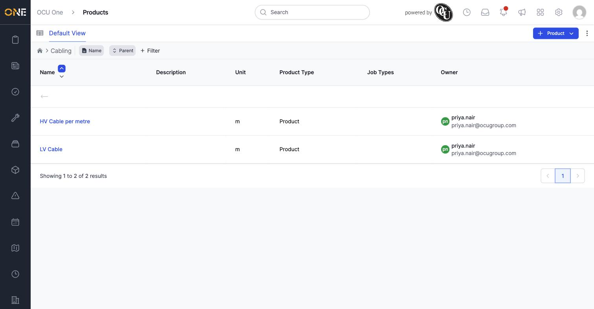
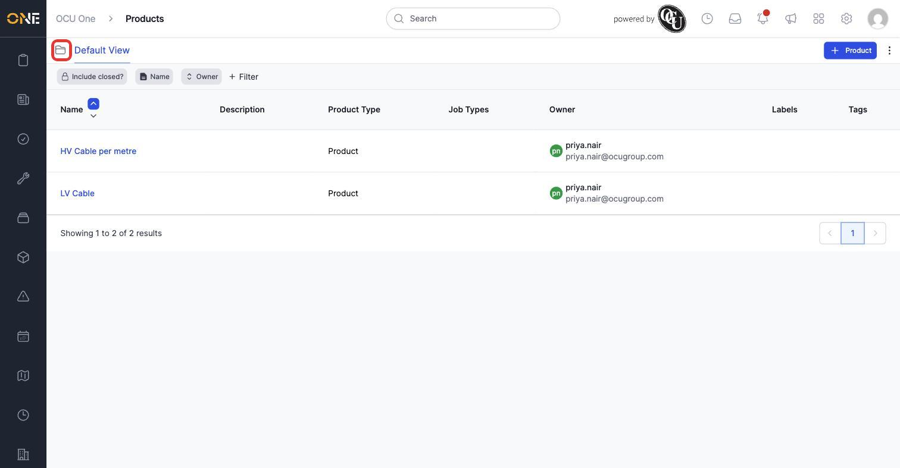

# Browsing the product catalog and drilldown hierarchy

Every product and material your organisation can allocate to work lives in the product catalog. Products can be grouped into folders, and folders can contain other folders or products, so the catalog can go as many levels deep as you need. There are two ways to browse it — a drilldown tree view that shows one level at a time, and a flat table view that lists everything at once.

## Browsing the drilldown tree

The drilldown view shows the top level of the catalog first. Folders show a folder icon next to their name.

*The drilldown view. Clicking anywhere in a folder's row (not just its name) opens that folder and shows what's inside it.*

Clicking into a folder shows only what's directly inside it, with a breadcrumb across the top showing where you are and a back arrow to go up a level.

*Inside "Cabling": two products, "HV Cable per metre" and "LV Cable". The breadcrumb at the top ("Cabling") and the back arrow row let you navigate back out.*

Clicking a product's name (rather than a folder's row) takes you straight to that product's own overview page.

## Switching to the table view

If you'd rather see everything in one flat, sortable list instead of browsing folder by folder, click the view icon in the top left to switch to the table view. The same icon switches back to the drilldown view when you're already in the table.

*The table view lists every product regardless of which folder it's in — here filtered by name to just the two cable products for this example. The circled icon in the top left switches back to the drilldown view.*

The table view also has an **Include closed?** toggle, letting you show products that have been deleted (archived), which the drilldown view doesn't offer.

## Sorting and filtering

Both views let you sort by clicking a column heading, and both support adding filters (the **+ Filter** button) to narrow down what's shown — by name, description, reference, owner, and more. This is especially useful in the table view once your catalog has grown large, since it's no longer organised by folder there.
