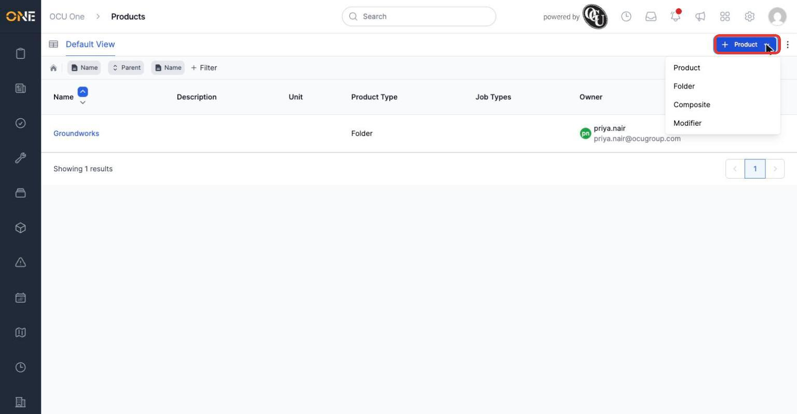
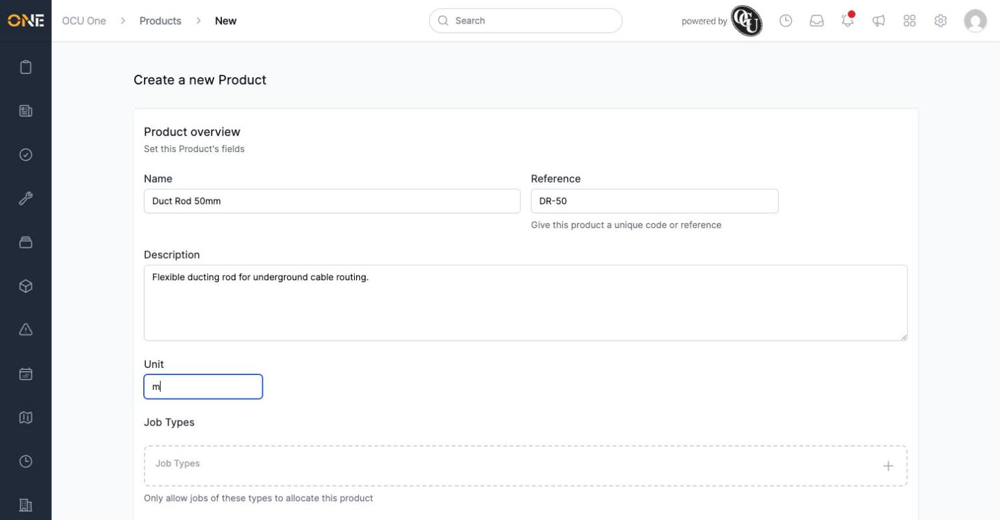
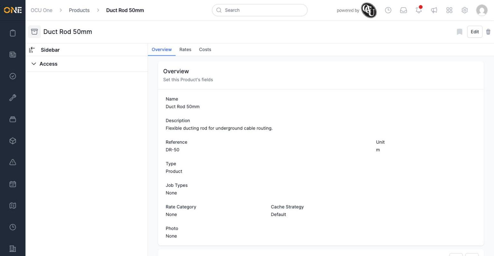
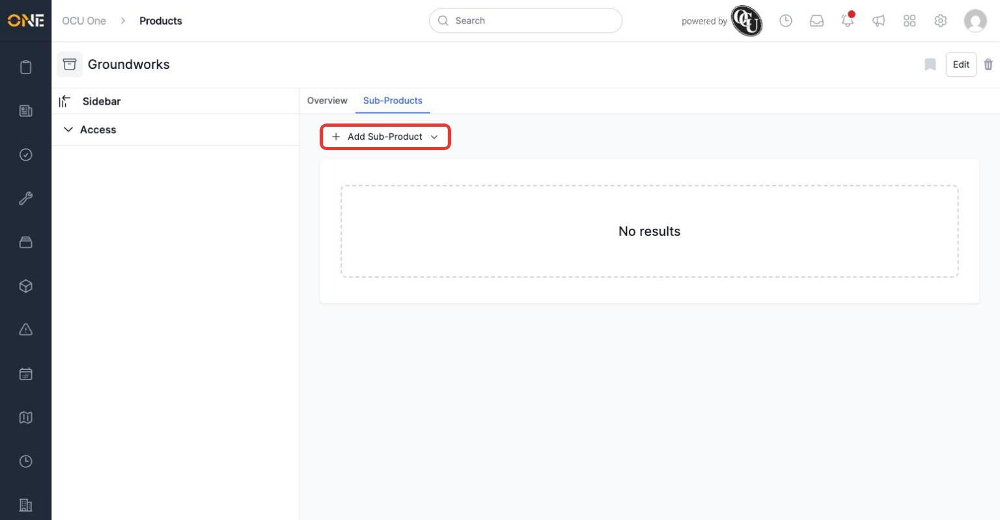
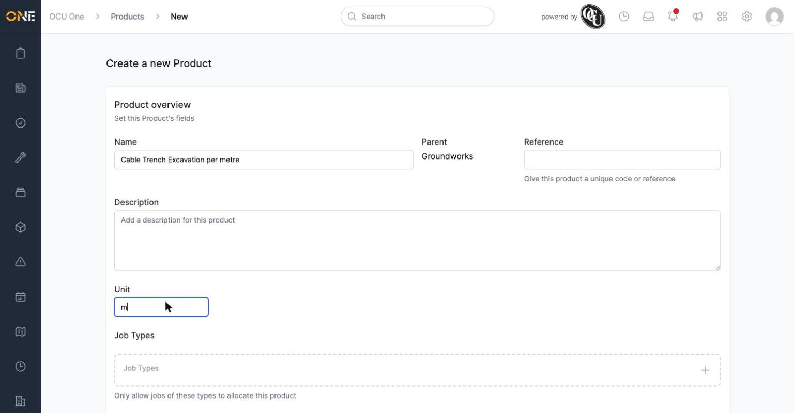
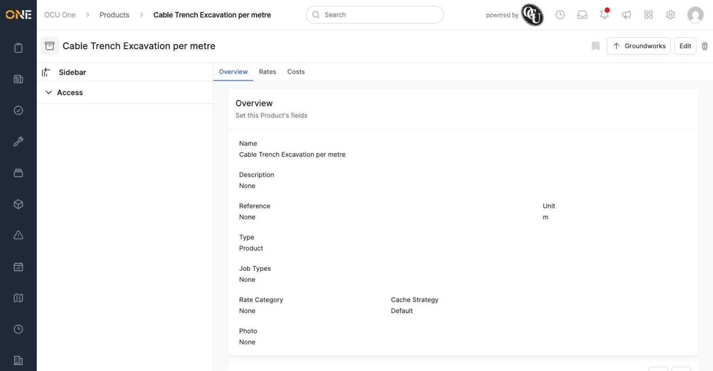

# Creating a product or sub-product

New products and materials are added to the catalog from the Products area, either as standalone top-level items or nested underneath a folder as a sub-product. The steps are almost identical either way — the difference is just where you start.

## Creating a top-level product

From the products drilldown or table view, click the arrow next to the **+ Product** button to see what you can create.

*Choosing a type from this menu takes you to the new product form pre-set to that type.*

Most of the time you'll pick **Product**. This opens the "Create a new Product" form.

*A minimum of a Name is required. Reference, Description, and Unit are optional but recommended — Unit especially, since it's what shows on allocations and rates later (e.g. "m" for metres).*

Scroll down and click **Create Product** to save it. You land on the new product's own overview page.

*The product is created with no parent — it appears as a top-level item in the catalog.*

## Creating a sub-product

To add a sub-product instead, open the folder you want it inside and go to its **Sub-Products** tab, then click **Add Sub-Product**.

*A folder with no sub-products yet shows "No results" here. The same type menu (Product, Folder, Composite, Modifier) appears when you click Add Sub-Product.*

The form is the same as before, except the **Parent** is already set to the folder you started from.

*The Parent field confirms which folder this will be added under. You can still change the product's parent later by editing it.*

Once created, the sub-product's page shows a button back to its parent folder in the top right, and it now appears in the parent's Sub-Products tab.

*Clicking "Groundworks" in the top right takes you straight back to the parent folder.*

**Worth knowing:** only folders can have sub-products — you can't add a sub-product to a plain product. If you want to build out a hierarchy, start by creating a Folder, then add products or further folders underneath it.
