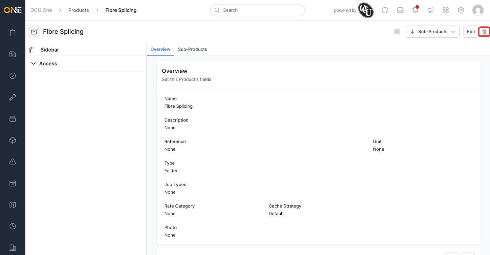
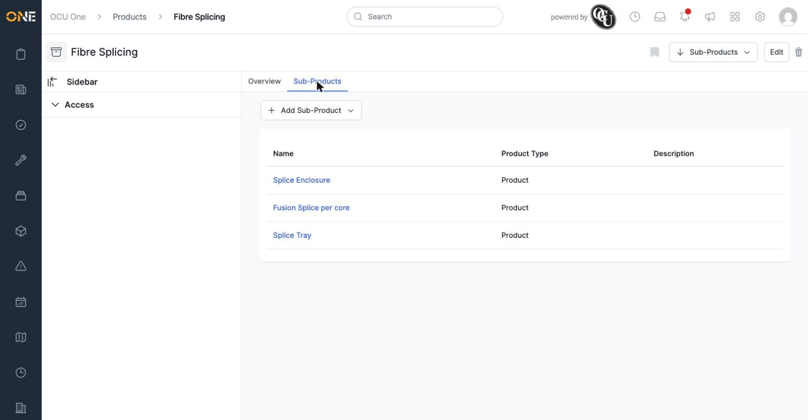
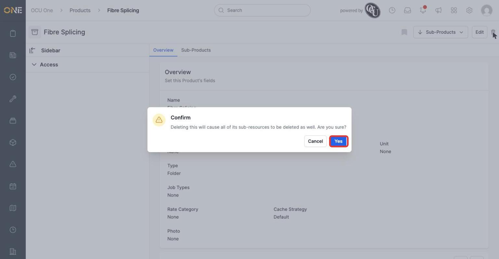
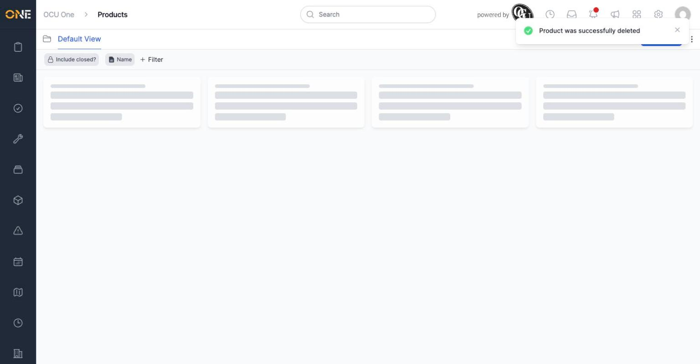

# Deleting a product

If a product or folder is no longer needed, you can delete it from its own overview page.

*The trash icon sits next to Edit in the top right of any product or folder's page.*

This example, "Fibre Splicing", is a folder with three sub-products underneath it.

Clicking the trash icon brings up a confirmation dialog before anything is deleted.

*Click "Yes" to confirm, or "Cancel" to back out without changing anything.*

Once confirmed, you're taken back to the products list and a confirmation message appears.

Deleting a product doesn't erase it outright — it archives it, so it stops appearing in normal browsing and can't be allocated to anything new, but the record itself isn't wiped from history.

**Worth knowing:** although the confirmation dialog warns that sub-resources will be deleted too, only the product or folder you deleted is actually archived — its sub-products stay active and remain reachable directly (for example, from a link, a saved view, or global search), even though they no longer show up when browsing from the top of the catalog since their parent is now archived. If you're deleting a folder that has sub-products you also want gone, delete each sub-product individually as well rather than relying on the parent's delete to remove them for you.
