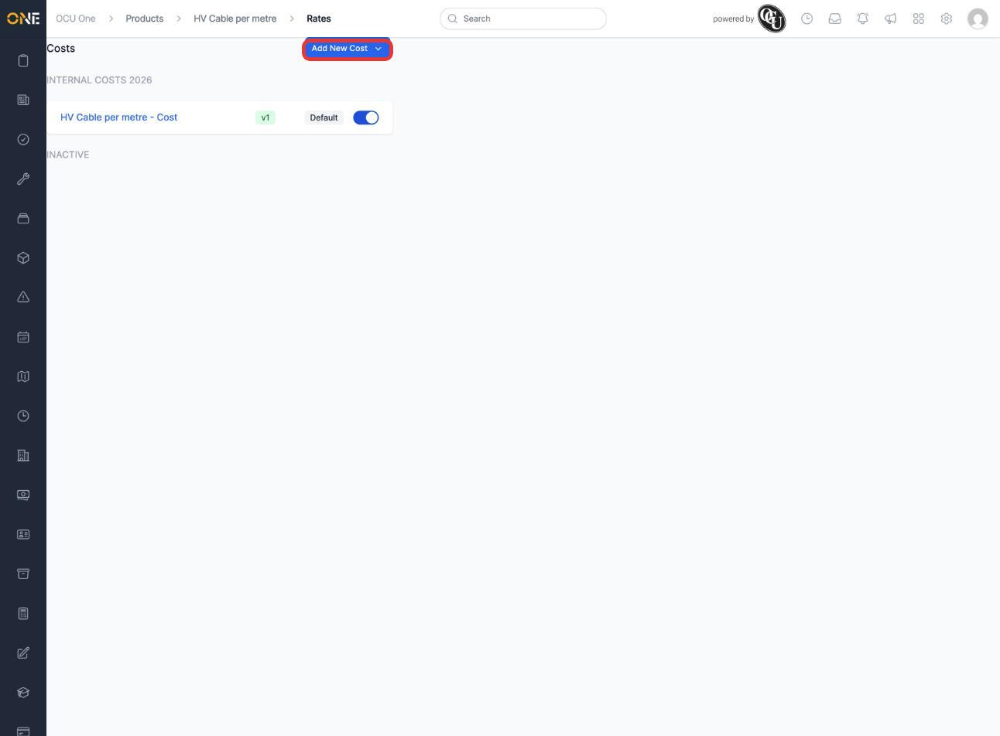
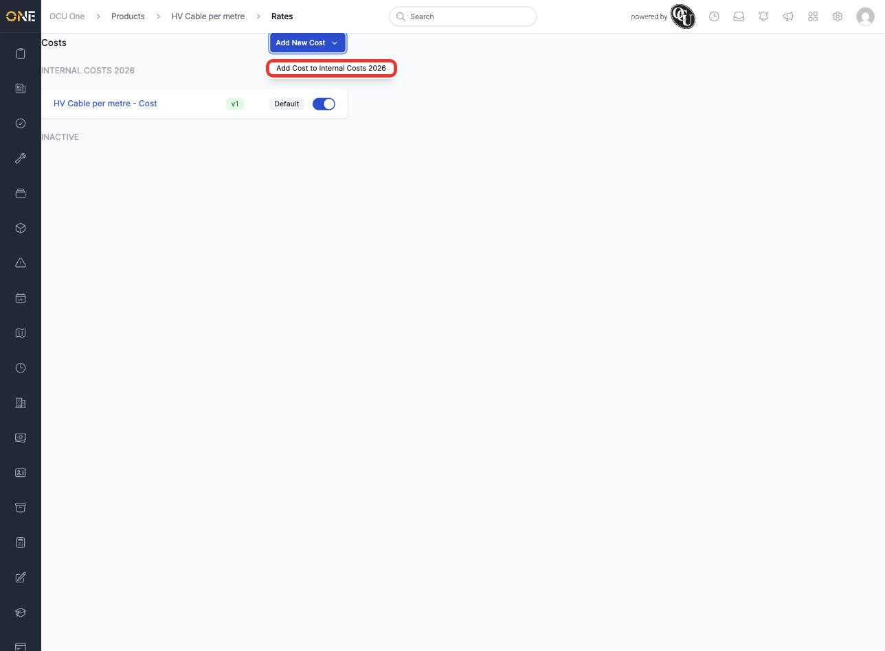
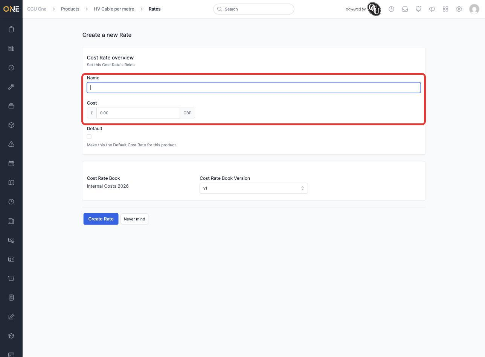
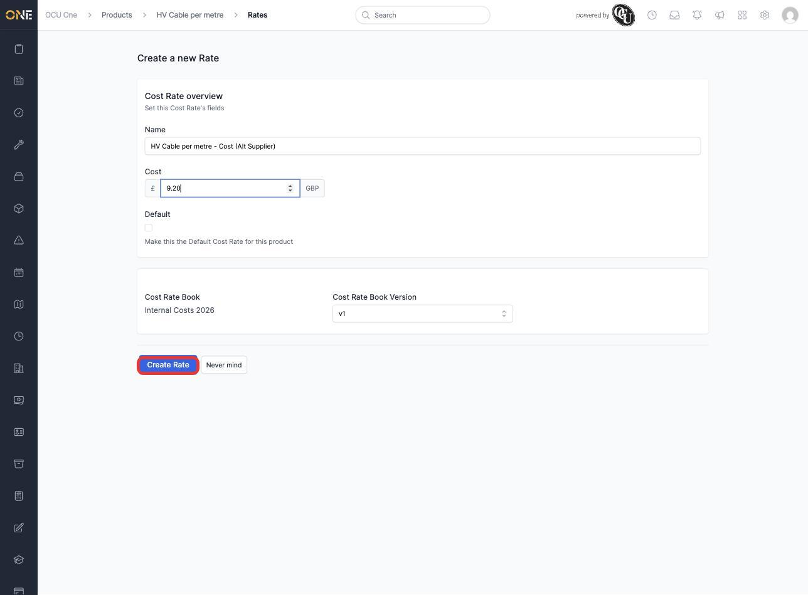
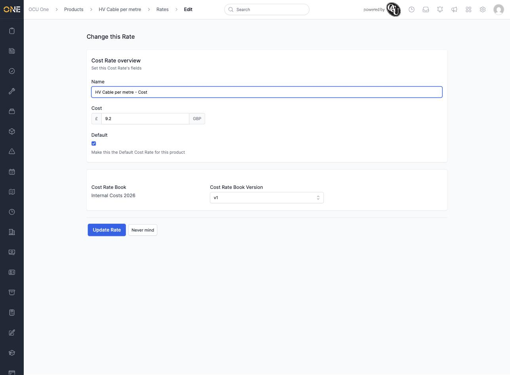

# Managing cost rates on a product

Every product has two sides to its pricing: what you charge a client for it (its **Rates**, covered in a separate guide) and what it actually costs your business internally — materials, supplier price, labour cost, and so on. The **Costs** tab on a product is where you manage that internal cost side, kept under its own set of cost books so it's never confused with your sell prices.

## Viewing a product's cost rates

1. Open a product and go to its **Costs** tab. Existing cost rates are grouped by the cost book they belong to — here, "HV Cable per metre" has one cost rate under the **Internal Costs 2026** cost book.

   

   A rate marked **Default** is the one used automatically wherever this product's cost needs to be looked up without specifying a particular cost book version.

## Adding a new cost rate

1. Click **Add New Cost**, then choose which cost book to add it to.

   

2. Fill in the cost rate's details — a **Name**, the **Cost** amount, and whether it should be the **Default** cost rate for this product. Notice the form is labelled for costs throughout ("Cost Rate overview", "Cost Rate Book") so it's always clear you're setting an internal cost, not a client-facing sell price — and unlike the Rates form, there's no income amount to fill in here, since a cost rate only tracks what something costs you, not what you charge for it.

   

3. Enter the details and click **Create Rate**.

   

## Editing an existing cost rate

1. Click a cost rate's name from the Costs tab to open it for editing. The same cost-specific form appears, pre-filled with its current values — update the name, cost, or default status, then click **Update Rate**.

   

## Things to know

- Cost rates live in their own **cost books**, separate from the rate books used for sell rates — a product can have cost rates in one cost book and sell rates in a completely different rate book, since they're tracking different things.
- Only one cost rate per cost book can be the **Default** for a given product — setting a new one as Default automatically un-defaults the previous one.
- Toggling a rate's active switch (next to Default) deactivates it without deleting it — it moves to the **Inactive** group at the bottom of the list and stops being used, but stays there if you need to reactivate it later.
- If you click **Never mind** while creating a brand new cost rate, you're currently taken back to the product's **Rates** tab rather than Costs — just click the **Costs** tab again to get back to where you started. This is a known quirk, not something wrong on your end.
