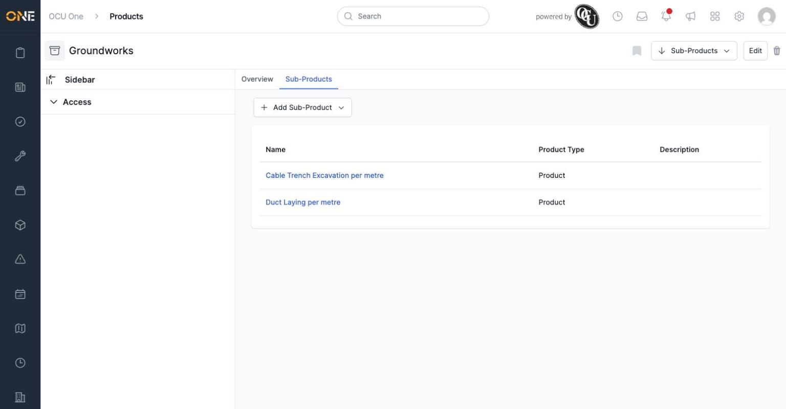
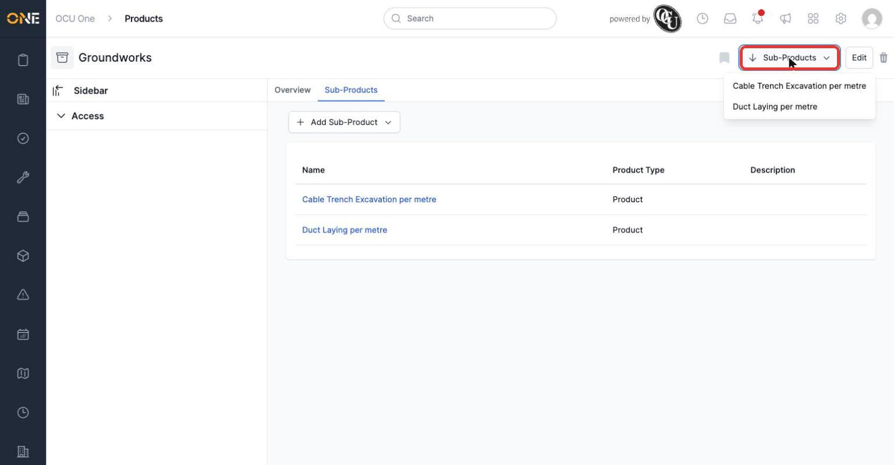

# Viewing a product's sub-products

A folder's **Sub-Products** tab lists everything directly nested underneath it.

*Each row shows the sub-product's name, type, and description. Clicking a name takes you to that sub-product's own overview page.*

This tab only appears on folders (and composite products) — a plain product has no Sub-Products tab, since it can't have anything nested underneath it.

## Jumping to a sub-product from anywhere

Wherever you are on a folder's pages, a **Sub-Products** button in the top right gives quick access to the same list as a dropdown, without switching tabs.

*Clicking a sub-product's name here takes you straight to it, the same as clicking it in the tab.*

If a folder has a lot of sub-products, this button switches to a plain link that takes you to the Sub-Products tab instead of showing them all in a dropdown.
