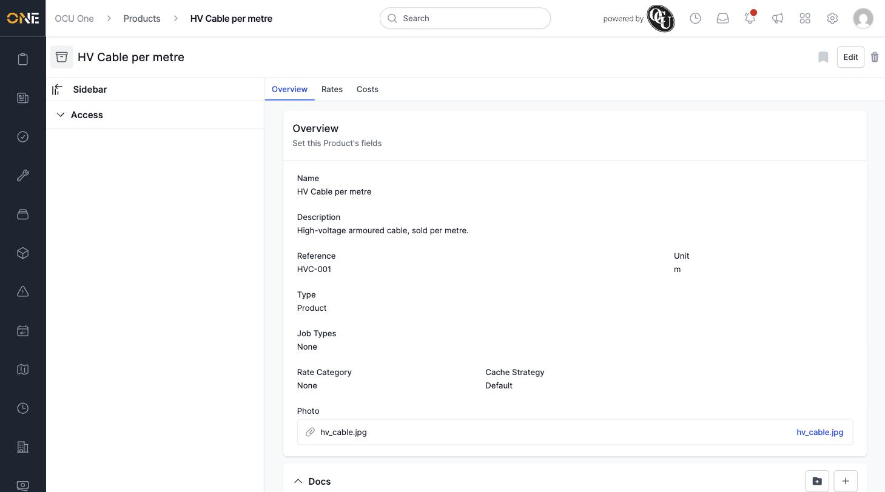
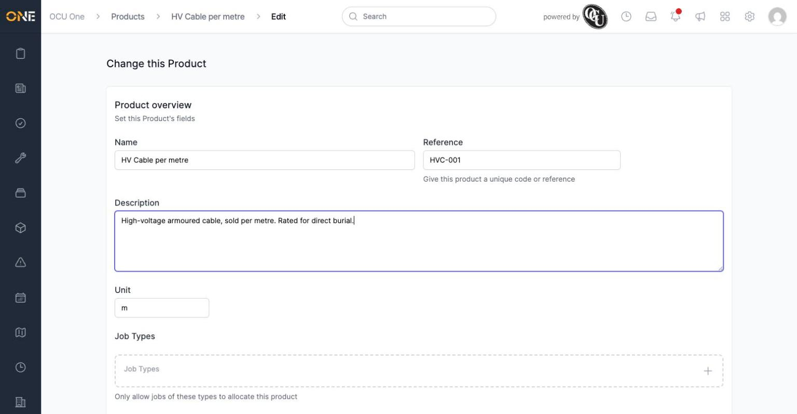
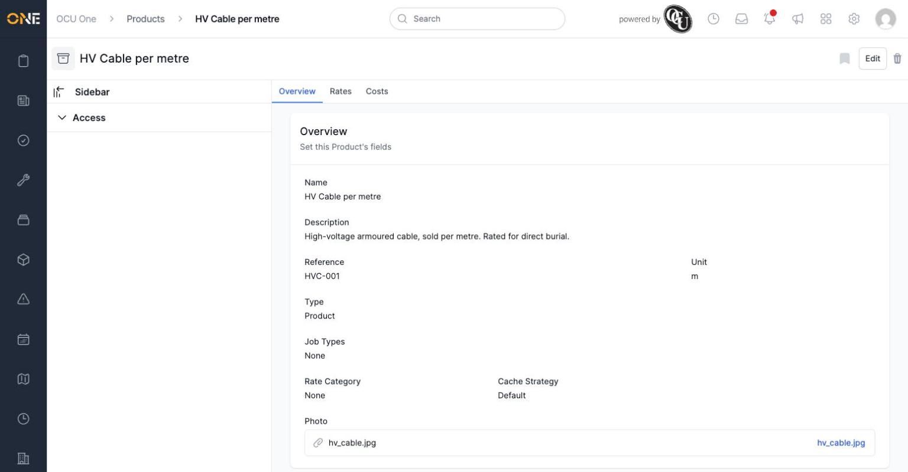
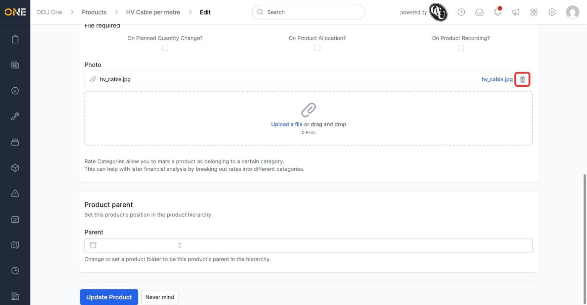
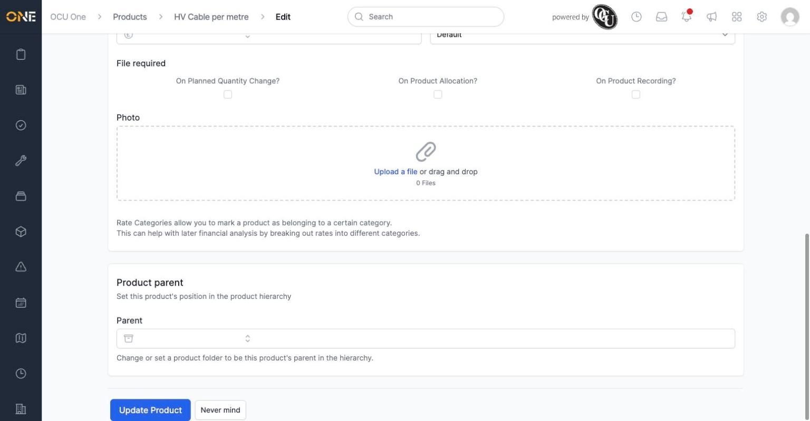

# Viewing and editing a product

Every product has its own overview page showing everything set on it — its name, description, reference, unit, rate category, and photo.

*"HV Cable per metre" with a description, reference ("HVC-001"), unit ("m"), and an attached photo shown as a file link.*

## Editing a product

Click **Edit** in the top right to change any of these fields.

*Every field from the overview page can be changed here, including Name, Reference, Description, and Unit.*

Scroll down and click **Update Product** to save your changes. You're taken back to the overview page, now showing the updated details.

## Removing a photo

To remove a product's photo, open **Edit** and find the **Photo** field — the attached file is listed with a trash icon next to it.

*Clicking the trash icon removes the photo immediately — it doesn't wait for you to click Update Product.*

Once removed, the field goes back to an empty upload box, ready for a new photo if needed.

**Worth knowing:** removing a photo this way takes effect straight away, separately from the rest of the form — if you decide afterwards you didn't want to remove it, you'll need to upload it again rather than being able to undo it with "Never mind".
