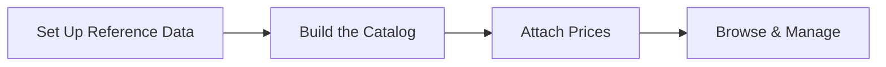

# Products & Rates — Overview

**Products & Rates** covers everything about the catalog of products and materials your organisation allocates to work, and the prices attached to them — what you charge for a product, what it costs you internally, and the reference data (rate books, rate categories, allocation types) that all of that draws on. This guide explains how the pieces fit together, before you dive into the detailed guides for each part.

## The core pieces

A **Product** is a single item or material in the catalog — a name, an optional reference, description, unit (e.g. "m" for metres), and an optional photo. Products can be grouped into **Folders**, and folders can contain further folders or products, so the catalog can nest as many levels deep as needed — a folder's contents are its **sub-products**.

A **Rate Book** is a named price list. Its **Source** decides what kind of list it is: **Price** rate books hold what you charge for a product (a "sell rate"), **Cost** rate books — sometimes just called cost books — hold what a product costs you internally. Every rate book can have several **versions**, each a dated snapshot of the whole list, so prices can be updated for a new year or contract without losing the old figures.

A **Rate Category** is a simple Income/Expenditure tag you can attach to a product for reporting — it doesn't affect pricing itself.

A **Product Allocation Type** decides what statuses an allocation of a product can move through (Open, Locked, Closed) and whether it counts as revenue, cost, both, or neither. These are what someone picks between when they allocate a product to a job, project, estimate, or variation.

## Why this matters

Keeping the catalog and its pricing organised is what makes allocating products elsewhere in the app fast and accurate:

- **Consistent pricing** — rates live on the rate book, not scattered across individual allocations, so updating a price for a new contract or year updates it everywhere that rate book is used.
- **Cost vs. sell visibility** — tracking what something costs alongside what it sells for, separately, is what makes margin visible at all.
- **Reporting and control** — rate categories and allocation types are what let allocations be grouped, filtered, and governed (e.g. locking a type as soon as it's used) without touching pricing itself.

## The end-to-end flow

It starts with **browsing the catalog** — either the drilldown tree, one folder at a time, or a flat, sortable table view of everything at once. See [Browsing the product catalog and drilldown hierarchy](Browsing%20the%20product%20catalog%20and%20drilldown%20hierarchy.md).

**Adding to the catalog** is covered in [Creating a product or sub-product](Creating%20a%20product%20or%20sub-product.md) — as a top-level item or nested under a folder — and [Viewing and editing a product](Viewing%20and%20editing%20a%20product.md) covers its overview page and changing its details later. A folder's contents are covered separately in [Viewing a product's sub-products](Viewing%20a%20product's%20sub-products.md). If something's no longer needed, [Deleting a product](Deleting%20a%20product.md) covers archiving it — worth knowing that deleting a folder does **not** delete its sub-products, they stay active and reachable even once their parent is archived.

Before a product can be priced, the reference data behind it needs setting up: [Creating a rate book and its versions](Creating%20a%20rate%20book%20and%20its%20versions.md) covers price books and cost books alike (the only difference is one setting), [Managing rate categories](Managing%20rate%20categories.md) covers the Income/Expenditure tags, and [Managing product allocation types](Managing%20product%20allocation%20types.md) covers what governs an allocation's status and invoicing model.

Once a rate book has a version, **pricing a product** can be done from either side: [Setting product rates within a rate book version](Setting%20product%20rates%20within%20a%20rate%20book%20version.md) covers attaching a price starting from the rate book, while [Managing sell rates on a product](Managing%20sell%20rates%20on%20a%20product.md) and [Managing cost rates on a product](Managing%20cost%20rates%20on%20a%20product.md) cover the same thing starting from the product itself — handy when you're focused on one product and want to see its price across every rate book at once.

## The flow at a glance

- **Set Up Reference Data** — rate books and versions, rate categories, allocation types.
- **Build the Catalog** — create products and folders, nest sub-products where needed.
- **Attach Prices** — set sell rates and cost rates, from either the rate book or the product's side.
- **Browse & Manage** — find things via the drilldown or table view, edit or delete as needed.

Not every product needs a cost rate, a rate category, or a custom allocation type — a product with just a name and a sell price is a complete, usable entry in the catalog. The full flow above is there for the level of detail a given product actually needs.
