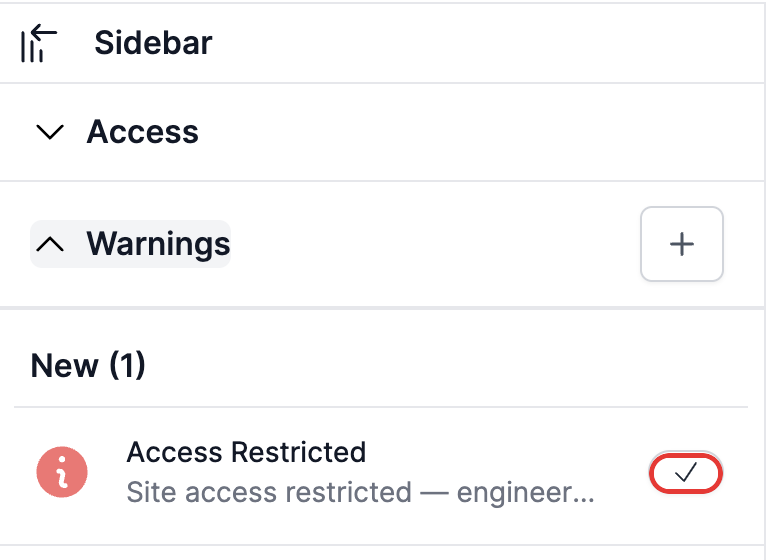
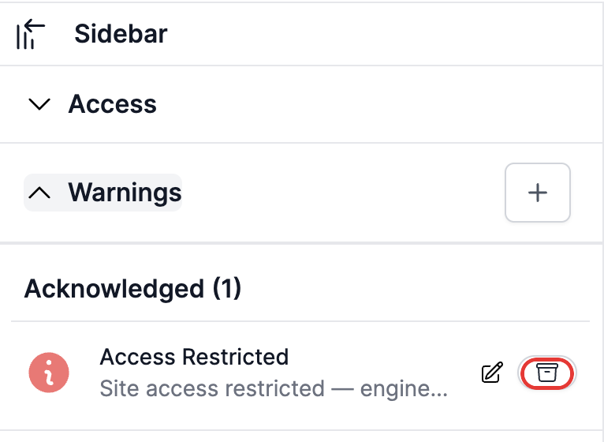
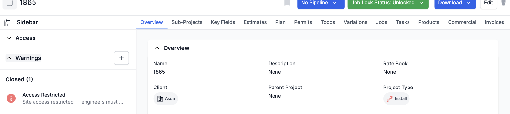

# Acknowledging and closing a warning

A warning moves through three stages: **New** → **Acknowledged** → **Closed**. Acknowledging shows you've seen and understood it; closing shows the issue is resolved.

## Acknowledging a warning

In the project's **Warnings** section, a warning listed under **New** has a checkmark button next to it.

*Click the checkmark to acknowledge the warning.*

Clicking it asks you to confirm: "Are you sure you want to acknowledge this warning?" Confirming moves the warning into the **Acknowledged** group, and its buttons change — the checkmark is replaced by an edit (pencil) icon and a close (archive box) icon.

*Once acknowledged, the warning can be edited (see [Editing a warning's message](Editing%20a%20warning's%20message.md)) or closed.*

## Closing a warning

Click the archive box icon on an acknowledged warning. You'll be asked to confirm: "Are you sure you want to close this warning?" Confirming moves the warning into the **Closed** group, where it's kept for reference but has no further actions available.

*A closed warning is read-only — it can't be re-opened, edited, or acknowledged again.*

**Worth knowing:** if the warning's type automatically locks the project's jobs, closing it (once no other job-locking warnings remain open) automatically switches the project's "Job Lock Status" back to unlocked — you can see this happen in the screenshot above.

**Note:** not every warning can be closed this way — some warning types aren't set up to be closable at all, and system-generated warnings can't be closed manually regardless of type.
