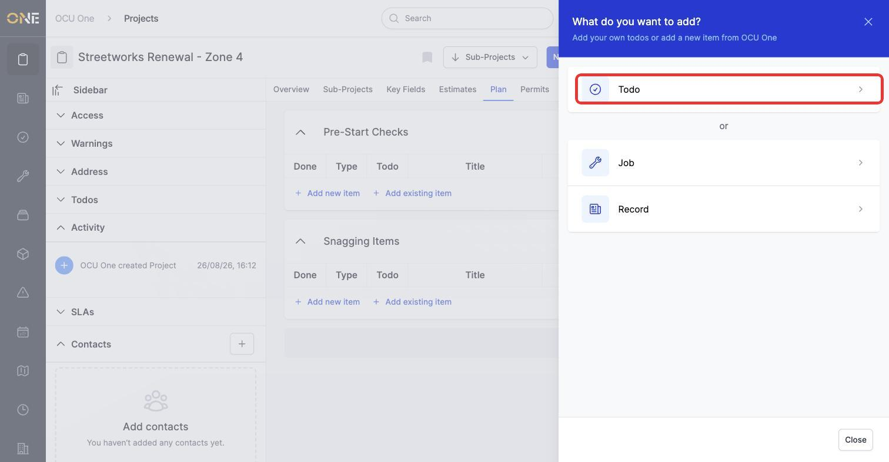
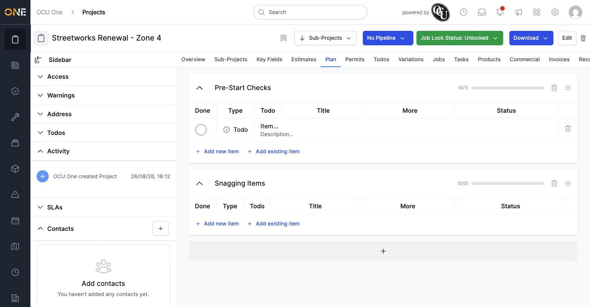
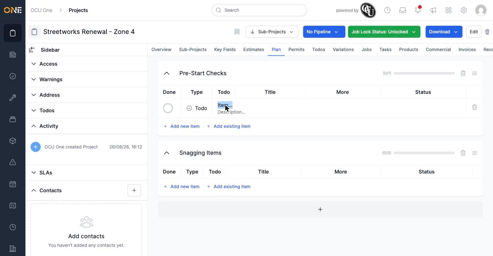
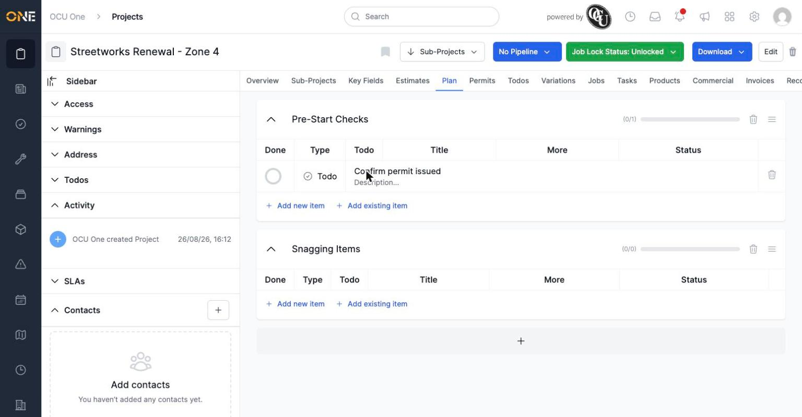

# Adding a new checklist item to a project group

Each group on a project's **Plan** tab holds a list of items to work through. This guide covers adding a brand new item — a plain to-do, or a job or record created from scratch. See "Attaching an existing job or record to a project group checklist" if you want to add something that already exists instead.

## Opening the add-item screen

On the Plan tab, click **Add new item** underneath the group you want to add to.

*Choose what kind of item to create: a Todo, a new Job, or a new Record.*

- **Todo** — a plain checklist item with a title and description, not linked to anything else.
- **Job** — creates a brand new job and adds it to the checklist in one step.
- **Record** — creates a brand new record and adds it to the checklist in one step.

## Creating a Todo

Click **Todo**. A blank item appears in the group straight away, with a placeholder title ("Item...") ready to be renamed.

*The new item appears immediately — no separate save step.*

Click the title to make it editable, type the real name, then press Tab or click elsewhere to save.

*Click the placeholder title to rename it.*

*The item is saved under its new title as soon as you click away.*

**Worth knowing:** choosing Job or Record from this screen creates a brand new one from scratch and immediately attaches it — it isn't a search. If the job or record you want already exists, use "Add existing item" instead so you don't end up with a duplicate.
