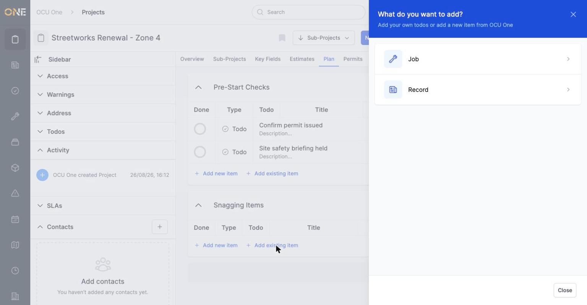
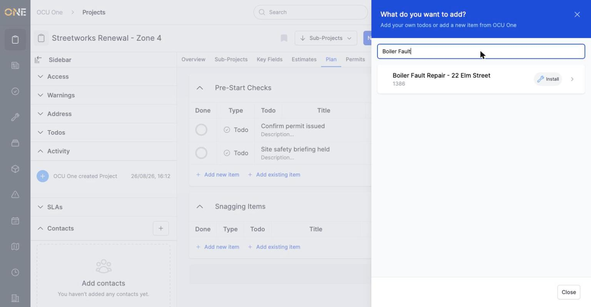
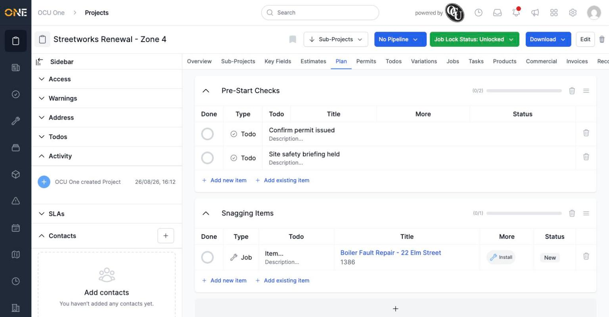

# Attaching an existing job or record to a project group checklist

If the job or record you want on a checklist already exists elsewhere, search for it and attach it rather than creating a duplicate. See "Adding a new checklist item to a project group" if you want to create a brand new job, record, or plain to-do instead.

## Opening the search

On the Plan tab, click **Add existing item** underneath the group you want to add to.

*Unlike "Add new item," this panel only offers Job and Record — there's no "create a plain to-do" option here, since a to-do can't already exist independently of a checklist.*

## Searching and attaching

Click **Job** (or **Record**), then type into the search box that appears. Matching results update as you type.

*Only jobs matching the search text are shown.*

Click the job (or record) you want to attach it to the group.

*The job now appears as a checklist item, linked to the real job — clicking its title opens the job itself.*

**Worth knowing:** a job or record attached this way keeps its own identity — completing it on the checklist doesn't change its actual status, and the checklist item just tracks whether it's been ticked off as part of this particular plan.
