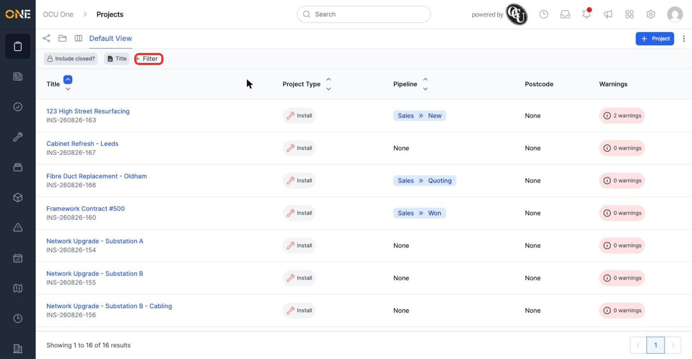
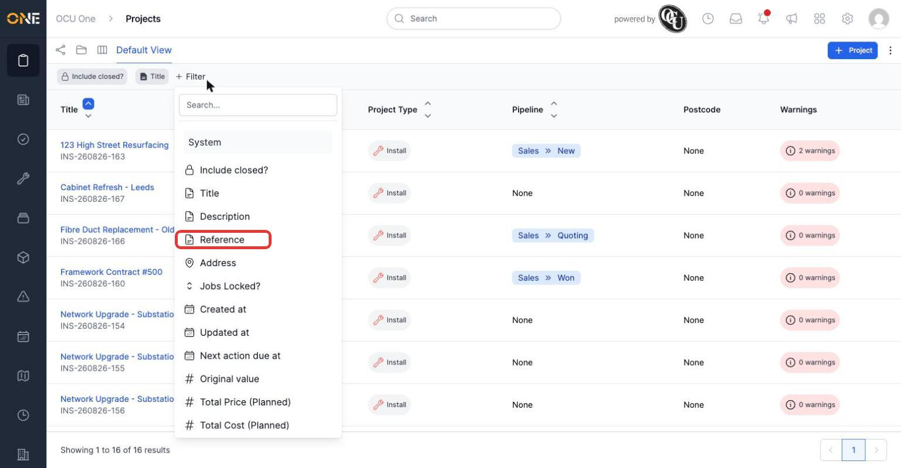
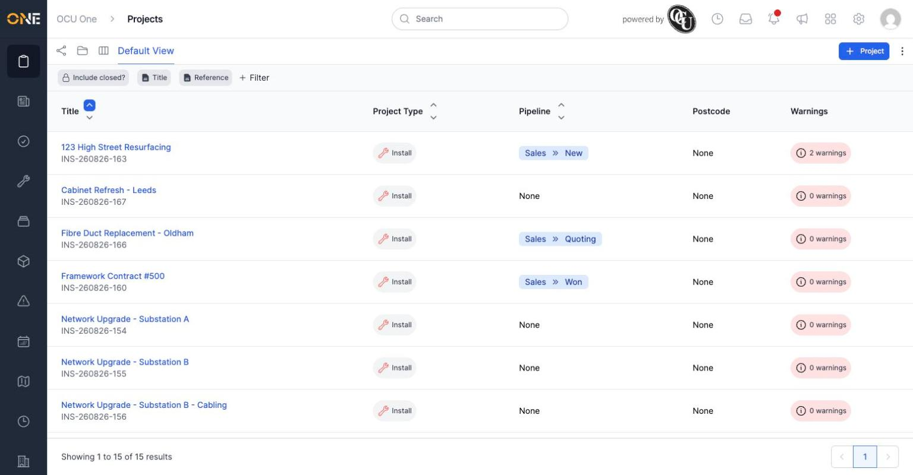

# Browsing and filtering the projects list

The Projects list shows every project you have access to, one row per project, with its Project Type, Pipeline stage, Postcode, and how many warnings it has. It's the default landing page when you open Projects.

*The Projects list. Each row shows the project's type, its current pipeline stage (if it's on one), postcode, and a warnings count.*

## Reading a row

- **Title and reference** — the project's name, with its auto-generated reference underneath (e.g. "INS-260826-163").
- **Project Type** — the badge shows which type of project this is (here, "Install"). Different types can show different columns depending on how they're set up.
- **Pipeline** — if the project's type is tracked through a pipeline, this shows the pipeline name and current stage (e.g. "Sales » New"). Projects not on a pipeline show "None".
- **Warnings** — a count of open warnings on the project. A project with 0 warnings shows a faint badge; one with active warnings (like "123 High Street Resurfacing" above, with 2) stands out and is worth checking.

## Filtering the list

Click **+ Filter** to narrow the list down by any field — Title, Description, Reference, Address, and more.

*Clicking "+ Filter" opens a picker of every field you can filter by.*

Pick a field (this example uses **Reference**), choose a comparison like "contains", type a value, and click **Update**. The list narrows immediately.

*Filtered by Reference — only projects whose reference contains the typed text remain.*

Multiple filters can be added at once and stack together (a project has to match all of them). Each active filter shows as its own chip next to "+ Filter" — click a chip to change it, or its **Remove** link to take it off. Sorting works independently of filtering: click a column header's up/down arrows (like **Title** at the top of the list) to sort by that field.

**Worth knowing:** by default, closed (archived) projects are hidden — the padlock icon on **Include closed?** shows this is locked on. Click it to include them if you need to find a project that's since been closed.
