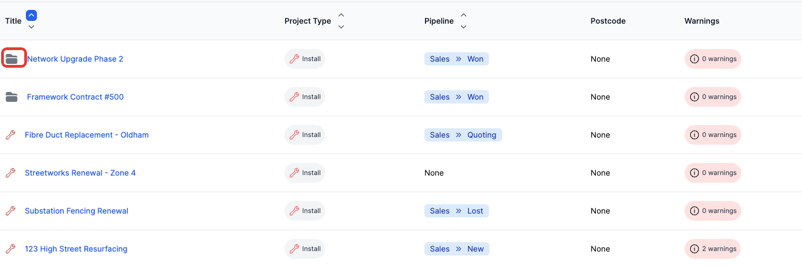
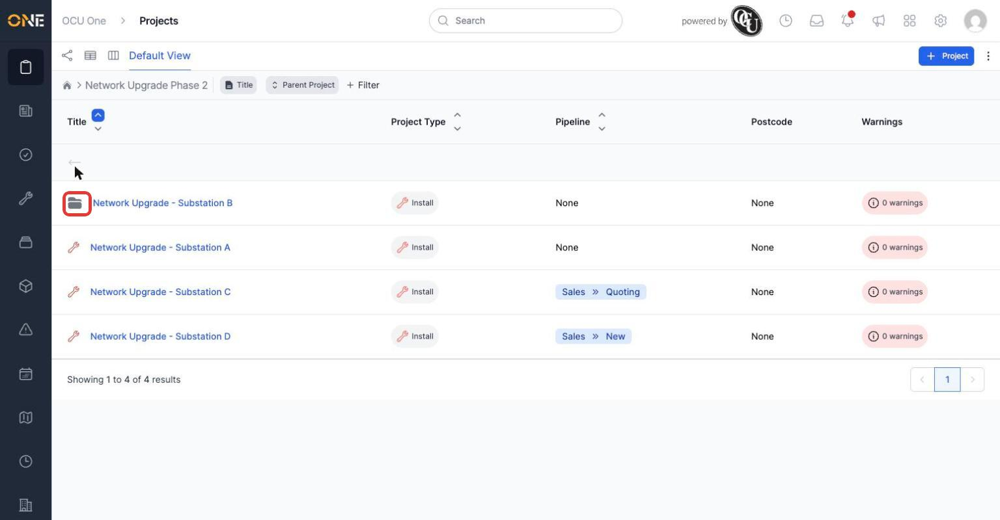
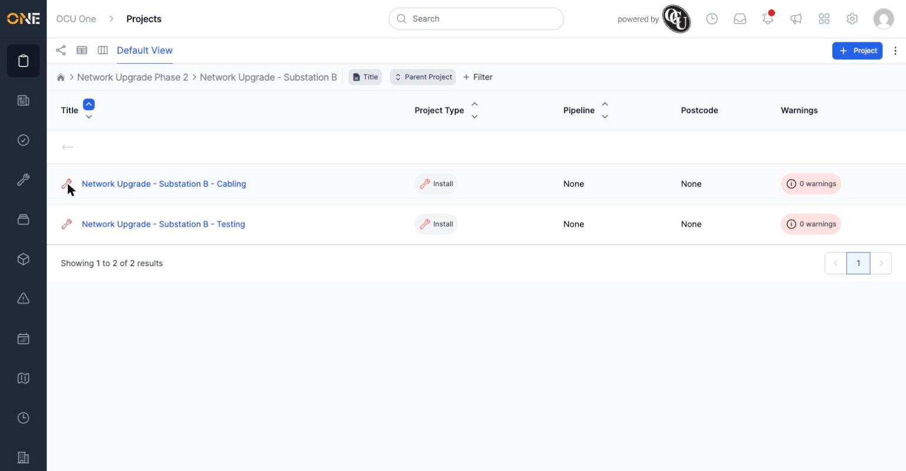

# Browsing projects in drilldown (hierarchy) view

Some projects are made up of smaller sub-projects — a large framework contract split into individual site visits, or a phased upgrade split into one project per substation. The **Drilldown** view lets you step through that structure one level at a time, instead of seeing every project (parent and child alike) mixed together in one flat list.

*The top level shows every project with no parent. A folder icon means it has sub-projects underneath it — click the icon (not the title) to step inside.*

## Stepping into a project's children

Click the **folder icon** on a project that has one (its title link takes you straight to that project's own page instead — the folder icon is what drills in). The list updates to show only that project's direct children, and a breadcrumb appears above the list so you can see where you are and step back out.

*Drilled into "Network Upgrade Phase 2" — its breadcrumb sits above the list, and its 4 children are shown. "Substation B" has its own folder icon, meaning it has children of its own.*

## Going deeper

The same trick works at any depth — a child with its own folder icon can be drilled into again, and the breadcrumb keeps growing to show the full path.

*Two levels deep: Phase 2 → Substation B → its own two sub-projects ("Cabling" and "Testing"). Click the breadcrumb (or the back arrow above the list) to step back out to a parent level.*

**Worth knowing:** the same Title, Project Type, Pipeline, Postcode, and Warnings columns from the main Projects list are available here too, along with the same filtering and sorting — drilldown is a different way of navigating the same underlying projects, not a separate dataset.
