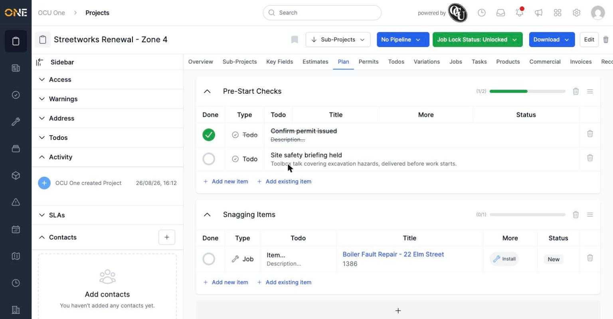
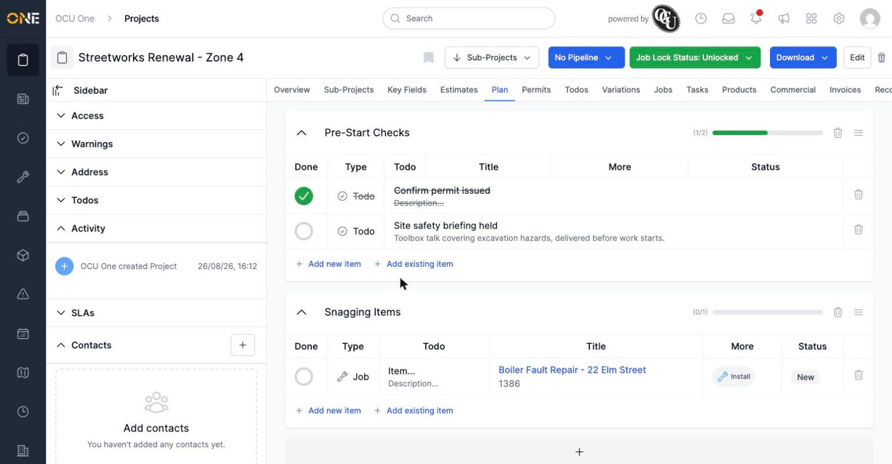
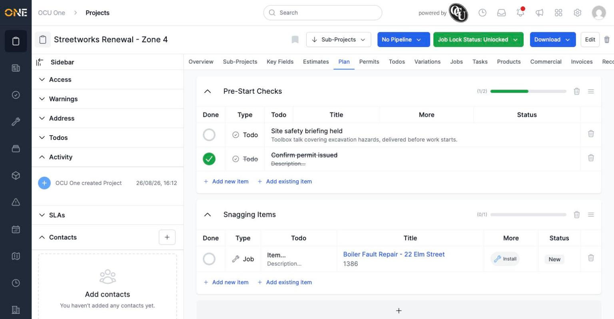
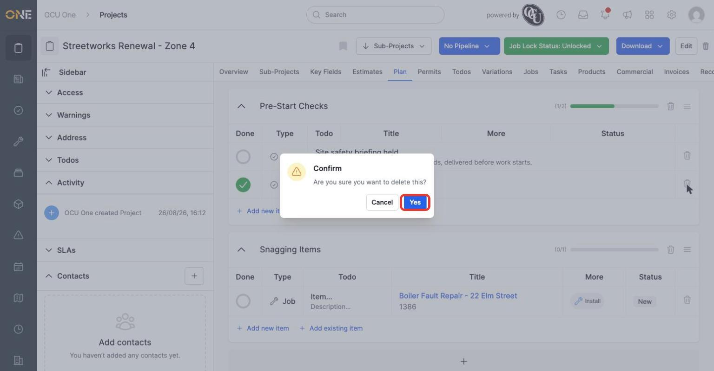
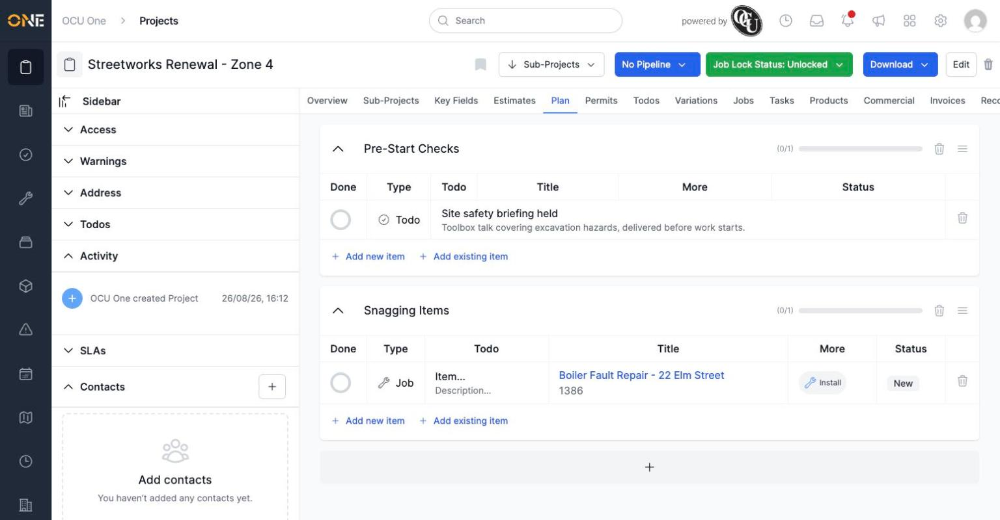

# Completing, editing, reordering, and removing checklist items

Once a checklist item exists on a project's Plan tab — whether it's a plain to-do, or a linked job or record — you can tick it off, change its details, move it up or down the list, or remove it entirely.

## Marking an item done

Click the circle in the **Done** column next to an item.

*The item's title gets a strikethrough, and the group's progress bar updates immediately. Click the circle again to mark it not done.*

## Editing an item's title or description

Click directly on the title or description text to make it editable, type the change, then press Tab or click elsewhere to save.

*Titles and descriptions can both be edited this way, the same as renaming a group.*

## Reordering items

Each item has a drag handle for moving it up or down within its group, changing the order the checklist is worked through.

*"Confirm permit issued" (done) currently sits above "Site safety briefing held".*

*Dragging "Site safety briefing held" above the other item moves it to the top of the group.*

## Removing an item

Click the trash icon on the item's row, then confirm.

*Confirming removes the item from the checklist for good.*

*The group's item count and progress bar update to reflect what's left.*

**Worth knowing:** removing a checklist item that's linked to a job or record only removes it from this checklist — the underlying job or record itself isn't affected or deleted.
