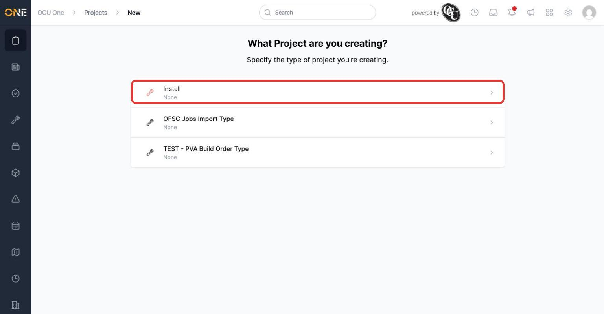
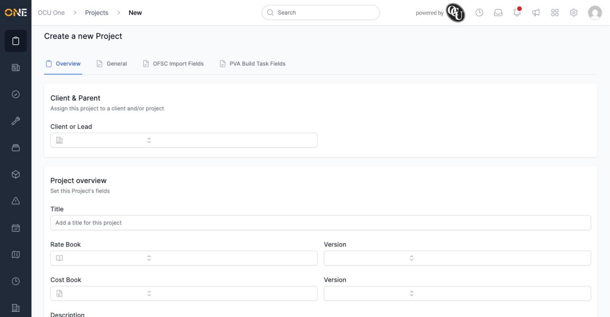
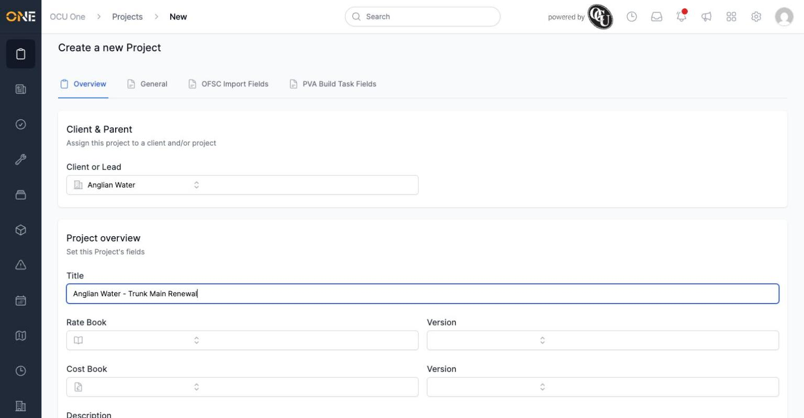
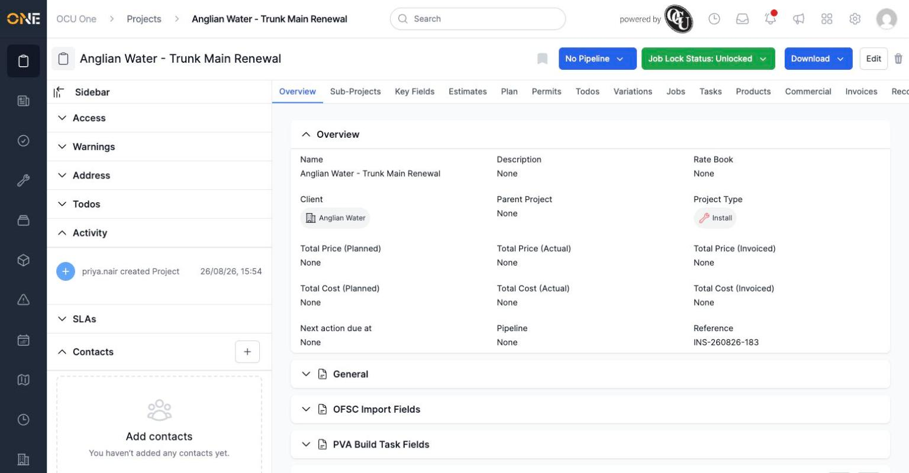

# Creating a new project

Whenever you need to start tracking a new piece of work — a client job, a framework agreement, a piece of streetworks — you create it as a **project**.

## Choosing a project type

From the Projects list, click **+ Project**. You're first asked what type of project you're creating.

*Pick the project type that matches the work — here, "Install."*

Each project type can show a different set of tabs and fields later on, so picking the right one up front matters.

## Filling in the details

After picking a type, you land on the "Create a new Project" form.

*The empty form — client, title, rate book, address, and pipeline are all set here.*

Start by searching for and selecting the **Client or Lead** this project is for, then give the project a clear **Title**.

*Client and title filled in. Rate book, cost book, address, and pipeline are all optional at this stage — you can fill them in now or add them later.*

A **Rate Book** and **Cost Book** can be set here if you already know which pricing to use, and an **Address** can be searched for or entered manually. If the project type has a pipeline configured, you can also place the project straight onto it.

## After creating

Click **Create Project** to save it. You're taken straight to the new project's own page, with its Reference number already generated.

*"Anglian Water - Trunk Main Renewal" has been created, with its reference "INS-260826-183" and an activity entry recording who created it.*

From here, the project has its own set of tabs — Sub-Projects, Key Fields, Estimates, and more — ready for you to build out the rest of the work.
