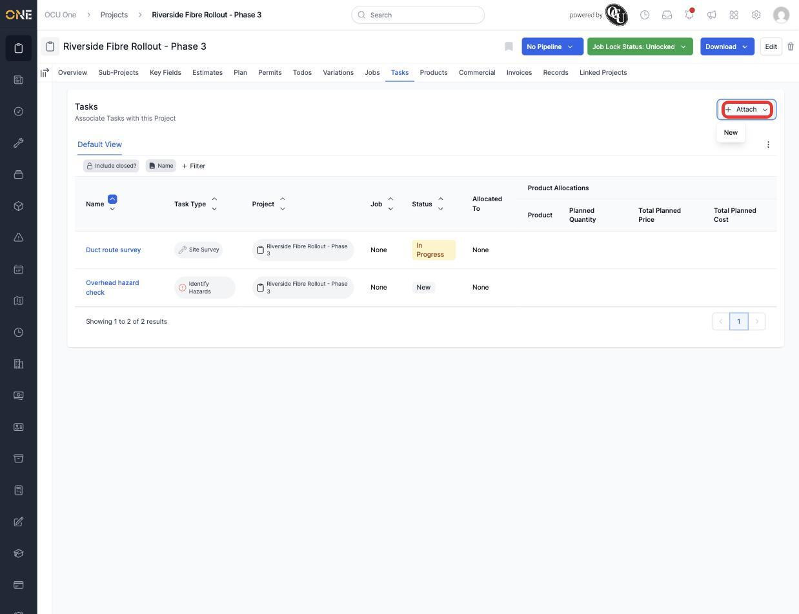
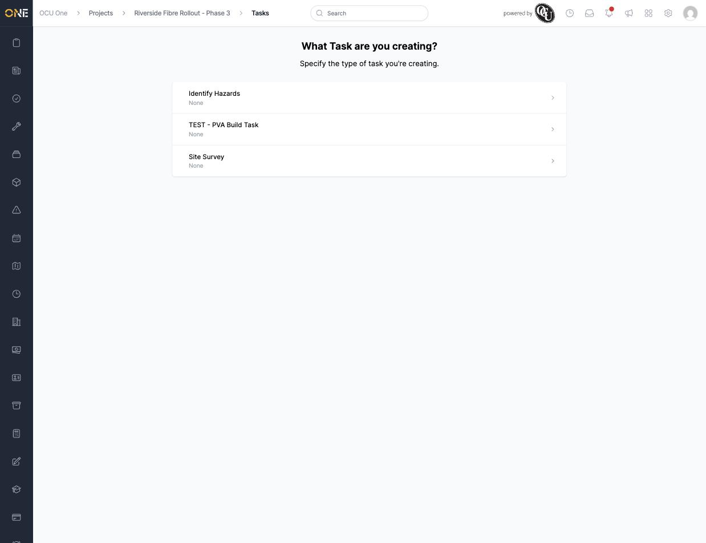
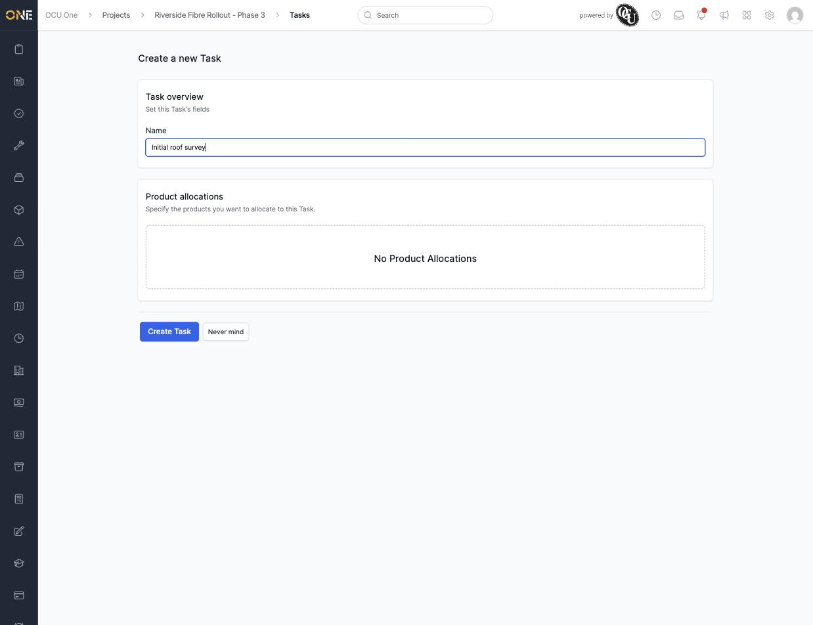
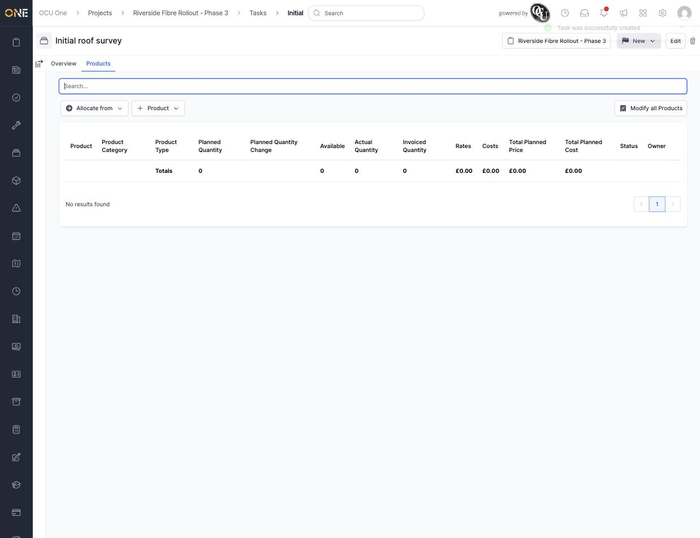

# Creating a new task under a project

Sometimes a piece of work belongs to a project directly, without needing a full job. This guide covers creating one of these tasks from a project's Tasks tab.

## Starting a new task

Open a project and go to its **Tasks** tab, then click **Attach** in the top right.

*Unlike Records, a task can only be created new here — there's no "attach an existing task" option, since a task belongs to one project.*

Click **New**. You're asked which type of task you're creating.

*Choosing the task type. Only types that have been set up in this tenant appear here.*

Pick a type and you land on a short form: give the task a name, and optionally allocate products to it if the task type supports that.

*Naming the task "Initial roof survey" before creating it.*

Click **Create Task**. You're taken straight to the new task's page.

*The new task exists with no product allocations yet — these can be added later from here if needed.*

**Worth knowing:** a task created this way starts with status "New" and belongs directly to the project — it isn't tied to a job unless one is linked to it later.
