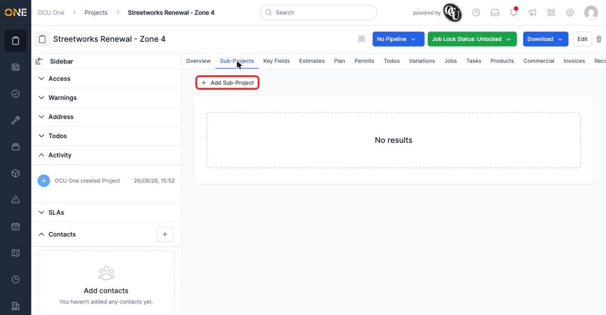
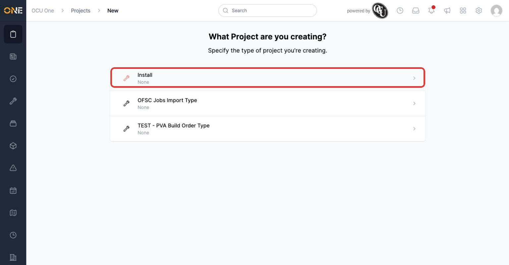
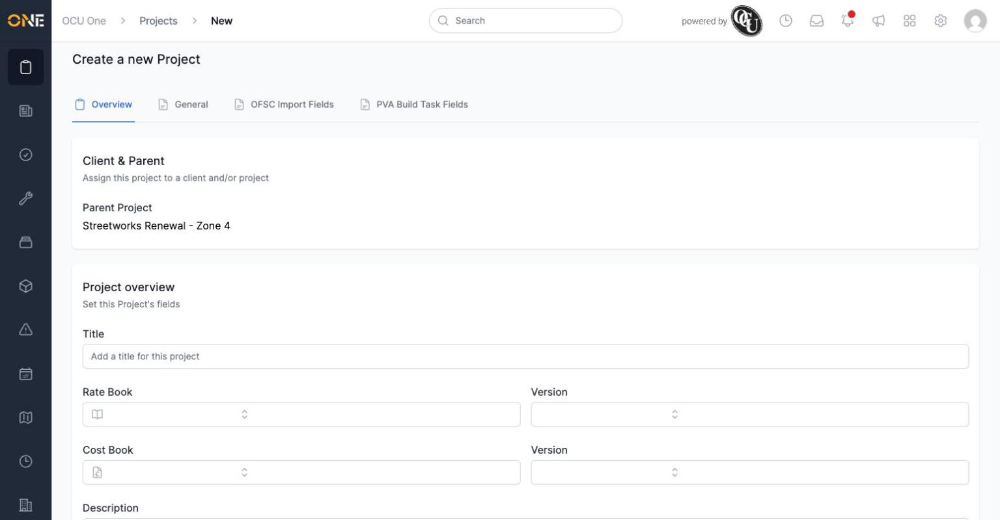
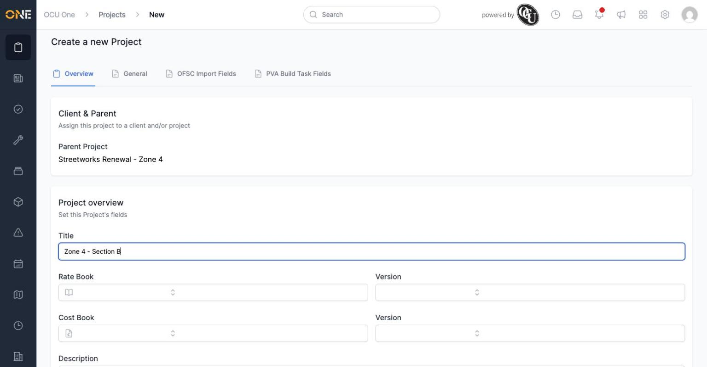
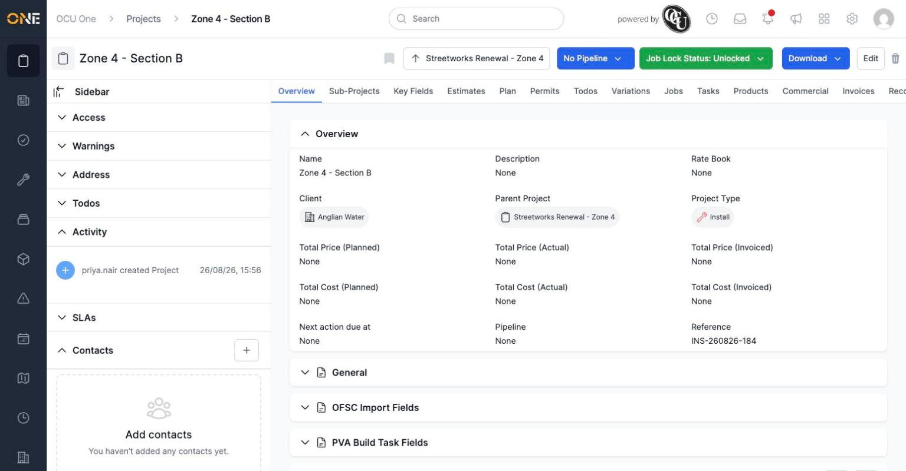
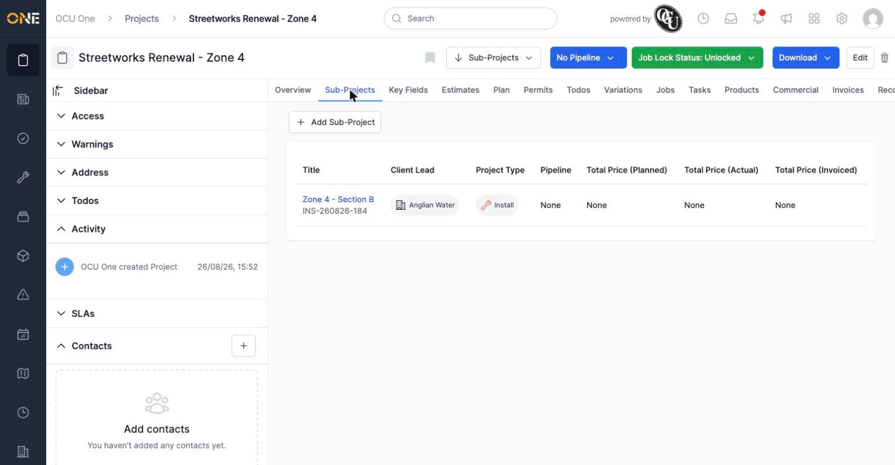

# Creating a sub-project (child project) under an existing project

Larger pieces of work are often easier to manage as a parent project with smaller sub-projects underneath it — for example, splitting a large renewal scheme into individual sections.

## Starting from the parent project

Open the project that should become the parent, and go to its **Sub-Projects** tab.

*No sub-projects yet — click "+ Add Sub-Project" to create the first one.*

## Picking a type and filling in the details

Just like creating a top-level project, you're first asked which project type to use.

Once you pick a type, the form appears — but this time there's no Client field to fill in.

*The parent project is shown at the top instead. The sub-project automatically takes on the parent's client.*

Give the sub-project its own **Title**.

## After creating

Click **Create Project**. The new sub-project has its own page, but with the parent project shown as a chip near the top so you can jump back to it at any time.

*"Zone 4 - Section B" now exists as a sub-project, and has inherited the "Anglian Water" client from its parent automatically.*

Back on the parent project's Sub-Projects tab, the new sub-project now appears in the list.

*The parent can have any number of sub-projects added this way, and each one can have its own sub-projects too, if you need more than one level.*
