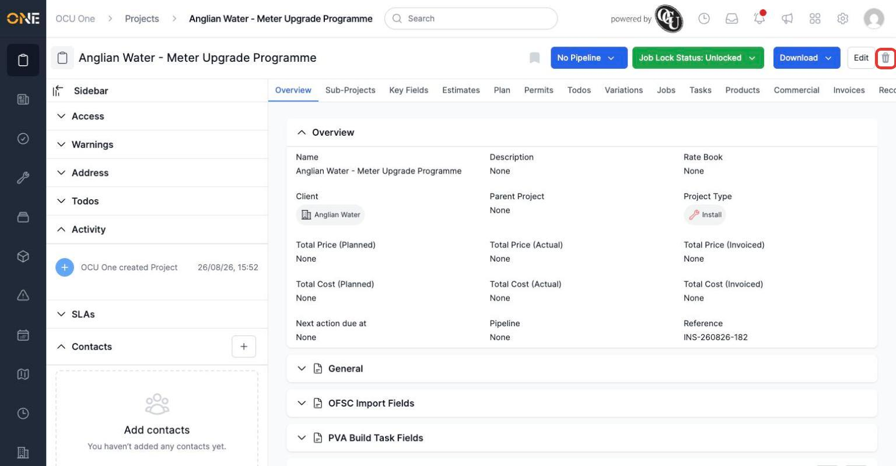
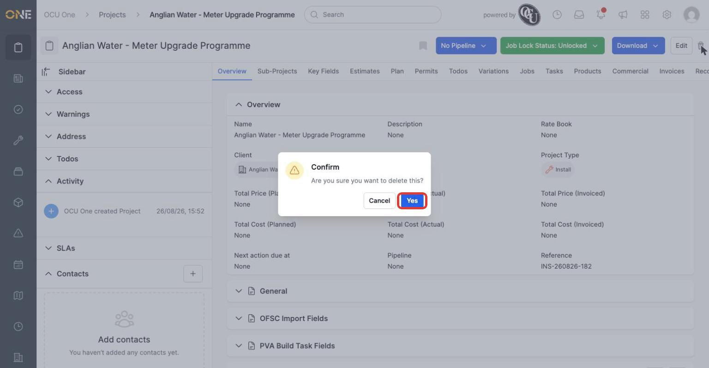
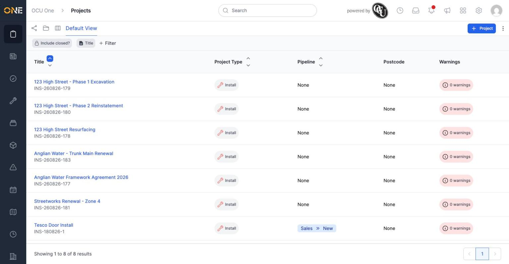

# Deleting (archiving) a project

If a project was created by mistake, or is finished and no longer needs to appear in your day-to-day lists, you can delete it. This doesn't erase it completely — it archives it, so it drops out of the active project list but isn't destroyed.

## Deleting from the project page

Open the project you want to remove, and click the trash icon in the top right.

*"Anglian Water - Meter Upgrade Programme" — a completed project with no open jobs, ready to be archived.*

## Confirming

A confirmation dialog appears, asking you to confirm the deletion.

Click **Yes** to confirm, or **Cancel** to back out without making any changes.

## After deleting

You're redirected to the projects list, with a confirmation that the project was deleted. The project no longer appears in the default list.

**Worth knowing:** deleting a project is best reserved for projects that are genuinely finished or were created in error. Since it archives rather than permanently erases the project, an admin can still find and restore it later if it turns out to have been deleted by mistake — but it's not something you'd want to do casually, since a project with open jobs or ongoing work attached shouldn't normally be archived.
