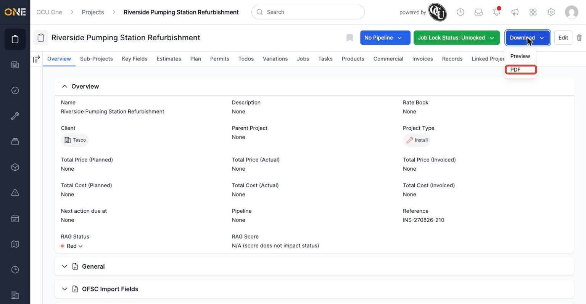
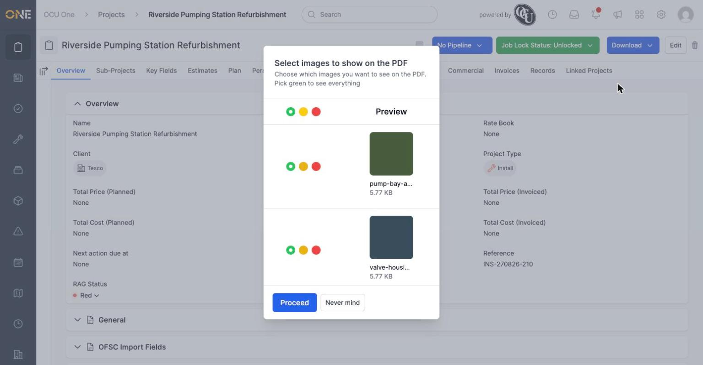
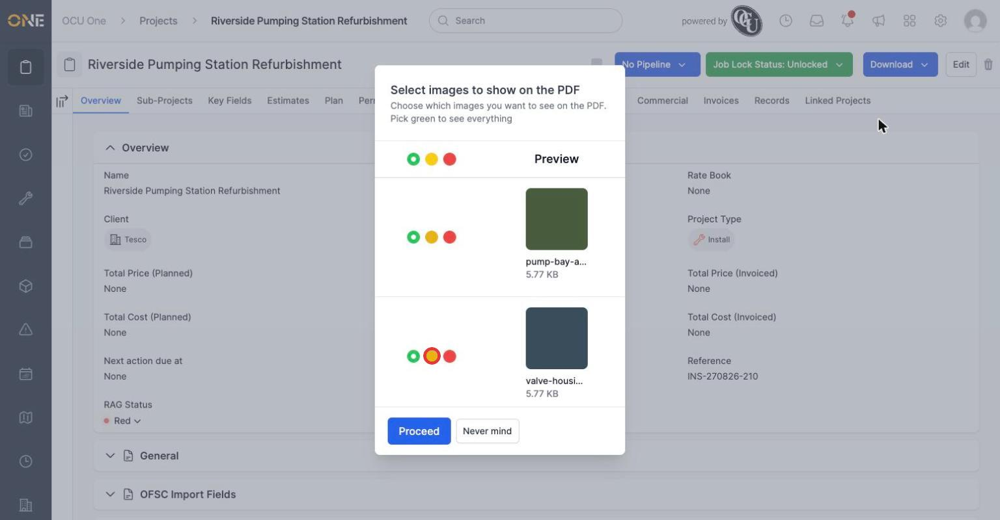

# Downloading or previewing a project PDF

A project can be exported as a PDF — a shareable summary you can send to a client or keep on file. Before it's generated, you get a chance to choose exactly which photos attached to the project should appear in it.

## Starting a download or preview

On a project's page, click the **Download** button in the top right, then choose **Preview** or **PDF**.

*Preview opens the PDF's content inline; PDF generates and downloads the file.*

## Choosing which photos to include

Before the PDF is put together, you're taken to a screen listing every photo attached to the project.

*Both photos default to Show (green) unless changed previously.*

Each photo has three colour options: 🟢 **Show** (always included), 🔴 **Don't show** (never included, until changed again), and 🟡 **Don't show this time** (skip it for just this export, without changing its usual default).

*Click the yellow circle to leave a normally-shown photo out of just this one export.*

Clicking it updates that photo's choice straight away.

*Only this export will skip the photo — its default stays Show for next time.*

Once you're happy with your choices, click **Proceed** to continue to the PDF or preview, or **Never mind** to close the screen without generating anything.

**Worth knowing:** this same photo-selection screen appears whenever you download or preview a PDF anywhere in the app that has attached photos, not just on projects — the choices you make here only affect the images, not any other content on the PDF.
