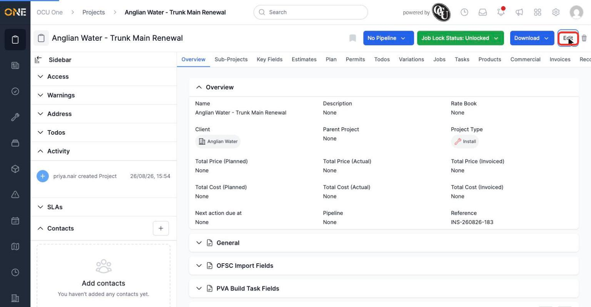
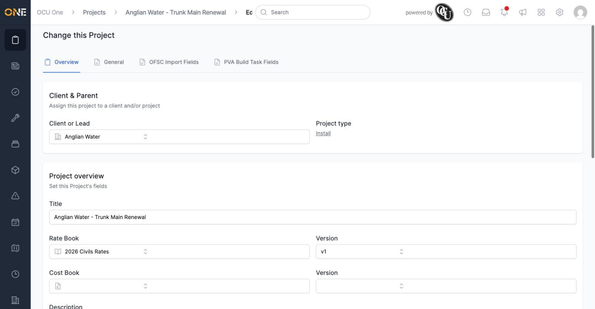
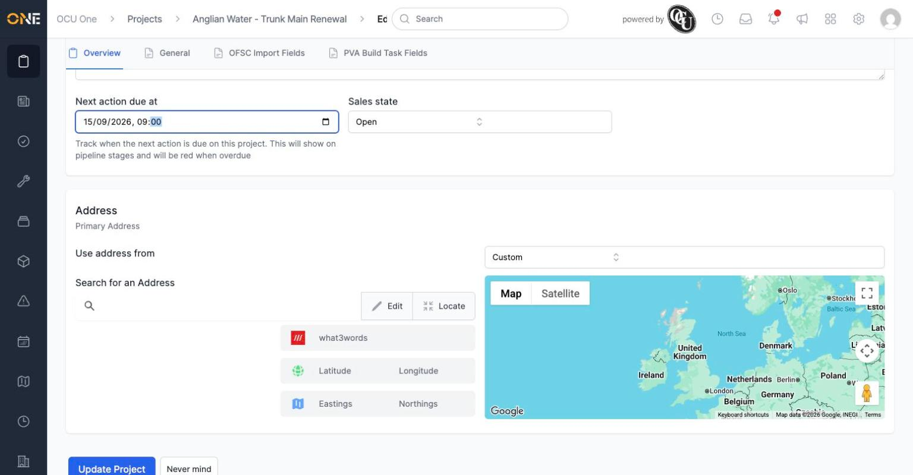
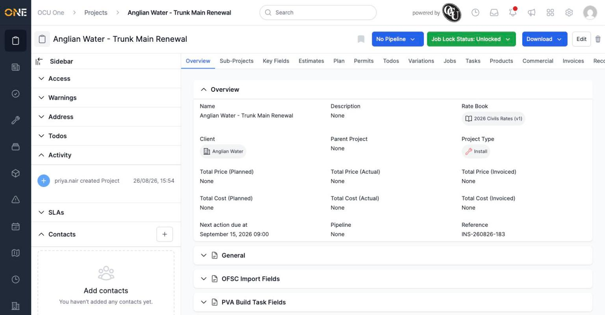

# Editing a project's details

Once a project exists, most of what you set when creating it can be changed later — its rate book, next action date, address, and more.

## Opening the edit form

From the project's page, click **Edit** in the top right.

*This project currently has no Rate Book set and no Next Action Due date.*

This opens the same form used when the project was created, pre-filled with its current details.

## Changing the rate book

To change which rate book a project uses, open the **Rate Book** field, search for the one you want, and select it.

*Selecting a rate book also lets you pick a specific Version of it, if the rate book has more than one.*

## Changing the next action date

Scroll down to the **Next action due at** field and set a new date and time.

*This date is what shows on the pipeline stage as overdue (in red) once it passes, so keeping it up to date helps whoever's tracking the project's progress.*

## Saving your changes

Click **Update Project** to save. You're taken back to the project's overview, now showing the updated details.

*Rate Book now shows "2026 Civils Rates (v1)" and Next action due at shows "September 15, 2026 09:00."*

**Worth knowing:** the project's **Project Type** can't be changed after creation — if you picked the wrong type, you'll need to create a new project with the correct one instead of editing this field.
