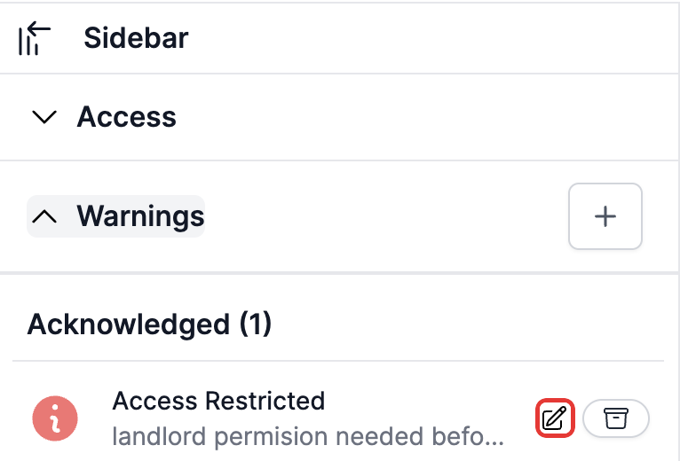
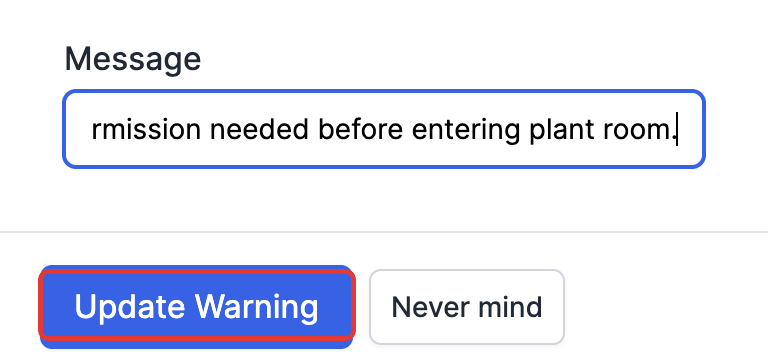
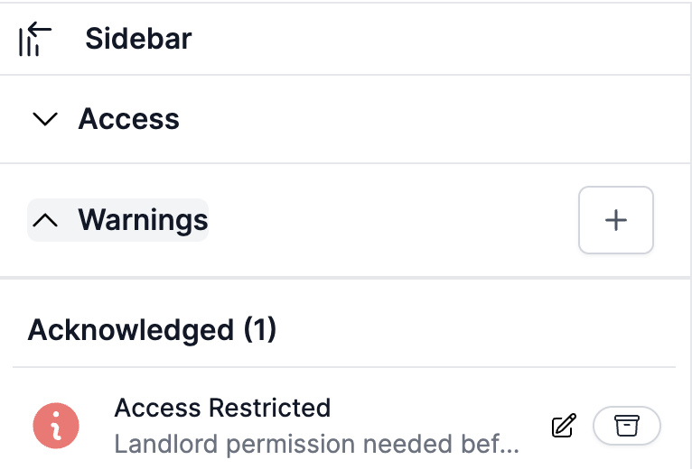

# Editing a warning's message

Once a warning has been acknowledged, you can go back and edit its message — useful for fixing a typo, adding more detail, or correcting the wording once you know more about the situation.

## Where to find it

Open the **Warnings** section in a project's sidebar. Under any warning listed as **Acknowledged**, a small pencil icon appears next to it.

*The edit icon only shows on warnings that have already been acknowledged — new and closed warnings can't be edited this way.*

## Editing the message

Click the pencil icon to open the edit form. Only the **Message** field can be changed — the warning type is fixed once the warning has been created.

Update the wording, then click **Update Warning**.

*Type the corrected message and click Update Warning to save it.*

The warning's message updates immediately, still showing under **Acknowledged** with its new wording.

*The message is updated in place — the warning's type and status don't change.*
