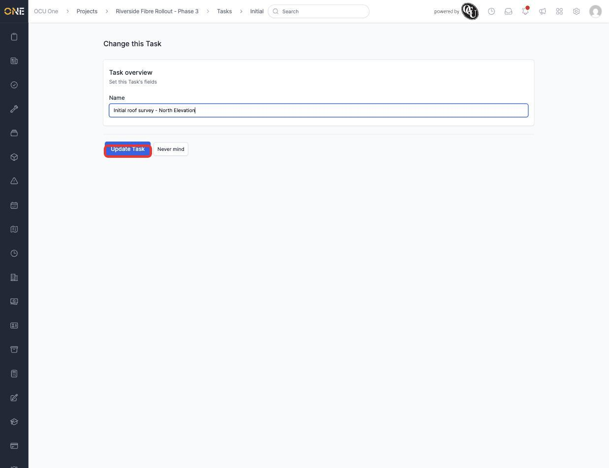
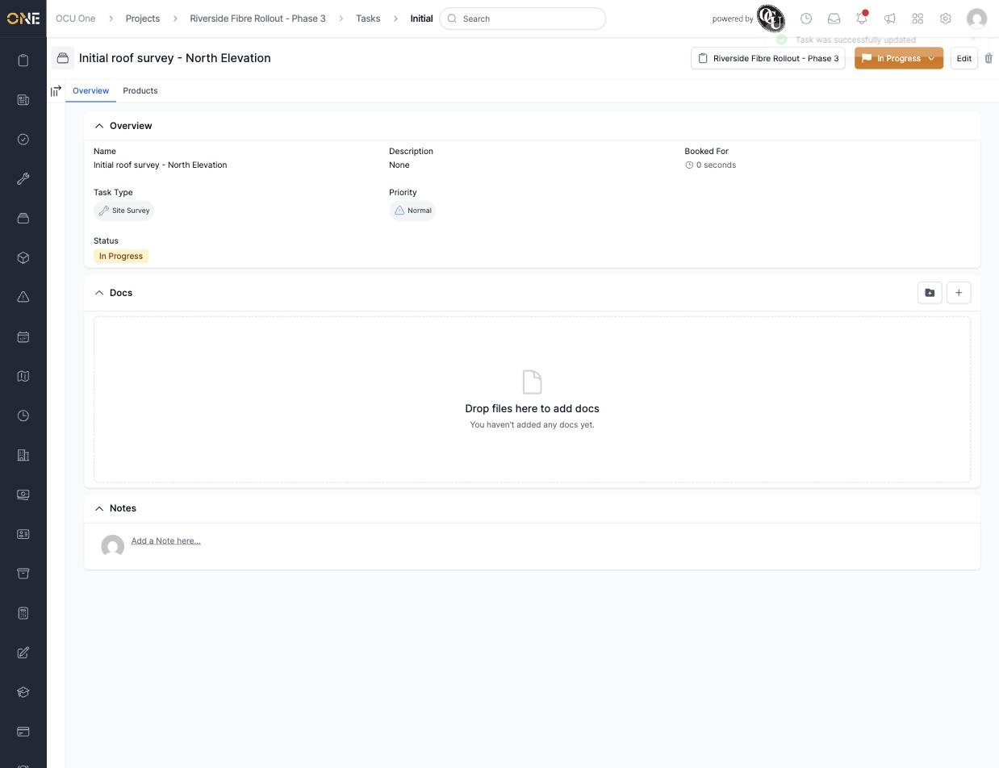
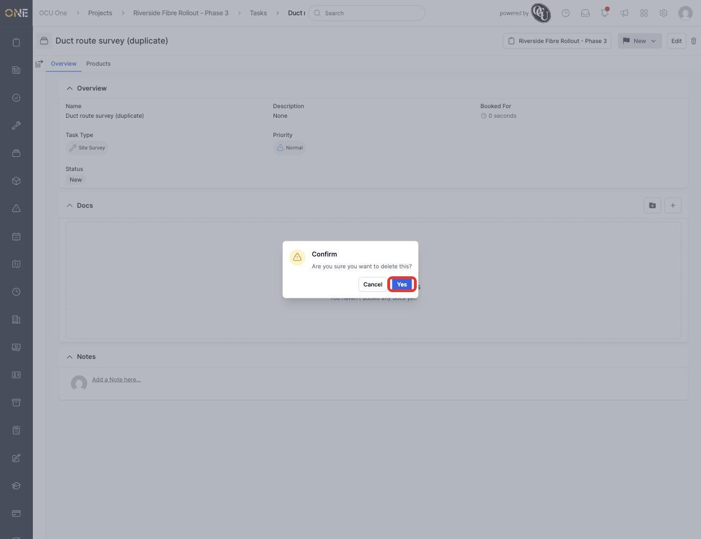
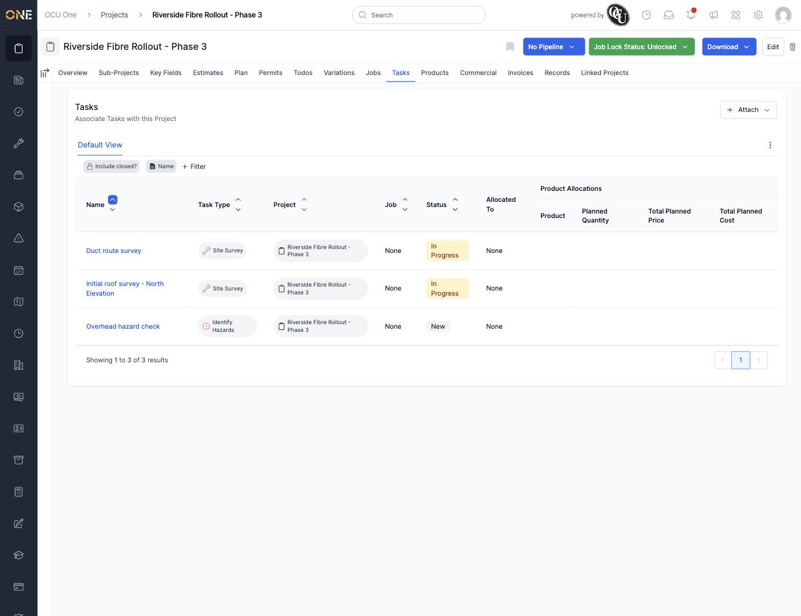

# Editing or deleting a task

Once a task exists, you can rename it or remove it entirely if it was created by mistake. This guide covers both.

## Renaming a task

Open the task and click **Edit** in the top right. The edit form only has one field to change — the task's name.

*Editing "Initial roof survey" to be more specific.*

Change the name and click **Update Task**.

*The task is now called "Initial roof survey - North Elevation" everywhere it appears, including on the project's Tasks tab.*

## Deleting a task

Open the task you want to remove and click the trash icon in the top right, next to **Edit**. A confirmation dialog appears before anything happens.

*Click **Yes** to confirm, or **Cancel** to back out without deleting anything.*

Once confirmed, the task is removed from the project's Tasks list.

*"Duct route survey (duplicate)" no longer appears — only the tasks that were meant to stay remain.*

**Worth knowing:** deleting a task here archives it rather than permanently erasing it — it's removed from the everyday list, but the record isn't gone in a way that could surprise you later.
