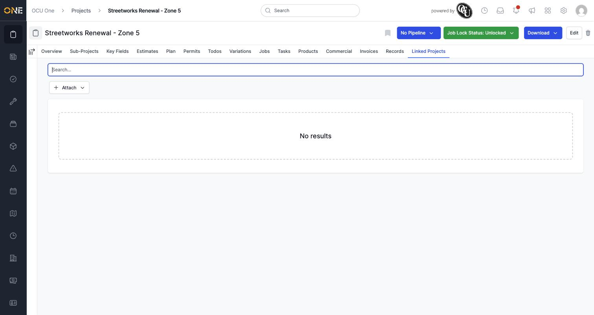
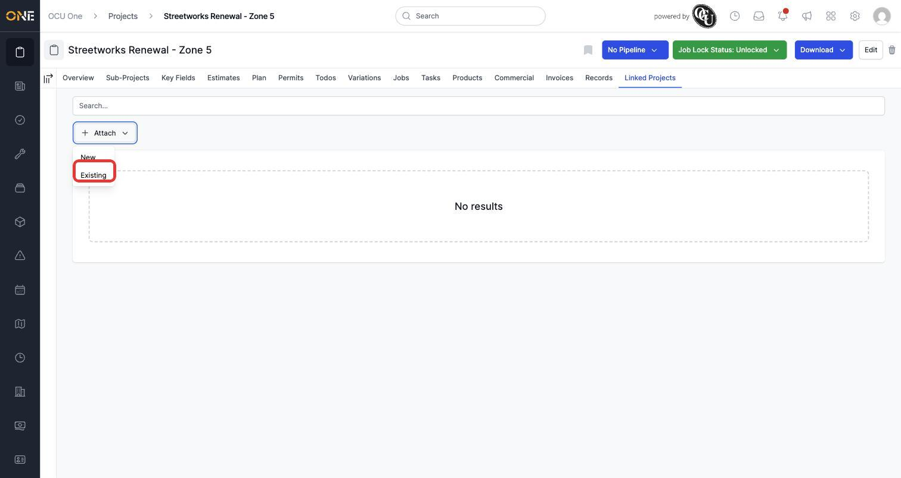
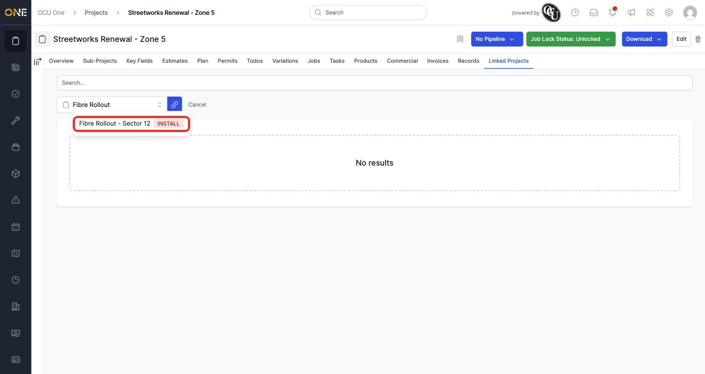
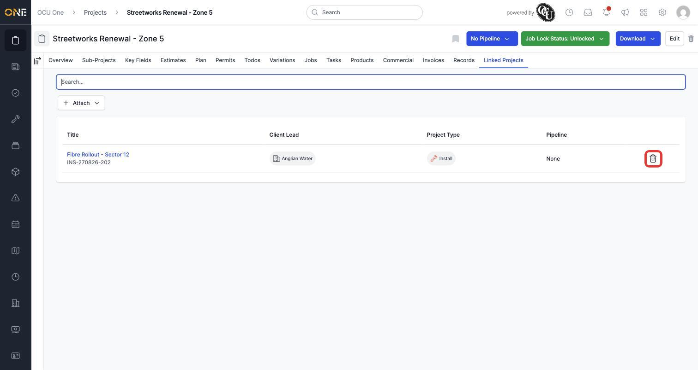

# Linking related projects together

Two projects don't need a parent/child relationship to be connected — the **Linked Projects** tab lets you attach any other project as a related reference, in either direction.

## Viewing linked projects

Open a project and click the **Linked Projects** tab. If nothing's linked yet, you'll see an empty state and a search box you can use once something's attached.

*An empty Linked Projects tab. Click **Attach** to link one.*

## Linking an existing project

Click **Attach**, then choose **Existing** (the **New** option instead creates and links a brand-new project in one step).

*Choose **Existing** to link a project that already exists.*

A search field appears in its place. Type part of the project's name to search for it.

*Type to search, then click the matching project.*

Click the project you want, then click the blue link icon next to the search field to confirm.

*The linked project now appears in the list, showing its client, type, and pipeline. Click the trash icon to remove the link at any time.*

**Worth knowing:** linking a project doesn't change either project's data or hierarchy — it's a reference only, separate from the parent/child sub-project relationship covered in [Creating a sub-project (child project) under an existing project](Creating%20a%20sub-project%20%28child%20project%29%20under%20an%20existing%20project.md). Removing a link only removes the reference — neither project is deleted.
