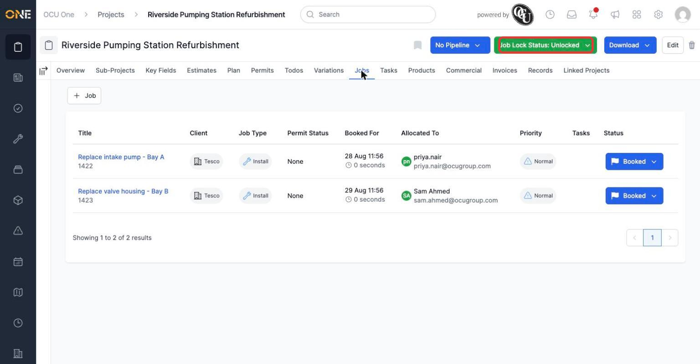
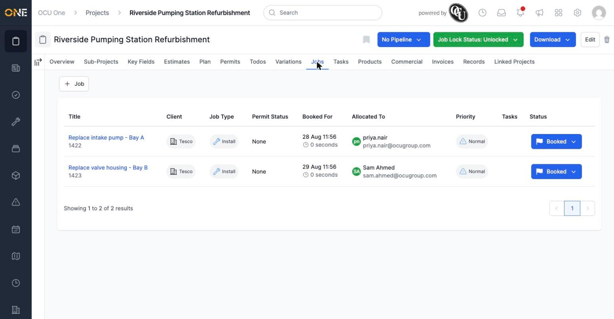
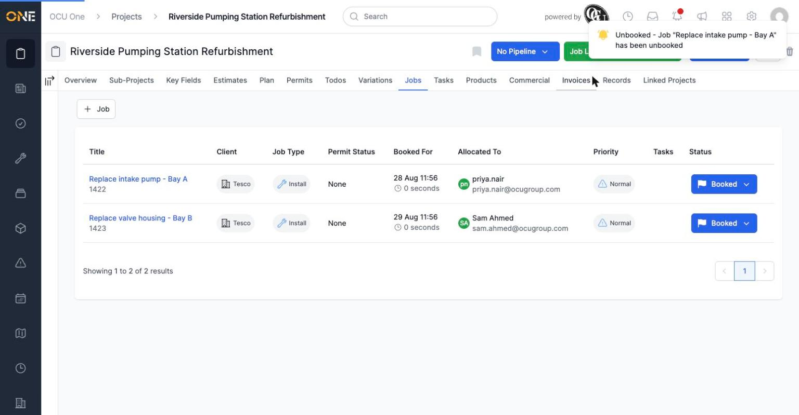
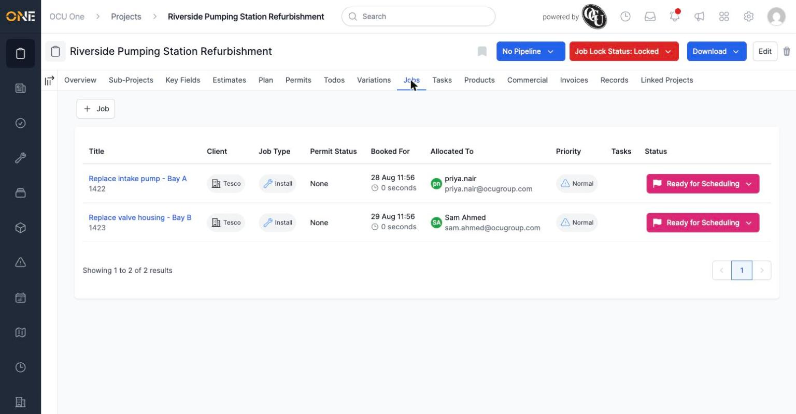
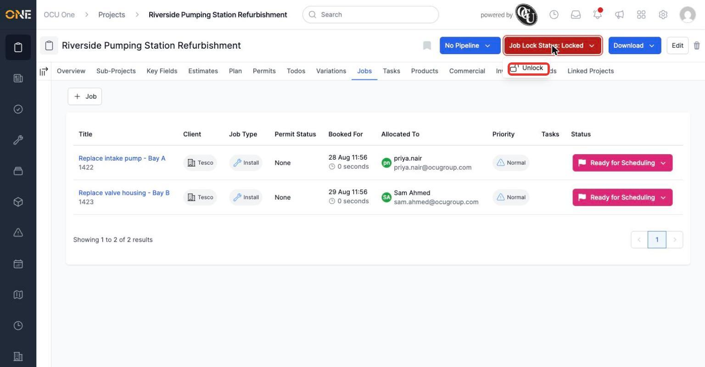
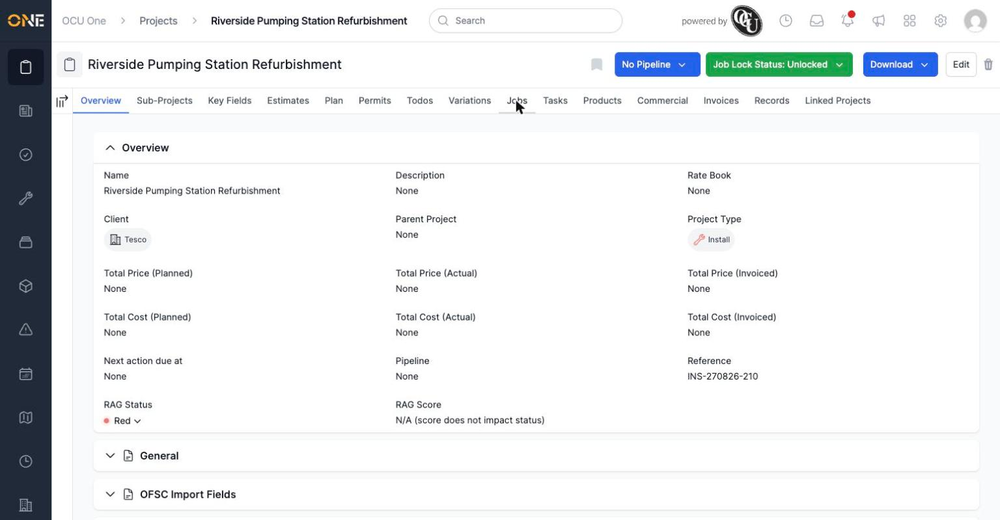

# Locking and unlocking jobs on a project

A project can be **locked** to stop work continuing on it — useful if something's come up (a missing permit, a client hold, a safety concern) and the jobs on that project shouldn't carry on until it's resolved.

## Where to find it

On a project's page, the **Job Lock Status** button sits in the top right, next to Download. It shows green when unlocked, red when locked.

*Click the button to open the lock/unlock menu.*

Before locking, here's the project's Jobs tab with two jobs booked in:

*Both jobs are currently booked and scheduled.*

## Locking a project

Click the button, then **Lock**.

**Important:** locking a project automatically un-books any of its jobs that are currently Booked or In Progress. You'll see a confirmation for each job that gets unbooked.

*Each affected job is unbooked automatically — this isn't optional or reversible by re-locking.*

The button turns red to show the project is locked, and both jobs move to "Ready for Scheduling".

*Neither job is scheduled any more — they'll need to be re-booked once the project is unlocked.*

## Unlocking a project

Click the red **Job Lock Status: Locked** button, then **Unlock**.

*Unlocking doesn't automatically re-book anything — jobs that were unbooked when the project was locked stay unbooked and need to be re-booked manually.*

The button turns back to green.

*The project is unlocked again — but its jobs are still Ready for Scheduling until someone re-books them.*

**Worth knowing:** locking is a one-way street for booked jobs — it unbooks them straight away, and unlocking doesn't undo that. If you're locking a project just to make a quick change and expect to unlock it again shortly, be aware that any booked engineers will need re-booking afterwards.
